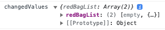
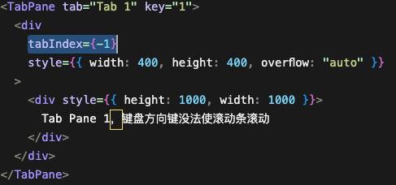

## Modal

### 函数式

```jsx
Modal.confirm({
  title: "批量添加商品",
  icon: <></>,
  content: <BatchImport ref={batchImportRef} />,
  onOk: async() => {
    const list: any[] = await (batchImportRef.current as any).submit();
    combineGoods(list)
  }
})
```

异步自动loading：函数式调用，可以在onOk中通过返回Promise自动将confirm按钮变为loading状态并延迟关闭。

隐藏Icon：需要将icon属性设置为`<></>`

样式兼容：confirm Modal的content包裹了一层`ant-modal-confirm-body`，其css中含有`display: flex`，在某些情况下会导致内部组件样式异常（如Modal里放入了ProTable，ProTable的`scroll: { x: 'max-content' }）`不生效，宽度会超出Modal，响应式功能也会丢失）。因此不建议再confirm Modal中放入太大的组件，如果非要这样使用，需要去掉这个`display: flex`属性并使`icon: <></>`


## Table

### rowKey

​		定义表格每一行的key,如果dataSource中的数据有key字段则可以省略。

```
<Table 
	rowKey='id'
	dataSource={[
		{id:1,name:'ysx'},
		{id:2,name:'lxy'}
	]}
/>
```

### 批量操作

```
rowSelection={{
	type:'checkbox' || 'radio',
	alwaysShowAlert: true, // 批量操作提示框常显
	onChange:()=>{}
	...
}}
```

#### onChange

```
onChange: (selectedRowKeys, selectedRows) => {
  console.log(
    `selectedRowKeys: ${selectedRowKeys}`,
    `selectedRows: ${selectedRows}`
  );
},
//selectedRowKeys: 每一行数据中的key值所组成的数组
//selectedRows: 每一行数据组成的对象数组
```

#### selectedRowKeys

​		定义该属性以灵活地控制选择框。

​		如果定义了该属性，必须配合 onChange使用，并且在onChange中手动修改selectedRowKeys的值，否则选择框将失去选择功能。（如果不定义该属性，Table会自行管理选择框）

```
const [selectedRowKeys,setSelectedRowKeys] = useState([])

<Table 
	rowSelection={{
		selectedRowKeys,
		onChange(selectedRowKeys){
			setSelectedRowKeys(selectedRowKeys)
		}
	}} 
/>
```

#### selections

​		自定义选择项，会受页数影响。

```
rowSelection={{
	selectedRowKeys,
	onChange(selectedRowKeys){
		setSelectedRowKeys(selectedRowKeys)
	},
	selections: [
        Table.SELECTION_ALL,  	// 全选所有页
        Table.SELECTION_INVERT, // 反选当前页
        Table.SELECTION_NONE,   // 清空所有页
        {						// 选择奇数行
        	key:'odd',
        	text:'选择奇数行'，
        	onSelect:(changableRowKeys)=>{
        		let newSelectedRowKeys = [];
          		newSelectedRowKeys = changableRowKeys.filter((key, index) => {
            		if (index % 2 !== 0) {
              			return true;
            		}
            		return false;
          		});
          		this.setState({ selectedRowKeys: newSelectedRowKeys });
        	}
        }
}}
```

#### 选择框的默认属性配置

```
const rowSelection = {
  selectedRowKeys,
  onChange: onSelectChange,
  getCheckboxProps: (record) => {
    return { disabled: record.status !== 1 }
  },
}
```

#### tableAlertOptionRender Bug

```
<ProTable 
	...
	tableAlertOptionRender={({ selectedRowKeys, selectedRows }) => {}}
	// 如果修改了列表数据，即使调用了actionRef.current.reload(),selectedRows中的数据也不会更新，需要actionRef.current.cleanSelected()来重新选择以获取最新数据
/>
```


### columns

#### render

​		在用render方法时，如果想设置max-width，不要在返回的标签div上设置，这会导致如果table给这一列分配了大于max-width的宽度，多余的宽度会用div的marginRight来填充，无法达到align：center的效果。应该在css中设置ant-table-cell的max-width。

#### key

​		与rowKey不同，如果已经设置了唯一的 `dataIndex`，可以忽略这个属性。

#### valueEnum

设置了这个属性后，render函数中的第一个参数text会变成一个Symbol。所以尽量使用render的第二个参数record。

#### filters & sorter

​		在columns需要使用filters或sorter的列增加对应的属性

```
const columns = [
	{
		title,
		dataIndex,
		filters:[],  // 定义筛选菜单选项，必选
		onFilter:(value,record)=>{},  // 筛选规则
		filterMultiple: boolean // 是否允许筛选条件多选,默认ture
		
		sorter:(aRecord,bRecord)=>{},   // 排序规则，必选，与ascend对应
		sortDirections:['ascend' | 'descend'] // 切换排序时按数组内容依次切换
        defaultSortOrder:'descend'		// 默认排序
	}
]
```

##### 多列排序

​		使用`column.sorter` 的 `multiple` 字段。`multiple` 值越大，权重越高。

```
 {
    title: 'Chinese Score',
    dataIndex: 'chinese',
    sorter: {
      compare: (a, b) => a.chinese - b.chinese,
      multiple: 3,
    },
  },
  {
    title: 'Math Score',
    dataIndex: 'math',
    sorter: {
      compare: (a, b) => a.math - b.math,
      multiple: 2,
    },
  },
```

##### 可控的筛选和排序

​		columns 中定义了 filteredValue 和 sortOrder 属性即视为受控模式。

```jsx
state = {
  filteredInfo: null,
  sortedInfo: null,
};
// 受控之后需要手动设置该属性
  handleChange = (pagination, filters, sorter) => {
    this.setState({
      filteredInfo: filters,
      sortedInfo: sorter,
    });
  };
// 定义事件处理函数来进行筛选以及排序操作
	// 排序
  setAgeSort = () => {
    this.setState({
      sortedInfo: {
        order: 'descend',
        columnKey: 'age',
      },
    });
  };
	// 筛选,多个字段表示多列筛选，例如同时对name和adress列筛选
  setFilters = () => {
    this.setState({
      filteredInfo: {
        name: ["Jim"],
        adress:["London","Park"]
      },
    });
  };

// 设置 filteredValue 和 sortOrder 属性
// 以及必须的column.key属性
{
    title:'Name',
    dataIndex:'name',
    key:'name',
    filters:[],
    onFilter:()=>{},
    filteredValue:filteredInfo.name || null,
    sorter:()=>{}
    // === 是为了保证只排序一列数据
    sortOrder: sortedInfo.columnKey === 'address' && sortedInfo.order,
}
```


### onChange

​		当table发生变化时，触发该方法，参数依次为table所涉及的信息——*pagination*分页信息, *filters*筛选信息, *sorter*排序信息, *extra*操作及当前数据信息。

```
function onChange(pagination, filters, sorter, extra) {
  console.log("params", pagination, filters, sorter, extra);
}
<Table columns={columns} dataSource={data} onChange={onChange} />
```


### Pro-Table

#### request

```jsx
const fetchList = async(param) => {
  const { current, pageSize } = param
  const params = {
    page: current,
    size: pageSize,
    formId,
    queryCondition
  }

  const { flowDataList } = await getFlowData(params)
  return {
    data: flowDataList, // 数据源
    page: current,	// 当前页数，用于分页
    total: flowDataList.length, // 总共有多少条数据，用于分页 
    success: true	// 必须
  }
}

<ProTable
  request={fetchList}
  pagination={{ defaultPageSize: 10 }}
/>
```

当配置了上边的分页信息后，ProTable会根据返回的数据判断后端是否分页了，如果刚好返回的就是10条，则将这10条数据直接展示，如果返回了40条，则会被判断为未分页的数据，ProTable会自动取中间的10条数据进行展示。

##### 有坑：

1. request返回的total必须是number，如果是string会导致分页器不可用。

#### postData

​		用于处理request得到的data数据。

```
<ProTable
request={fetchList}
postData={(data) => {
	const newData = data.map((item) => {
    	item.state = "closed";
    	return item;
	});
	return newData;
}}
>
```


#### valueType

​		封装了一些常用的值类型来减少重复的 `render` 操作，配置一个`valueType` 即可展示格式化响应的数据。

​		就是把原本渲染的数据根据valueType进行相应的处理得到对应的结果。

#### valueEnum

​		valueEnum 需要传入一个枚举，ProTable 会自动根据值获取响应的枚举，并且在 form 中生成一个下拉框。

当data.state=open时，会在表格中显示未解决，并标注状态。

```
// status: 'Success' | 'Error' | 'Processing' | 'Warning' | 'Default';
  {
    title: "状态",
    dataIndex: "state",
    valueType: "select",
    valueEnum: {
      all: { text: "全部", status: "Default" },
      open: {
        text: "未解决",
        status: "Error",
      },
      closed: {
        text: "已解决",
        status: "Success",
        disabled: true,
      },
      processing: {
        text: "解决中",
        status: "Processing",
      },
    },
  },
```


#### 必填的查询表单

```jsx
<ProTable
	form={{
    ignoreRules: false,
  }}
  columns={[
  	{
  		title: '标题',
    	dataIndex: 'title',
    	formItemProps: {
      	rules: [
        	{
          	required: true,
          	message: '此项为必填项',
        	},
      	],
    	},
  	}
  ]}
/>
```


#### 在表格头部左侧添加按钮或文本

```jsx
<ProTable
headerTitle={
  <>
    <CheckAuth permissionCode="shixiaohongbao01" fallback={<span />}>
      <Button type="primary" onClick={() => showModal(selectedRowKeys)}>
        失效红包
      </Button>
    </CheckAuth>
  </>
}
/>
```


#### renderFormItem

​		暂未实际使用过，存在诸多疑惑之处，待完善。

​		搜索表单自定义，当内置的表单项无法满足我们的基本需求，这时候我们就需要来自定义一下默认的组件。

```jsx
  {
    title: "标签",
    dataIndex: "labels",
    formItemProps: {
      // 需要配合ProTable.form属性使用
      rules: [
        {
          required: true,
          message: "此项为必填项",
        },
      ],
    },
    fieldProps: {
      status: "AAAA",
    },
    renderFormItem: (
       // column的fieldProps，formItemProps属性
       // 都会存在于item参数
      item,
      { type, defaultRender, formItemProps, fieldProps, ...rest },
       // 获取查询表单
      form
    ) => {
    // 当渲染搜索表单时，自定义渲染逻辑
      if (type === "table") return <Input placeholder="hello world" />;
      return defaultRender(item);
    },
```

#### 禁止回车自动提交表单

```
form={{ isKeyPressSubmit: true }}
```


### 案例

#### 1.pageSize !== request.data.length

ProTable通过request获取的数据量与分页传入的pageSize不一致，导致ProTable崩溃.

```jsx
import React, { useState, useRef } from 'react'
import moment from 'moment'
import ProTable from '@ant-design/pro-table'
import { Button, message, Table, Pagination, Tooltip } from 'antd'
import { getApiHost } from '@/utils/util'
import { getSaleOrderList } from '@/services/queryList'
import { QuestionCircleOutlined } from '@ant-design/icons'

const apiHost = getApiHost()

const SaleOrderList = ({ enumData, legoSend }) => {
  const [restData, setRestData] = useState([])
  const [size, setSize] = useState(20)
  const [current, setCurrent] = useState(1)
  const [total, setTotal] = useState(0)
  const [loading, setLoading] = useState(false)

  const formRef = useRef()
  const { saleOrderEnums = [] } = enumData
  const orderStatusMap = saleOrderEnums.reduce((obj, item) => {
    obj[item.k] = item.v
    return obj
  }, {})

  const columns = [
    {
      title: '销售父单号',
      dataIndex: 'parentOrder',
      fieldProps: { placeholder: '使用父单号查询会使其他条件失效' },
      copyable: true
    },
    {
      title: '销售子单号',
      dataIndex: 'childOrder',
      hideInSearch: true,
      copyable: true
    },
    {
      title: '交易业务线（ID号）',
      dataIndex: 'businessLineId',
      fieldProps: { placeholder: '请输入业务线ID' },
      render: (_, { business }) => business
    },
    {
      title: '订单状态',
      dataIndex: 'orderStatus',
      valueEnum: orderStatusMap,
      fieldProps: { mode: 'multiple' }
    },
    {
      title: '实付金额',
      dataIndex: 'payMoney',
      hideInSearch: true
    },
    {
      title: '购买商品',
      dataIndex: 'goods',
      hideInSearch: true
    },
    {
      title: '是否使用红包',
      dataIndex: 'pack',
      hideInSearch: true
    },
    {
      title: '是否使用促销',
      dataIndex: 'promotion',
      hideInSearch: true
    },
    {
      title: '是否发生售后',
      dataIndex: 'afterSale',
      hideInSearch: true
    },
    {
      title: '是否有服务',
      dataIndex: 'service',
      hideInSearch: true
    },
    {
      title: '服务信息',
      dataIndex: 'serviceDesc',
      hideInSearch: true,
      render: (serviceDesc) =>
        serviceDesc.map((item, index) => (
          <p key={index}>
            {item.k}&nbsp;{item.v}
          </p>
        ))
    },
    {
      title: '买家手机号',
      dataIndex: 'buyerPhone',
      hideInSearch: true
    },
    {
      title: '买家UID',
      dataIndex: 'buyerUid'
    },
    {
      title: '买家昵称',
      dataIndex: 'buyerName',
      hideInSearch: true
    },
    {
      title: '卖家手机号',
      dataIndex: 'sellerPhone',
      hideInSearch: true
    },
    {
      title: '卖家UID',
      dataIndex: 'sellerUid'
    },
    {
      title: '卖家昵称',
      dataIndex: 'sellerName',
      hideInSearch: true
    },
    {
      title: '销售订单创建时间',
      dataIndex: 'createTimeRange',
      valueType: 'dateTimeRange',
      search: {
        transform: (value) => ({
          createTimeRange: `${moment(value[0]).valueOf()}_${moment(value[1]).valueOf()}`
        })
      },
      render: (_, { createTime }) => moment(+createTime).format('YYYY-MM-DD HH:mm:ss')
    },
    {
      title: '最后一次操作时间',
      dataIndex: 'latestOpTimeRange',
      valueType: 'dateTimeRange',
      search: {
        transform: (value) => ({
          latestOpTimeRange: `${moment(value[0]).valueOf()}_${moment(value[1]).valueOf()}`
        })
      },
      render: (_, { lastOpTime }) => moment(+lastOpTime).format('YYYY-MM-DD HH:mm:ss')
    },
    {
      title: '操作',
      fixed: 'right',
      align: 'center',
      valueType: 'option',
      width: 80,
      render: (_, { childOrder }) => (
        <a
          href={`https://d.zhuanspirit.com/trade/universe_chain/index.html?apiHost=${apiHost}#/universe/home?businessType=1&orderId=${childOrder}`}
          target="_blank"
        >
          <Button type="link">查看详情</Button>
        </a>
      )
    }
  ]

  const handleSearch = async(params) => {
    // 处理订单状态
    if (Array.isArray(params.orderStatus)) params.orderStatus = params.orderStatus.join(',')

    const validValues = Object.values(params).filter((item) => item)
    if (validValues.length <= 0) {
      message.warning('请至少填写一项查询条件')
      return {}
    }

    // lego上报点击事件
    legoSend()

    // 没有传pageNum则表示是点击查询按钮进行查询，应该将pageNum初始化为1
    if (!params.pageNum) {
      setCurrent(1)
    }

    const searchParams = {
      ...params,
      pageNum: params.pageNum || 1,
      pageSize: params.pageSize || size
    }

    const res = await getSaleOrderList(searchParams)

    setRestData(res.data)
    setTotal(res.total)
    setLoading(false)
    return {
      // data: res.data,
      // success: true,
      // total: res.total,
    }
  }

  const onChange = (pageNum, pageSize) => {
    // 在此处修改分页信息而不在数据请求后再修改是为了在点击后能马上渲染到页面上
    setSize(pageSize)
    setCurrent(pageNum)
    setLoading(true)

    const fieldsValue = formRef.current.getFieldsValue(true)
    const params = {
      ...fieldsValue,
      pageNum,
      pageSize
    }
    handleSearch(params)
  }

  return (
    <ProTable
      columns={columns}
      formRef={formRef}
      manualRequest
      request={handleSearch}
      search={{ labelWidth: 120, defaultCollapsed: false }}
      pagination={false}
      tableRender={() => {
        return (
          <Table
            className="customize-table"
            rowKey={(record) => `${record.parentOrder}_${record.childOrder}`}
            scroll={{ x: 'max-content' }}
            dataSource={restData}
            columns={columns}
            loading={loading}
            pagination={false}
            footer={() => {
              return (
                <Pagination
                  current={current}
                  pageSize={size}
                  pageSizeOptions={[10, 20, 50, 100]}
                  showSizeChanger
                  hideOnSinglePage
                  cardProps={{ bodyStyle: { padding: 0 } }}
                  onChange={onChange}
                  total={total}
                  size="small"
                  showTotal={(totalItem, range) => {
                    return (
                      <div>
                        {`第 ${range[0]}-${range[1]} 条 `}
                        <Tooltip
                          title={
                            <div>
                              实际展示的数据并非完全与您选择的数量相匹配:
                              <br />
                              这是因为查询是以父单维度进行查询的，而展示则是以子单维度进行展示的
                            </div>
                          }
                        >
                          <QuestionCircleOutlined />
                        </Tooltip>
                        {` /总共 ${totalItem} 条`}
                      </div>
                    )
                  }}
                />
              )
            }}
          ></Table>
        )
      }}
    />
  )
}

export default SaleOrderList
```


## Form

### form

```jsx
import { Form } from 'antd'
const [form] = Form.useForm()
<Form form={form} />
```

#### 表单统一去除空格

```jsx
<Form.Item normalize={(value) => value.replace(/\s+/g, '')} >
```


#### form禁用回车提交

使用form实例的submit方法。

```jsx
 <Button type="primary" onClick={form.submit}>提交</Button>
```

如果使用<Button *type*="primary" *htmlType*="submit">则会在输入框回车时自动提交。

#### form.setFieldValue

该方法对于数组和对象这种引用类型的获取，得到的也是引用地址。

低版本兼容：

```js
// 低版本antd不支持form.setFieldValue，用这个方法代替
export const formSetFieldValue = (form, namePath, value) => {
  if (!form || !namePath?.length || !value) return
  const { setFieldsValue, getFieldsValue } = form
  const firstName = namePath[0]
  const copyValue = lCloneDeep(getFieldsValue([firstName]))
  lSet(copyValue, namePath, value)
  setFieldsValue(copyValue)
}
```


#### form.setFieldsValue

```jsx
useEffect(() => {
    if (props.record) {
      form.setFieldsValue({
        groupType: props.record.groupType,
        name: props.record.name,
        serviceGroupId: props.record.serviceGroupId,
        serviceIds: props.record.serviceIds,
        updateTime: props.record.updateTime
      })
    }
  }, [])
```

在onChange事件中修改表单值时，需要确保在form收集数据完成后再设置值，因此需要异步设置。

```jsx
const handleChangeCheckbox = (e, name) => {
  if (!e.target.checked) {
    setTimeout(() => {
      const configs = form.getFieldValue(prefixName)
      configs[field.name][name] = undefined

      form.setFieldsValue({ [prefixName[0]]: [...configs] })
    })
  }
}
```

#### form.getFieldsValue

- 传入一个namePath[]，按namePath[]平铺返回数据。

- 直接调用不传参数时，按form表单中定义的表单控件格式返回数据，注意，如果某个字段不存在实际的控件，则不会返回。
- 传入true，返回表单中的所有数据，即使不存在实际的表单控件。


#### onValuesChange

在方法内使用form.setFieldsValue时，监测不到表单变化。

第一个参数changedValue对于引用类型的字段值，拿到的也是引用值。

对于Form.List中的某个子级字段值变化，changedValues返回时只会返回被修改的那一项，其他项会以empty代替。

如果是新增了Form.List的项目，则返回全部的Form.List数据。




### Form.Item

​		被设置了 `name` 属性的 `Form.Item` 包装的控件，表单控件会自动添加 `value`（或 `valuePropName` 指定的其他属性） `onChange`（或 `trigger` 指定的其他属性），数据同步将被 Form 接管，这会导致以下结果：

1. 你**不再需要也不应该**用 `onChange` 来做数据收集同步（你可以使用 Form 的 `onValuesChange`），但还是可以继续监听 `onChange` 事件。
2. 你不能用控件的 `value` 或 `defaultValue` 等属性来设置表单域的值，默认值可以用 Form 里的 `initialValues` 来设置。注意 `initialValues` 不能被 `setState` 动态更新，你需要用 `setFieldsValue` 来更新。
3. 你不应该用 `setState`，可以使用 `form.setFieldsValue` 来动态改变表单值。

> 1. Form.Item包装的组件，会被提供onChange和value属性，在组件中通过onChange({...*value*,
>
>    ​    ...*changedValue*,}) 修改表单值，此处的value为修改之前的改组件所包括的所有表单值，changedValues是修改后的所有值，会覆盖掉value中的字段，所以要注意书写顺序。在Form中通过onValuesChange监听。

#### Children

```jsx
// 必须添加shouldUpdata属性
// Do not use `name` with `children` of render props since it's not a field.
<Form.Item shouldUpdate> // 使用Children需要把带name的Item放到Children中
	{({getFieldValue})=>{
		return (
    	<Form.Item name='name'>
        
    	</Form.Item>
    )
	}}
</Form.Item>
```


#### rules

##### validator

```jsx
rules={[
  {
    required: true,
    message: 'Please confirm your password!',
  },
  ({ getFieldValue }) => ({
    validator(_, value) {
      if (!value || getFieldValue('password') === value) {
        return Promise.resolve();
      }
      return Promise.reject(new Error('The two passwords that you entered do not match!'));
    },
  }),
]}
////////////////////// 写法
rules={[{ pattern: /^[0-9]*$/, message: '请输入纯数字' }, { validator: uidValidator }]}
const uidValidator = () => {
  const { getFieldValue } = form

  if (getFieldValue('zzuid') || getFieldValue('zljuid')) {
    return Promise.resolve()
  }
  return Promise.reject(new Error('不能两项均为空！'))
}
```


##### 使用时遇到的问题或技巧

1.必选星号不显示

```jsx
<Form.Item label="用户头像" required>
  <Row>
    <Col span={18}>
      <Form.Item name="avatar" rules={[{ required: true, message: '请上传用户头像！' }]}>
        <Upload value={fileList} limit={1} />
      </Form.Item>
    </Col>
    <Col span={6}>
      <Button type="primary" htmlType="submit" block>
        创建
      </Button>
    </Col>
  </Row>
</Form.Item>
```

当Form.Item有嵌套时，如果需要显示*标志，需要在外层Item添加required属性。

#### dependencies

​		当字段间存在依赖关系时使用。如果一个字段设置了 `dependencies` 属性。那么它所依赖的字段更新时，该字段将自动触发更新与校验。

```
<Form.Item label="密码" name="pwd">
  <Input placeholder="input placeholder" />
</Form.Item>
<Form.Item
  label="确认密码"
  name="pwdAgain"
  dependencies={["pwd"]}
  rules={[
    { required: true, message: "必选" },
    (form) => ({
      validator: (_, value) => {
        if (!value || form.getFieldValue("pwd") === value) {
          return Promise.resolve();
        }
        return Promise.reject("两次密码不一致");
      },
    }),
  ]}
>
  <Input placeholder="input placeholder" />
</Form.Item>
```

#### help、extra

​		help相当于校验不通过的message，只不过会在校验开始前就存在于表单的下方。

​		extra则是额外的提示。


#### valuePropName

​		设置子节点的值的属性，大多数表单控件的值都是使用value字段来存储（因此默认情况下，被有name属性的Form.Item包裹的组件会被添加value属性），但有些例外，如 Switch 和 CheckBox的是 'checked'。因此在使用这些非value存储数据的控件时，需要在Form.Item中添加`valuePropName=‘checked’`来修改传入的字段名。

#### name

```
// 赋初始值时
<Form
	onFinish={onFinish}
    initialValues={{
      count: {
        price: {
        number: 0,
        currency: "rmb",
        },
      },
    }}
>
// 取值时
const locationFreightType = getFieldValue([
  ...prefixName,
  field.name,
  'locationFreightType'
])
// onFinish
const onFinish = (values) => {
   console.log(values[count][price]);
};
// setFieldsValue
const data = form.getFieldValue(['dsParam']) // dsParam是一个FormList
data[name].dsName = 'A'
form.setFieldsValue({dsParam:data})
```

#### normalize

​		组件获取值后进行转换，再放入 Form 中。不支持异步。可以对用户输入的数据进行处理。

​		其触发时间早于Form.onValuesChange.

```
//  注意保持数据的原有格式
const handleNormalize = (value, preValue,prevValues) => {
  return {
    ...value,
    number: value.number + 1,
  };
};
```

#### getValueFromEvent

​		设置如何将 event 的值转换成字段值，相当于手动设置form的值，在该方法中获取到event.value，处理后返回，返回的值被form接收。在该方法中，不能对当前字段进行getFieldValue，因为在return之前，表单是未更新的，因此获取的值是undefined或修改之前的值。如果想要在某个字段值修改时，自动填充其他字段，请对该字段下的控件使用onChange，在修改字段时，form.onValuesChange的触发要先于控件的onChange事件。

```
<Form.Item 
	getValueFromEvent={(value) => {
		value = name + 1
    return value// return 之后，表单才算更新完成
  }}
/>
```


#### validateFirst

​		对于rules中的多个规则，当某一规则校验不通过时，是否停止剩下的规则的校验。

#### validateTrigger

​		设置字段校验的时机

```
validateTrigger={["onChange", "onBlur"]}
validateTrigger='onChange'
```


### Form.List

```
<Form.List>
  {(fields,{add,remoce,move}) =>
    fields.map(field => (
      <Form.Item {...field}>
        <Input />
      </Form.Item>
    ))
    <Button
		type="dashed"
		onClick={() => add()}
		style={{ width: "60%" }}
		icon={<PlusOutlined />}
	>
		Add field
	</Button>
  }
</Form.List>
// fields是FormList提供的表单列表的一些基本属性。
// name就是他们的标志，最终的FormList的value是一个数组，第一项就是name为0的表单值。
fields = [
{
	fieldKey: 0
	isListField: true
	key: 0
	name: 0
},
{
	fieldKey: 1
	isListField: true
	key: 1
	name: 1
}]
```

Form.List 下的字段不应该配置 `initialValue`，你始终应该通过 Form.List 的 `initialValue` 或者 Form 的 `initialValues` 来配置。

```
 form.setFieldsValue({
    id: '1',
    projectName:'订单'
    logo: 'https://pic4.zhuanstatic.com/zhuanzh/n_v2618c47a92e1c43ac9ae6dd430b0141f1.png',
    desc: '希望是一个好东西，也许是最好的，好东西是不会消亡的。',
    dataSourceConfigList: [
      { dataName: '销售订单数据源', dataSource: '/order/getorder' },
      { dataName: '销售服务数据源', dataSource: '/saleservice/getsaleservice' },
    ],
  })
```

FormList 应用：可展开的FormList项，一项有两个字段

```jsx
<Form.Item label="配置数据源" required>
  <Form.List name="dataSourceConfigList">
    {(fields, { add, remove }) => (
      <>
        {fields.map(({ key, name, fieldKey, ...restField }) => (
          <Form.Item shouldUpdate key={key} style={{ marginBottom: 0 }}>
            {({ getFieldValue }) => {
              const data = getFieldValue('dataSourceConfigList')[name]
              // 新增默认不展开Item不会渲染，导致无法校验而提交空值，因此需要设置默认展开
              const defaultActiveKey = data ? [] : ['1']
              const header = <span>{data ? data.dataName : '新数据源'}</span>
              const extra = fields.length > 1 && (
                <a onClick={() => removeDataSource(name, remove)}>移除</a>
              )

              return (
                <>
                  <Collapse defaultActiveKey={defaultActiveKey} ghost>
                    <Panel header={header} key="1" extra={extra}>
                      <Form.Item
                        name={[name, 'dataName']}
                        {...restField}
                        rules={[{ required: true, message: '数据源名称不能为空' }]}
                        style={{ marginBottom: 10 }}
                      >
                        <Input addonBefore="名称" />
                      </Form.Item>
                      <Form.Item
                        name={[name, 'dataSource']}
                        {...restField}
                        rules={[{ required: true, message: '数据源不能为空' }]}
                        style={{ marginBottom: 0 }}
                      >
                        <Input addonBefore="接口" />
                      </Form.Item>
                    </Panel>
                  </Collapse>
                </>
              )
            }}
          </Form.Item>
        ))}
        <Form.Item style={{ textAlign: 'center', marginBottom: 0 }}>
          <Button
            type="dashed"
            onClick={() => add()}
            style={{ width: '60%', marginTop: 20 }}
          >
            + 新增数据源
          </Button>
          <p style={{ color: '#f00', marginBottom: 0 }}>{errorMessage}</p>
        </Form.Item>
      </>
    )}
  </Form.List>
</Form.Item>
```


#### operation

​		Form.List 渲染表单相关操作函数

| 参数   | 说明       | 类型                                               |
| ------ | ---------- | -------------------------------------------------- |
| add    | 新增表单项 | (defaultValue?: any, insertIndex?: number) => void |
| move   | 移动表单项 | (from: number, to: number) => void                 |
| remove | 删除表单项 | (index: number \| number[]) => void                |

#### Form.ErrorList

​		错误展示组件，仅限配合 Form.List 的 rules 一同使用，仅用于处理Form.List 的校验规则。

```
// 在任何需要展示错误信息的地方使用
<Form.ErrorList errors={errors} />
```


### Form.Provider

​		提供表单间联动功能，其下设置 `name` 的 Form 更新时，会自动触发对应事件。

```jsx
<Form.Provider
  onFormFinish={(name, { values, forms }) => {
  	// name:提交的表单name
  	// values:提交表单的表单值
  	// forms:Provider下所有的form
  }}
>
	<Form  name="basicForm"></Form>
	<Modal
  		title="Basic Drawer"
  		visible={visible}
  		onOk={onOk}
  		onCancel={onCancel}
	>
		<Form  name="basicForm"></Form>
	</Modal>
</Form.Provider>
```


### Form与控件

#### form与控件的onChange事件

在控件的onChange事件中使用form.setFieldsValue不会触发被动修改的控件的onChange事件，也无法在Form.onValuesChange中拿到被动修改的表单字段的值.

```jsx
const onParamChange = (value, name) => {
  // 自动填充默认
  form.setFieldsValue({ dsName: 'lalalal' })
}
<Form.Item
  name={[name, 'paramFlag']}
  label="参数标识"
>
  <Select
    options={options}
    onChange={(value) => onParamChange(value, name)}
  />
</Form.Item>
<Form.Item name="dsName" label="名称" rules={[{ required: true, message: '请输入名称' }]}>
	<Input onChange={() => console.log('changeName')} />
</Form.Item>
```


### ProForm

#### 属性透传

直接写在`ProFormField`上的属性会透传给`FormItem`，表单控件的属性需要通过`fieldProps`传递。

但是`FromItem的style`，需要通过`*formItemProps*={{ style: { marginBottom: 0 } }}`才能生效，直接将style写在`ProFormField`不起作用。

```
const ProFormText = (props) => {
  return (
    <ProForm.Item {...props}>
      <Input placeholder={props.placeholder} {...props.fieldProps} />
    </ProForm.Item>
  );
};
```

### 更佳实践

1. 使用tab来展示表单且在校验不通过时，自动切换表单

   ```jsx
   <Tabs activeKey={activeKey}>
     <TabPane tab="给买家-短信" key="1" forceRender>
       <MsgDetail prefix="toBuyerSms" />
     </TabPane>
     <TabPane tab="给买家-PUSH" key="2" forceRender>
       <PushDetail prefix="toBuyerPush" />
     </TabPane>
   </Tabs>
   ```

   ```jsx
   // 提交的时候
   try {
   	const values = await formRef.current.validateFields()
   } catch (error) {
     // 自动跳转到检验不通过的表单项所在的TabPane
     if (error && error.errorFields) {
       for (let i = 0; i < error.errorFields.length; i += 1) {
         const index = configKeys.indexOf(error.errorFields[i].name[0])
         if (index !== -1) setActiveKey(String(index + 1)) // 自动展示检验不通过的tab
       }
     }
   }
   ```

1. 多个表单项的组合校验

   ```jsx
   const redNumValidator = () => {
       const {
         redNum: { hongbao1, hongbao2, hongbao3 },
       } = form.getFieldsValue([
         ['redNum', 'hongbao1'],
         ['redNum', 'hongbao2'],
         ['redNum', 'hongbao3'],
       ])
       if (hongbao1 + hongbao2 + hongbao3 > 10) {
         form.setFields([
           {
             name: ['redNum', 'hongbao1'],
             errors: [''],
           },
           {
             name: ['redNum', 'hongbao2'],
             errors: [''],
           },
         ])
         return Promise.reject(new Error('红包元数量总和不能超过10个'))
       }
       form.setFields([
         {
           name: ['redNum', 'hongbao1'],
           errors: [],
         },
         {
           name: ['redNum', 'hongbao2'],
           errors: [],
         },
       ])
       return Promise.resolve()
     }
     
   <Form.Item label="红包元数量">
   <Form.Item name={['redNum', 'hongbao1']} label="商品红包" initialValue={5}>
     <InputNumber min={0} max={10} readOnly />
   </Form.Item>
   <Form.Item name={['redNum', 'hongbao2']} label="补贴红包" initialValue={0}>
     <InputNumber min={0} max={10} />
   </Form.Item>
   <Form.Item
     name={['redNum', 'hongbao3']}
     label="邮费红包"
     initialValue={0}
     dependencies={[
       ['redNum', 'hongbao1'],
       ['redNum', 'hongbao2'],
     ]}
     rules={[
       {
         validator: redNumValidator,
       },
     ]}
   >
     <InputNumber min={0} max={10} />
   </Form.Item>
   <div className="tip-error">
     注：模板中设置的红包元数量表示红包计划中的红包元数量，至少需要设置一个红包元
   </div>
   </Form.Item>
   ```
   
   


## Input


1. 换行需要用模板字符串

   ```jsx
   placeholder={`输入统跳协议\neg. 放一个真实的例子`}
   ```

   


## Select

​	`<Select onChange={props.onChange}></Select>`

​		当被Form.Item包裹时，会在props中继承onChange方法，直接在标签上的onChange属性输入props.onChange,表单即可捕获的变化的值。

​	事实上，绝大多数组件在被封装成组件后，都会从props中继承一些方法或属性以较好的与父组件保持联系。

#### labelInValue

​		可以让setFieldsValue时设置value，但是在显示的时候显示对象的text。此外，在onChange中会将label一起传入到参数中，此时onChange函数的value参数是一个对象。

```
form.setFieldsValue({
  groupType: props.record.groupType === '主从服务' ? '1' : '2',
})

<Form.Item
  labelInValue
  name="groupType"
  label="分组类型"
  rules={[{ required: true, message: '该项为必选！' }]}
>
  <Select placeholder="N选1" allowClear>
    <Select.Option value="1">主从服务</Select.Option>
    <Select.Option value="2">N选1</Select.Option>
  </Select>
</Form.Item>
<Form.Item shouldUpdate noStyle>
  {({ getFieldValue }) => {
    const groupType = getFieldValue('groupType')
    console.log(groupType);
    if (groupType === '1') {
      return (
        <Form.Item
          name="mainServiceId"
          label="主服务ID"
          rules={[{ required: true, message: '请选择主服务' }]}
        >
          <SearchInput />
        </Form.Item>
      )
    }
    return null
  }}
</Form.Item>
```

#### options

​		options传入{value,label}[]即可自动生成选择项，且比jsx更高效。

```
const clubInfoTypes = [
  { value: '0', label: '普通商品' },
  { value: '1', label: '拍卖商品' },
  { value: '2', label: '一元购商品' },
]
<Select options={clubInfoTypes} />
```

## Modal

##### 注意：

1. `<Modal />` 默认关闭后状态不会自动清空, 如果希望每次打开都是新内容，请设置 `destroyOnClose`。
2. `<Modal />` 和 Form 一起配合使用时，设置 `destroyOnClose` 也不会在 Modal 关闭时销毁表单字段数据，需要设置 `<Form preserve={false} />`。
3. zant-ui中的函数式调用不支持confirmLoading，也无法将okButtonProps中的disabled属性通过state设置来动态修改

## Cascader

cascader默认不能存储labelInValue类型的值，只能保存value，因此需要特殊处理。此外为了保证能正确的显示初始值（labelInValue）而不是value，需要在设置初始值的时候转成labelInValue。ps：如果label和value都是动态获取的，则需要后端在保存和发送请求时都以labelInValue进行存储。

```jsx
{/* 接口需要的数据格式 */}
<Form.Item name={[name, 'rank1']} fieldKey={[fieldKey, 'rank1']} style={{ display: 'none' }}>
  <Input />
</Form.Item>
<Form.Item
  {...restField}
  name={[name, 'rank1Alias']}
  fieldKey={[fieldKey, 'rank1Alias']}
  label="品类"
>
  <Cascader
    fieldNames={{
      label: 'cateName',
      value: 'cateId'
    }}
    allowClear={false}
    customRequest={fetchProductCates}
    onChange={(_, selectedOptions) => {
      const list = selectedOptions.map((option) => ({
        label: option.cateName,
        value: option.cateId
      }))
      const preCateIds = form.getFieldValue('cateIds')
      const newCateIds = [...preCateIds]
      newCateIds[name].rank1 = list
      form.setFieldsValue({ cateIds: newCateIds })
      setCurrentCates(list)
    }}
  />
</Form.Item>
```


## Switch

switch的使用方式

```jsx
<Item
  label="角色状态"
  name="status"
  initialValue={1} // 可以设置为1/0
  valuePropName="checked" // 更改表单收集值时的字段名
  normalize={(val) => (val ? 1 : 0)} // 将组件的布尔值转为1/0
>
  <Switch checkedChildren="启用" unCheckedChildren="禁用" />
</Item>
```


## Tabs

##### 注意: 

1. Tab内容区的非 focusable 元素无法使用键盘方向键控制滚动。如Tab内容区的Table组件，无法使用键盘进行横向滑动。[issue](https://github.com/ant-design/ant-design/issues/36895#issuecomment-1206303697)

   原因：TabPane 容器里有个 `tabindex="0"` 用来做可访问性，但这会导致点击内部非 focusable 元素后会聚焦在外面这个 div 上，你可以在你的滚动容器上加上 tabIndex 来解决。

   

   ```js
   // ProTable组件需要操作dom
   // 全局执行入口
   import lDebounce from "lodash/debounce";
   
   // debounce减少性能开销
   const makeTableCanBeFocused = lDebounce(() => {
     const tableElements = Array.from(document.querySelectorAll("table"));
     tableElements.forEach((ele) => {
       ele.setAttribute("tabindex", "-1"); // 使table可以被聚焦
       ele.style.setProperty("outline", "none"); // 去掉聚焦时的默认边框样式
     });
   }, 200);
   
   // 创建MutationObserver实例
   const observer = new MutationObserver((mutationsList) => {
     mutationsList.forEach((mutation) => {
       mutation.addedNodes.forEach(() => {
         makeTableCanBeFocused();
       });
     });
   });
   
   const targetNode = document.body;
   const config = { childList: true, subtree: true }
   observer.observe(targetNode, config);
   
   ```
   
   
   
   


## ProFormDependency

name字段是一个数组，但是要注意，每一个元素表示一个表单项，如果需要填入一个nameList，应该是个多维数组。

```jsx
<ProFormRadio.Group name={[prefix, 'sendType']} />
<ProFormText name='txt' />
<ProFormDependency name={[[prefix, 'sendType'], 'txt']}>
  {(formValues) => {
    return <></>
  }}
</ProFormDependency>
```

## ProFormList

wrapperCol属性不生效


## EditableProTable

### 基本使用

### 可勾选

### 注意事项

1. 使用实时保存的编辑表格时，如果有操作列，需要在column中指定`valueType: option`，然后设置组件的`actionRender`

   ```tsx
   const colums = [
     {
       title: "操作",
       valueType: 'option'
     }
   ]
   <EditableProTable
   	columns={colums}
     editable={{
       actionRender: (row, config, defaultDoms) => {
         return [<a onClick={() => deleteRow(row)}>删除</a>];
       },
     }}
   />
   ```

   


## ProForm

### 常用布局

```jsx
<ProForm
  form={form}
  layout="horizontal"
  grid={true}
  colProps={{
    xl: 12,
  }}
  labelCol={{
    flex: '0 0 130px',
  }}
  style={{ width: '100%', marginTop: 20 }}
  submitter={submitter}
>
  <p style={titleStyle}>基础信息</p>
  <ProFormText
    name="uid"
    label="关联转转账号UID"
    rules={[{ required: true, message: '请填写转转账户UID' }]}
  />
  <ProFormText
    name="oname"
    label="商户简称"
    rules={[{ required: true, message: '请填写商户简称' }]}
  />

  <Col span={12}>
    <ProForm.Item label="默认收货地址">
      <ProForm.Item
        name="region"
        style={{ marginBottom: 8 }}
        rules={[{ required: true, message: '请选择收货所在地区' }]}
      >
        <RegionCascader style={{ width: '100%' }} />
      </ProForm.Item>
      <ProFormText
        name="address"
        colProps={{ span: 24 }}
        rules={[{ required: true, message: '请填写收货详细地址' }]}
      />
    </ProForm.Item>
  </Col>

  <ProFormSelect name="type" label="认证类型"/>
</ProForm>
```

