| 第一周 | 内容                                                         | 备注                                                         |
| ------ | ------------------------------------------------------------ | :----------------------------------------------------------- |
| 1      | 1.开发环境安装<br />2.各种账号、权限申请等等一些杂事         | 能到clone一个项目下来就行                                    |
| 2      | 基建学习，知道有哪些公共能力<br />比如移动/PC端组件库、吊起、埋点、常用工具库等 |                                                              |
| 3      | 基建学习                                                     |                                                              |
| 4      | 带着完成一个简单的需求<br />走一个完整的开发流程<br />过程中熟悉TAPD、Beetle、gitlab、代理的使用 | 1.需要了解业务背景<br />2.引导完成技术方案设计<br />3.zapi的使用以及协作相关<br />4.简单记录开发流程 |
| 5      | 完成需求                                                     | 新人周五总结                                                 |

| 第二周 | 内容                                 | 备注                                                         |
| ------ | ------------------------------------ | ------------------------------------------------------------ |
| 3      | 介绍下交易侧的业务，以及各个业务系统 |                                                              |
| 4      | 再分配一个较为简单的需求<br />       | 1.介绍业务背景<br />2.引导完成技术方案设计<br />3.其余部分让其尝试独立完成，有问题再协助解决 |
| 5      | 完成一个简单的需求                   | 新人周五总结                                                 |


# 开发环境/工具

## Git

参考：[官方文档](https://git-scm.com/book/zh/v2/%E8%B5%B7%E6%AD%A5-%E5%AE%89%E8%A3%85-Git)

#### 名词解释


- Workspace：工作区
- Index / Stage：暂存区
- Repository：仓库区（或本地仓库）
- Remote：远程仓库

#### Git命令

参考：[git常见命令整理](https://juejin.cn/post/7209234917287854139#heading-21)

##### 克隆项目到本地

```
git clone ssh
```

##### 创建并切换到新的分支

```
git checkout -b new_feature
```

##### 推送到远程仓库

```
git push origin branch_name
```

##### 从零开始创建本地库，并推送到远程

```shell
git init 目录名 新建一个本地仓库
git add README.md -- 将README.md文件加入到仓库中
git commit -m "提交描述" -- 将文件提交到本地仓库
git remote add origin <远程仓库地址> -- 添加远程仓库，origin是一个远程主机的别名，名称可以随意取，一个远程主机上可以有多个远程仓库
git branch --set-upstream-to=origin/main main -- 将本地分支与远程分支关联
git pull origin <branch_name> --allow-unrelated-histories -- 合并处理冲突
git push -u origin master -- 将本地仓库push到远程主机origin的master分支，并将origin设为默认远程主机 -u参数设置默认远程主机，后续push代码，不写主机名的话，就是默认主机
```

##### 将本地分支与远程分支关联

​	在远程创建一个与本地`branch_name`同名的分支并跟踪

```
git push --set-upstream origin branch_name
```

​	本地创建一个与`branch_name`同名分支跟踪远程分支

```
git checkout --track origin/branch_name
```

##### 打印日志

```
git log --pretty=oneline
```

##### 合并分支

```
merge branch_name
rebase branch_name
```


在master执行`git merge develop`


在master执行`git rebase develop`


1. 可以看出merge结果能够体现出时间线，但是rebase会打乱时间线。
2. 而rebase看起来简洁，但是merge看起来不太简洁。
3. 最终结果是都把代码合起来了，所以具体怎么使用这两个命令看项目需要

##### 版本回退

```
git reset --hard hash
git revert -n hash
```

使用 reset 回退到低版本时，需要使用git push -f强制提交。

revert 类似于撤销某一次提交的内容，不会影响被撤销版本之后版本的内容。

##### 暂存修改到堆栈

​	将修改后但还未提交的代码暂存起来，恢复到上一次commit的状态。等操作完其他东西后在复原。stash中的内容可以被所有分支访问。

```
git stash
git stash pop
```

默认情况下， git stash 命令会把以下修改存储到一个新的堆栈中。堆栈中的内容（stash）可以被所有分支访问。

- 暂存区中的修改
- 工作区中已经存在的文件的修改

也就是说，默认情况下，git stash 命令不会存储下列文件。

- 工作区中新增的文件（untracked files）
- 被版本库忽略的文件（.gitignore 中定义的）

如果你还想要存储 untracked files，可以使用 -u 选项。

```
git stash -u
```

##### 查看代码修改行数

```
git log --format='%aN' | sort -u | while read name; do echo -en "$name\t"; git log --author="$name" --pretty=tformat: --numstat | awk '{ add += $1; subs += $2; loc += $1 - $2 } END { printf "added lines: %s, removed lines: %s, total lines: %s\n", add, subs, loc }' -; done
```

##### git checkout hash 

切换到某个快照。

##### git show hash

展示某个快照的所有代码变动。

##### git fetch + git checkout branchName

使用远程仓库的分支作为模板创建本地分支

##### git reset cmHash <--hard/--soft/--mixed> HEAD~1

回退一个版本，或者HEAD^

> --hard：工作目录里的新改动和已经add到stage区的新改动一起全都消失,本地文件被恢复的版本替换。
>
> --soft：保留工作目录中的内容，可以commit继续提交。
>
> --mixed：保留工作目录中的内容，需要先add再commit提交。

##### git merge branch

合并分支

> 出现冲突时，手动解决，删除新增的提示内容，自主选择保留的代码。之后`git add .`、`git commit -m "注释"`

##### git push 

> 将本地分支推送至远程仓库。如果我们是新切的分支，远程仓库中并不存在，需要根据cmd提示输入`git push --set-upstream origin bc-a`  

##### git rebase master

> 变基，改变当前分支的基点。原理是将当前分支上的所有后来新提交的commit单独拿出来，然后以最新的master为模板，依次合并到新的模板上，因此可能会出现多次冲突的情况。
>
> 比如master是commit是12，branch1是commit1234。
>
> master又提交了一次commit，变为125。branch1要是想获得这个更新，需要在branch1上使用上述命令（先获得最新的125，然后将自己的34依次加入到125，形成最新的branch1）。如果出现冲突，需要先手动解决冲突。然后`git add .`,`git rebase --continue`继续下一个commit节点的rebase。

##### git config --local -e

> 修改本地git配置


#### Bugs:

1. git fetch拉不到远程分支

   ```
   # 修改git配置：
   git config --local -e
   
   修改前：
   [remote "origin"]
           url = https://github.com/xxx/project.git
           fetch = +refs/heads/master:refs/remotes/origin/master
   
   修改后：
   [remote "origin"]
           url = https://github.com/xxx/project.git
           fetch = +refs/heads/*:refs/remotes/origin/*
   ```

2. vpn下git操作超时

   与远程仓库交互时，报ssh: connect to host gitlab.com port 22: Operation timed out

   ps：原因并非网上大多数说的端口问题，将22端口修改成443后仍然会报超时：ssh: connect to host gitlab.zhuanspirit.com port 443: Operation timed out

   ```shell
   # 在项目目录下，执行`vim .git/config`或者`git config --local -e`,然后将url配置修改为http链接
   git@gitlab.zhuanspirit.com:zz-fe-trade/pay_success.git
   # 修改为
   http://gitlab.zhuanspirit.com/zz-fe-trade/pay_success.git
   ```

3. husky - .git can't be found

   需要在对应目录下执行下`git init`


## Node

[node]: ../node/node.md

##### nvm管理

参考：[使用nvm管理node](https://github.com/nvm-sh/nvm#manual-install)

```shell
# 安装
nvm install 20.11.0
# 使用指定版本
nvm use 20
# 设置默认版本
nvm alias default 20.11.0
```


##### n模块管理

```shell
# 全局安装n 
npm install -g n 
#	切换版本：输入n回车，出现node版本列表，上下键移动选择切换的版本后回车(切换非n安装的node版本会报错，删掉，使用n安装即可）
n 
# 安装某个具体版本node
n 10.13.0	
# 安装最新稳定版node
n stable
#安装最新版node
n latest
# 删除某个版本
n rm 10.13.0
# 查看已安装版本
n ls
# 以指定版本来运行
n use 10.13.0 test.js
```


## Shell

参考：[shell、bash、zsh区别](https://zhuanlan.zhihu.com/p/34197680)

常见的shell解释器：bash、zsh，使用`echo $SHELL`查看当前使用的shell

### 常见命令

1.`openssl rand -base64 32` —— generate a secret key

### iTerm2

| 命令               | 功能                 |
| ------------------ | -------------------- |
| cmd + d            | 左右分屏             |
| cmd + ；           | 弹出自动完成提示     |
| cmd + ⬆️ + h        | 调出复制过的文本历史 |
| cmd + opt + b      | 回放一段时间内的操作 |
| cmd + ⬆️ + m        | 标记当前行           |
| cmd + ⬆️ + 上下箭头 | 查看上/下一个标记    |
| cmd + ⬆️ + j        | 跳转到最新的一个标记 |
|                    |                      |

##### Oh My Zsh

安装：https://juejin.cn/post/6844904178075058189#heading-3

无需翻墙：在 👉[oh-my-zsh GitHub](https://github.com/ohmyzsh/ohmyzsh) 上下载 zip -> 解压 -> 移动 oh-my-zsh 目录到根目录：

```
cd ~/Downloads
mv ohmyzsh-master ~/.oh-my-zsh
cp ~/.oh-my-zsh/templates/zshrc.zsh-template ~/.zshrc
source ~/.zshrc
```

##### 插件

1. autojump

   ```
   cd ~/.oh-my-zsh/custom/plugins/
   git clone https://gitee.com/mirror-github/autojump.git
   cd autojump
   ./install.py
   # 安装完成后会提示
   Please manually add the following line(s) to ~/.zshrc:
   
   	[[ -s /Users/zzzz/.autojump/etc/profile.d/autojump.sh ]] && source /Users/zzzz/.autojump/etc/profile.d/autojump.sh
   
   	autoload -U compinit && compinit -u
   
   Please restart terminal(s) before running autojump.
   # 按照提示将中间那一段代码添加到~/.zshrc 中，并在plugins=(git)的括号中添加autojump
   # eg：plugins=(git autojump)
   source ~/.zshrc
   ```

2. zsh-autosuggestions[镜像源](https://gitee.com/hailin_cool/zsh-autosuggestions.git)

   在plugin目录下下载文件（但是不需要执行安装文件），并在~/.zshrc中的plugin项中添加zsh-autosuggestions，最后source ~/.zshrc
   
   ```shell
   # ~/.zshrc
   plugins=(
     git
     zsh-autosuggestions
     autojump
   )
   ```


## NPM

参考：[使用nrm管理源地址](https://github.com/Pana/nrm)

##### 常用命令及参数：

```sh
# 登录
npm login
# 登出
npm logout
# 查看当前用户
npm whoami
# 查看当前npm源
npm config get registry
# 长期修改当前源
npm config set registry https://registry.npmmirror.com/
# 仅本次使用其他源
npm install PACKAGE_NAME --registry https://registry.npmmirror.com/
# 添加权限
npm owner add USER_NAME PACKAGE_NAME
# 查看自己有哪些包的权限
npm access ls-packages

##### 常用源 #####
# 淘宝
https://registry.npmmirror.com/
# 转转
https://rcnpm.zhuanspirit.com/
# 官方
https://www.npmjs.org/
```

###### 1. npm install / npm i

1. `npm i express --save`/`npm i express -S` (安装 express，同时将 `"express": "^4.14.0"` 写入 dependencies )

2. `npm i express --save-dev`/`npm i express -D` (安装 express，同时将 `"express": "^4.14.0"` 写入 devDependencies )

3. `npm i express --save --save-exact` (安装 express，同时将 `"express": "4.14.0"` 写入 dependencies )

   运行以下命令：

   ```
   npm config set save-exact true
   ```

   这样每次 `npm i xxx --save` 的时候会锁定依赖的版本号，相当于加了 `--save-exact` 参数。

   > 小提示：`npm config set` 命令将配置写到了 ~/.npmrc 文件，运行 `npm config list` 查看。

4. `npm i packagename --ignore-scripts  `(安装package，并且不执行该package中的任何script，例如postinstall)

###### 2. npm shrinkwrap

使用`-exact true`参数只能锁定最外一层的依赖，而里层依赖的模块的 package.json 有可能写的是 `"mongoose": "*"`。

为了彻底锁定依赖的版本，让你的应用在任何机器上安装的都是同样版本的模块（不管嵌套多少层），通过运行 `npm shrinkwrap`，会在当前目录下产生一个 `npm-shrinkwrap.json`，里面包含了通过 node_modules 计算出的模块的依赖树及版本。上面的截图也显示：只要目录下有 npm-shrinkwrap.json 则运行 `npm install` 的时候会优先使用 npm-shrinkwrap.json 进行安装，没有则使用 package.json 进行安装。

> 注意: 如果 node_modules 下存在某个模块（如直接通过 `npm install xxx` 安装的）而 package.json 中没有，运行 `npm shrinkwrap` 则会报错。另外，`npm shrinkwrap` 只会生成 dependencies 的依赖，不会生成 devDependencies 的。


##### 相关原理

###### package.json中的browser 、 module 、 main

参考：[browser VS module VS main](https://www.cnblogs.com/qianxiaox/p/14041717.html)

###### npm i 究竟安装了哪个版本的包？

1. 当package.json中没有写依赖包的版本规则时，输入`npm i package`，其实相当于安装`package@latest`，此时就要看这个包的latest标签指向了哪个版本，例如下边这种，就会安装`7.4.49-beta.11`，虽然这是一个beta版本。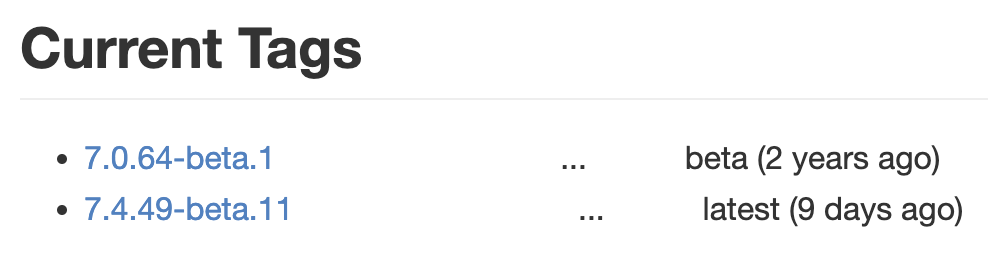
2. 如果在package.json中定义了规则，比如`"package: ^7.0.0"`，此时在`npm i package`时，就不会安装到beta版本，因为beta不符合该规则。

###### 运行 npm run xxx 的时候发生了什么

1.运行 npm run xxx的时候，npm 会先在当前目录的 node_modules/.bin 查找要执行的程序，如果找到则运行；

2.没有找到则从全局的 node_modules/.bin 中查找，npm i -g xxx就是安装到到全局目录；

3.如果全局目录还是没找到，那么就从 path 环境变量中查找有没有其他同名的可执行程序。

​    在库的源代码中的package.json里面，有一个bin字段，用于在安装时创建软链指向项目bin中的地址。

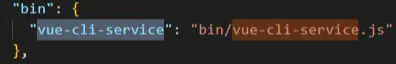

当我们npm i 整个新建的vue项目的时候，npm 将 bin/vue-cli-service.js 作为 bin 声明了。

所以在 npm install 时，npm 读到该配置后，就将该文件软链接到 ./node_modules/.bin 目录下，而 npm 还会自动把node_modules/.bin加入$PATH，这样就可以直接作为命令运行依赖程序和开发依赖程序，不用全局安装了。

假如我们在安装包时，使用 `npm install -g xxx` 来安装，那么会将其中的 bin 文件加入到全局，比如 create-react-app 和 vue-cli ，在全局安装后，就可以直接使用如 vue-cli projectName 这样的命令来创建项目了。

所以，我们无法直接在命令行执行`vue-cli-service serve`来启动项目，因为我们没有全局安装`vue-cli-service`,我们只能通过npm 来执行，因为npm会去bin目录下找到需要执行的文件。


##### bugs

1. ```shell
   # Input
   sudo npm install -g rimraf  --registry https://registry.npm.taobao.org
   # err
   Error: EACCES: permission denied
   The operation was rejected by your operating system.
   It is likely you do not have the permissions to access this file as the current user. If you believe this might be a permissions issue, please double-check the
   # resolve
   sudo npm install -g rimraf --unsage-perm  --registry https://registry.npm.taobao.org
   ```

2. ```shell
   # Input
   sudo npm install -g rimraf  --registry https://registry.npm.taobao.org
   # err
   npm WARN tar ENOENT: no such file or directory, open '/Users/zzzz/Desktop/workspace/dsyy-main/node_modules/.staging/antd-1ecf7c39/lib/calendar/locale/zh_TW.d.ts' 
   npm WARN tar ENOENT: no such file or directory, open '/Users/zzzz/Desktop/workspace/dsyy-main/node_modules/.staging/antd-1ecf7c39/lib/date-picker/locale/zh_TW.d.ts' 
   npm WARN tar ENOENT: no such file or directory, open '/Users/zzzz/Desktop/workspace/dsyy-main/node_modules/.staging/antd-1ecf7c39/lib/locale-provider/zh_TW.d.ts' 
   # resolve
   rm -rf package-lock.json && npm i
   ```


##### 快速调试npm包

1. 以@zz-common/adapter为例

2. 先在adapter项目中执行`npm link`

   这会在全局 node_modules 目录中创建一个符号链接，指向你本地的 @zz-common/adapter 包

3. 在项目中根目录下运行` npm link @zz-common/adapter`

   这会在你项目的 node_modules 目录中创建一个符号链接，指向全局 node_modules 中的 @zz-common/adapter 包

4. 这样做的好处是：

   快速迭代开发：你可以在开发 @zz-common/adapter 包的同时，在项目中实时测试和使用它，而不需要每次修改后都发布到 npm 仓库。
   避免版本冲突：你可以避免在开发过程中因为版本不一致而导致的冲突问题。

## 代理工具


### whistle

参考：[官方文档](http://wproxy.org/whistle/install.html) 、[github](https://github.com/avwo/whistle)、[使用SwitchyOmega进行浏览器代理](https://juejin.cn/post/6844904167396343815)

**使用SwitchyOmega进行浏览器代理**

1. 配置规则

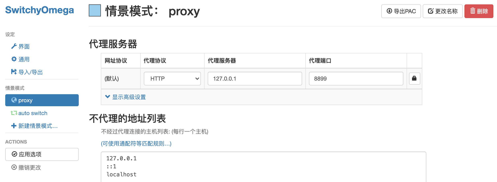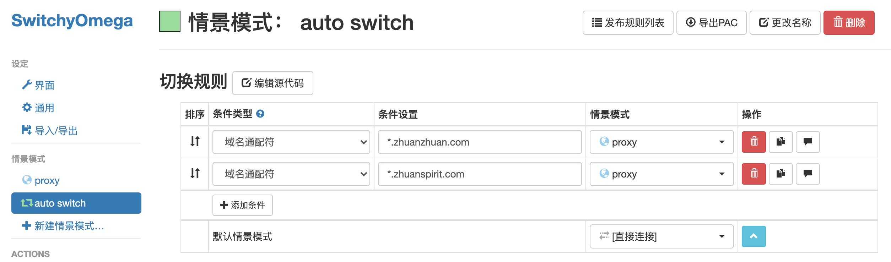

2. https设置

   **注意**：Capture HTTPS CONNECTs 一定要勾上，否则抓不到https的包

   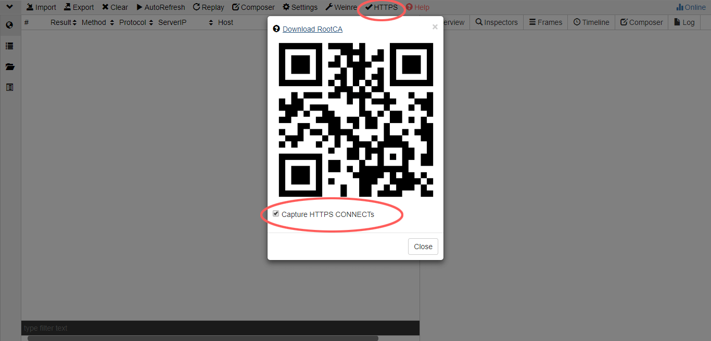

**常用规则**

```
# 一、Host
# 1.1 host
#127.0.0.1:8081 m.zhuanzhuan.com

# 1.2 组合模式
#192.168.187.2 m.zhuanzhuan.58.com m.zhuanzhuan.com s1.zhuanstatic.com img1.zhuanstatic.com

# 二、 匹配模式 - 域名、路径、正则、精确匹配、通配符匹配 - 注意：如果operatorURI不为请求路径，pattern和operatorURI位置可以调换

# 2.1 域名匹配 - http、https、ws、wss，tunnel
#127.0.0.1:3000 app.zhuanzhuan.com

# 2.2 http→https
#127.0.0.1:8081 https://m.zhuanzhuan.com

# 2.3 路径匹配
#192.168.187.2 m.zhuanzhuan.com/Mzhuanzhuan/
#192.168.171.123 m.zhuanzhuan.com/platform

# 2.4 正则匹配
#/Mzhuanzhuan/ 192.168.187.2

# 2.5 通配符
# http://*.com/abc/efg file:///User/xxx/test

# 三、请求转发
#m.zhuanzhuan.58.com m.zhuanzhuan.com

# 四、本地替换
#https://m.zhuanzhuan.com file://E:\test-whistle.html

# 五、Key-Value
#https://m.zhuanzhuan.com file://{index.html}

# 六、注入-插入到body底部
#https://m.zhuanzhuan.com html://E:\xx\test\test.html
#https://m.zhuanzhuan.com js://E:\xx\test\test.js
#https://m.zhuanzhuan.com css://E:\xx\test\test.css
#www.baidu.com html://{vConsole.html}
#www.baidu.com js://{test.js}

# 七、远程注入Log-插入到head顶部
#www.baidu.com log://{log.js}

# 八、调式Winer+自定义vConsole和eruda  注意：winer和vConsole不能同时开启
#m.zhuanzhuan.com weinre://test
#www.baidu.com log://{vConsole.js}
#www.baidu.com log://{eruda.js}

# 九、修改数据

# 9.1 修改请求头
#https://m.zhuanzhuan.com reqHeaders://{req-headers}

# 9.2 修改响应头
#https://m.zhuanzhuan.com resHeaders://{res-cors}

# 9.3 设置CORS
# 方法一
#/unionarticledetail/ resCors://{resCors}
# 方法二
#/unionarticledetail/ resHeaders://{res-cors}

# 9.4 模拟jsonp数据
#https://m.zhuanzhuan.com xtpl://{res-jsonp}

# 9.5 模拟json数据
#/getverificationcode/ resCors://{resCORS}  # // 开启跨域允许get，post请求
#/getverificationcode/ xtpl://{jsonp.json}

# 9.6 修改json数据-merge方法
#/getverificationcode/ resHeaders://{res-cors}
#/getverificationcode/ resMerge://{jsonp.json}

# 9.7 修改json数据-replace方法
#/getverificationcode/ resReplace://{res-replace.json}

# 9.8 通过插件whistle.vase模拟数据 - 支持模拟html(ejs等多模板)及json数据
# 9.8.1 模拟随机对象
# vase://random-data /getverificationcode/

# 其中random-data是插件规则文件名
# 规则内容写法
# out(random(
#    {"test": '000'},
#    {"test": '111'},
#    {"test": '222'},
#    {"test": '333'}
# ), 1000);
# 或者直接使用js
# var rand = Math.random();
# out({"test": rand},1000);
# 延时一秒后随机输出一个对象  更多使用方法移步https://github.com/whistle-plugins/whistle.vase

```


## Chrome

### 开发&调试技巧

##### 1.修改User agent

> 安卓-转转v10.10.0：
>
> Mozilla/5.0 (Linux; Android 10; OXF-AN10 Build/HUAWEIOXF-AN10; wv) AppleWebKit/537.36 (KHTML, like Gecko) Version/4.0 Chrome/88.0.4324.93 Mobile Safari/537.36 zzVersion/10.10.2 zzT/15 zzDevice/1_123_3.0 zzApp/58ZhuanZhuan
>
> 安卓-找靓机
>
> Mozilla/5.0 (Linux; Android 11; PCRM00 Build/RKQ1.200903.002; wv) AppleWebKit/537.36 (KHTML, like Gecko) Version/4.0 Chrome/83.0.4103.106 Mobile Safari/537.36 zlj{Android/11/zhaoliangji-v2/8.5.31}zlj

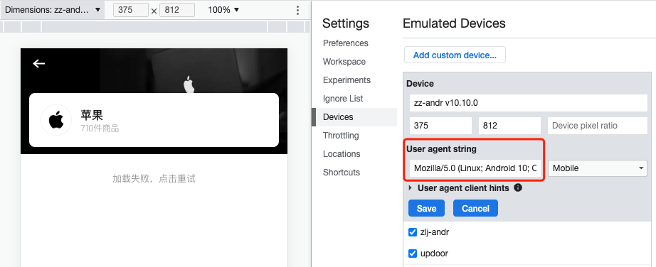


### 插件

#### Vue.js devtools

线上模式无法使用，可以在控制台输入下面代码强行开启。

```js
var Vue, walker, node;
walker = document.createTreeWalker(document.body,1);
while ((node = walker.nextNode())) {
  if (node.__vue__) {
    Vue = node.__vue__.$options._base;
    if (!Vue.config.devtools) {
      Vue.config.devtools = true;
      if (window.__VUE_DEVTOOLS_GLOBAL_HOOK__) {
        window.__VUE_DEVTOOLS_GLOBAL_HOOK__.emit("init", Vue);
        console.log("==> vue devtools now is enabled");
      }
    }
    break;
  }
}
```


## VSCode

#### 下载 & 安装

参考：[VSCode下载慢解决办法](https://blog.csdn.net/weixin_38106322/article/details/121708186)

官网下载过慢解决办法：把下载链接的域名换成`vscode.cdn.azure.cn`


#### 快捷键

| 快捷键                 | 功能                        |
| ---------------------- | --------------------------- |
| option + ← / →         | 光标移动到单词的最前面      |
| option + ↑  /  ↓       | 将当前行代码移动到上/下一行 |
| cmd + ← / →            | 光标移动到当前行最前/后     |
| cmd +  ↑  /  ↓         | 光标移动到文档最前/后       |
| 光标移动的同时选中文本 | 以上光标操作加入shift       |
| opt + shift + A        | 注释一整段代码              |
| opt + shift + F        | 格式化代码                  |


#### 插件

1. ES7 React/Redux/GraphQL/React-Native snippets

   ###### 

   | Prefix  | Method                                 |
   | ------- | -------------------------------------- |
   | `clo→`  | `console.log("object", object)`        |
   | `anfn→` | `(params) => { }`                      |
   | `nfn→`  | `const functionName = (params) => { }` |
   | `rce`   | React类组件                            |
   | `rafce` | React函数式组件                        |
   |         |                                        |
   |         |                                        |
   |         |                                        |
   |         |                                        |

   

   


#### 配置

##### setting.json

```json
{
    "workbench.colorTheme": "One Dark Pro",
    "[javascriptreact]": {
        "editor.defaultFormatter": "esbenp.prettier-vscode"
    },
    "[javascript]": {
        "editor.defaultFormatter": "esbenp.prettier-vscode"
    },
    "[typescriptreact]": {
        "editor.defaultFormatter": "esbenp.prettier-vscode"
    },
    "[json]": {
        "editor.defaultFormatter": "esbenp.prettier-vscode"
    },
    "[vue]": {
        "editor.defaultFormatter": "esbenp.prettier-vscode"
    },
    "[html]": {
        "editor.defaultFormatter": "esbenp.prettier-vscode"
    },
    "[typescript]": {
        "editor.defaultFormatter": "esbenp.prettier-vscode"
    },
    "[less]": {
        "editor.defaultFormatter": "esbenp.prettier-vscode"
    },
    "prettier.printWidth": 100,
    "prettier.semi": false,
    "prettier.singleQuote": true,
    "prettier.trailingComma": "none",
    "window.zoomLevel": 1,
    "prettier.requireConfig": true,
    "prettier.vueIndentScriptAndStyle": true,
    "editor.fontLigatures": null,
    "editor.codeActionsOnSave": { // 保存时自动修复eslint报错
      "source.fixAll.eslint": true
    }
}
```


# 工程化/效率

## Webpack

参考：[vue.config.js 的完整配置](https://juejin.cn/post/6886698055685373965#heading-22)

### Plugins

##### 1. postcss

不处理某些文件

```js
export default defineConfigVue({
  tplType: 'vue',
  group: 'platform',
  name: 'platform_pages',
  bundler: {
    dev: 'webpack',
    build: 'webpack'
  },
  mobileAdapt: {
    use: 'vw'
  },
  sentry: {
    key: '',
    project: 'platform_pages'
  },
  target: 'es5',
  urlPrefix,
  port: 8080,
  vueConfigJs: {
    runtimeCompiler: false,
    lintOnSave: true,
    devServer: {
      allowedHosts: 'all',
      port: 8080,
      https: true
    },
    pluginOptions: {
      imgPublicPath,
      assetsPublicPath,
      alias: {
        '@': resolve('src')
      }
    }
  },
  postcssExclude: [/src\/views\/businessCard\/(index|edit|previewPoster)PC.vue/i, /node_modules\/element-ui/i]
})
```


##### 2. babel-plugin-import

1.收集需要处理的Import语句

```js
ImportDeclaration(path, state) {
  const { node } = path;

  // path maybe removed by prev instances.
  if (!node) return;

  const { value } = node.source;  // import 语句from 后边的库名
  const libraryName = this.libraryName; // babel插件配置时写入的库名
  const types = this.types;
  const pluginState = this.getPluginState(state);
  if (value === libraryName) { // 必须是配置时设置库名才行
    node.specifiers.forEach(spec => { // specifiers的元素就是import进来的变量
      if (types.isImportSpecifier(spec)) { // 不满足条件说明 import 是名称空间引入或默认引入
        pluginState.specified[spec.local.name] = spec.imported.name;// localName是别名
      } else {
        pluginState.libraryObjs[spec.local.name] = true;
      }
    });
    pluginState.pathsToRemove.push(path);// 记录当前import节点，后边要删
  }
}
```

2.在各种场景下检查并新增按需加载的Import语句

```
const methods = [
  'ImportDeclaration',
  'CallExpression',
  'MemberExpression',
  'Property',
  'VariableDeclarator',
  'ArrayExpression',
  'LogicalExpression',
  'ConditionalExpression',
  'IfStatement',
  'ExpressionStatement',
  'ReturnStatement',
  'ExportDefaultDeclaration',
  'BinaryExpression',
  'NewExpression',
  'ClassDeclaration',
];
```

但无论是哪种场景下，都有一个共同点：

**都在判断了pluginState.specified[xxx.name]不为空的情况下调用了importMethod**

这样做的目的是只去替换那些有意义的import语句，也就是说import进来的变量必须使用了，才会去替换import语句；没有使用过的，只会在退出插件时（exit方法）进行删除。

3.调用importMethod

* 按需加载的命令
* 生成引入样式的命令
* 替换调用时的变量名

```js
import { Button } from '@zz-common/zz-ui';
Vue.use(Button, { v8: true })
      ↓ ↓ ↓ ↓ ↓ ↓

var _button = require('@zz-common/zz-ui/lib/button');
require('@zz-common/zz-ui/lib/button/style');
Vue.use(_button, {v8: true})
```

```js
importMethod(methodName, file, pluginState) {
  if (!pluginState.selectedMethods[methodName]) { // 处理过的import命令不再处理
    const libraryDirectory = this.libraryDirectory; // 源码所在文件 默认为lib
    const style = this.style; // 是否引入样式
    const transformedMethodName = this.camel2UnderlineComponentName 
      ? transCamel(methodName, '_')
      : this.camel2DashComponentName
        ? transCamel(methodName, '-') // 将引入的变量名CountDown转为文件名count-down
        : methodName;
    const path = winPath(	// 生成源文件路径 @zz-common/zz-ui/count-down
      this.customName ? this.customName(transformedMethodName) : join(this.libraryName, libraryDirectory, transformedMethodName, this.fileName) // eslint-disable-line
    );
    pluginState.selectedMethods[methodName] = this.transformToDefaultImport  // 记录已处理过的import语句
      ? addDefault(file.path, path, { nameHint: methodName }) // 以default方式引入
      : addNamed(file.path, methodName, path);
    // 支持各种自定义方式引入样式文件
    if (this.customStyleName) { // 根据用户指定的路径引入样式文件
      const stylePath = winPath(this.customStyleName(transformedMethodName));
      addSideEffect(file.path, `${stylePath}`);
    } else if (this.styleLibraryDirectory) { // 根据用户指定的样式目录引入样式文件
      const stylePath = winPath(
        join(this.libraryName, this.styleLibraryDirectory, transformedMethodName, this.fileName)
      );
      addSideEffect(file.path, `${stylePath}`);
    } else if (style === true) { // 引入 scss/less 一般情况
      addSideEffect(file.path, `${path}/style`);
    } else if (style === 'css') {
      addSideEffect(file.path, `${path}/style/css`);
    } else if (typeof style === 'function') {
      const stylePath = style(path, file);
      if (stylePath) {
        addSideEffect(file.path, stylePath);
      }
    }
  }
  return Object.assign({}, pluginState.selectedMethods[methodName]);
}
```

4.删除原先的import语句

```js
ProgramExit(path, state) {
	this.getPluginState(state).pathsToRemove.forEach(p => !p.removed && p.remove());
}
```


##### Gzip压缩

https://github.com/webpack-contrib/compression-webpack-plugin

```js
// vue.config.js
const webpack = require('webpack')
const { BundleAnalyzerPlugin } = require('webpack-bundle-analyzer');
const CompressionWebpackPlugin = require('compression-webpack-plugin');

module.exports = {
  configureWebpack: (config)=>{
    // 添加 BundleAnalyzerPlugin
    if (process.env.NODE_ENV === 'production') {
      config.plugins.push(
        new BundleAnalyzerPlugin({
          analyzerMode: 'static', // 可以是 'server', 'static', 'disabled'
          reportFilename: 'report.html', // 报告文件名
          openAnalyzer: true, // 打开报告页面
        })
      );
    }

    // 添加 Gzip 压缩插件
    config.plugins.push(
      new CompressionWebpackPlugin({
        filename: '[path].gz[query]', // 目标文件名
        algorithm: 'gzip', // 压缩算法
        test: /\.js$/, // 匹配文件名
        threshold: 10240, // 只有大小大于该值的资源会被压缩
        minRatio: 0.8, // 压缩率小于阈值的资源不会被压缩
      })
    )
  }
}
```


### 前端运行时的模块化设计与实现

参考：[前端运行时的模块化设计与实现](https://alienzhou.github.io/blog/15353386669734.html)、[webpack 打包后 JS 的运行过程](https://juejin.cn/post/6844903520378814471)

webpack 打包后 JS 的运行过程如下：

首先，webpack会提供`webpackJsonp`方法、`webpack_require`方法、`installedModules`对象、`modules`对象。

```js
(function(modules) {
  window["webpackJsonp"] = function webpackJsonpCallback(chunkIds, moreModules, executeModules) {
    var moduleId, result;
    for (moduleId in moreModules) {
      if (Object.prototype.hasOwnProperty.call(moreModules, moduleId)) {
        modules[moduleId] = moreModules[moduleId];
      }
    }
    if (executeModules) {
      for (i = 0; i < executeModules.length; i++) {
        result = __webpack_require__(executeModules[i]);
      }
    }
    return result;
  };
  var installedModules = {};

  function __webpack_require__(moduleId) {
    if (installedModules[moduleId]) {
      return installedModules[moduleId].exports;
    }
    var module = installedModules[moduleId] = {
      exports: {}
    };
    modules[moduleId].call(module.exports, module, module.exports, __webpack_require__);
    return module.exports;
  }
})([]);

```

​		我们的代码，以文件为单位被封装在一个函数中，这个函数提供了`module`,`exports`,`webpack_require`三个参数。这也是为什么我们能够直接使用`module`、`exports`、`require`(编译时会被处理为`webpack_require`)这三个变量。

​		可以看到，进来首先调用了之前IIFE所提供的`webpackJsonp`函数。并且这三个实参对应的形参依次为`chunkIds`、`moreModules`, `executeModules`。

```js
webpackJsonp([0], {
  "JkW7": (function(module, exports, __webpack_require__) {
    const test = __webpack_require__("zFrx");
    console.log(test);
  }),
  "zFrx": (function(module, exports) {
    const str = 'test is loaded';
    module.exports = str;
  })
}, ["JkW7"]);

```

​		让我们再回到之前的`webpackJsonp`函数。

```js
 window["webpackJsonp"] = function webpackJsonpCallback(chunkIds, moreModules, executeModules) {
    var moduleId, result;
     // 先来一手遍历，遍历的正是我们自己所写的module.
    for (moduleId in moreModules) {
      if (Object.prototype.hasOwnProperty.call(moreModules, moduleId)) {
        // 然后依次将我们的module添加到modules.
          modules[moduleId] = moreModules[moduleId];
      }
    }
     // 如果有入口文件，则执行require将其引入
    if (executeModules) {
      for (i = 0; i < executeModules.length; i++) {
        result = __webpack_require__(executeModules[i]);
      }
    }
     // 至此，打开我们的运行代码的大门~
    return result;
  };
```

​		继续，上边说到了引入我们的入口文件。那接下来就看看`webpack_require`是怎么一回事！

```js
  // 参数是module的ID，很好，继续往下走
  function __webpack_require__(moduleId) {
   // installedModules是用于缓存的，现在是在执行入口文件
   // 肯定没有缓存，直接先略过
    if (installedModules[moduleId]) {
      return installedModules[moduleId].exports;
    }
    // 很明显，由于上一步我们没有缓存可取，这一步直接开始往缓存对象里添加了
    var module = installedModules[moduleId] = {
      exports: {}
    };
      // 但是，上一步仅仅是创建了一个的空的缓存对象，实际的内容从这开始添加~
      // 这步代码乍一看很复杂，其实不然。
      // 首先，modules[moduleId]其实就是之前我们说到的封装了我们自己代码的那个函数，它已经被全数添加到了modules这个对象中。
      // 只不过，现在这个函数中的this指向了module.exports，其实就是缓存对象installedModules[moduleId].
    modules[moduleId].call(module.exports, module, module.exports, __webpack_require__);
    return module.exports;
  }
```

​		接着，在让我们详细看看，`modules[moduleId].call(module.exports, module, module.exports, __webpack_require__)`;是如何执行的。

```
 "JkW7": (function(module, exports, __webpack_require__) {
    const test = __webpack_require__("zFrx");
    console.log(test);
  }),
  "zFrx": (function(module, exports) {
    const str = 'test is loaded';
    module.exports = str;
  })
  // 以上，就是我们的两个module，其中，Jkw7是入口，也是最先被执行的那一个，我们就从他开始。
  // 好巧不巧，刚进来又是一个require.没关系，让我们慢慢捋。
  function __webpack_require__(zFrx) {
  // 这些之前都有叙述，不多bb
    if (installedModules[zFrx]) {
      return installedModules[zFrxd].exports;
    }
    var module = installedModules[zFrx] = {
      exports: {}
    };
    // 唯一不同的是这个地方，上次我们执行的是JkW7，而这次是zFrx
    modules[zFrx].call(module.exports, module, module.exports, __webpack_require__);
    return module.exports;
  }
```

​		继续！

```
// 这就是zFrx所对应的函数。
"zFrx": (function(module, exports) {
    const str = 'test is loaded';
    module.exports = str;
  })
// 一下就执行完了 很快傲~
// 就干了一件事，给module.exports 赋值
// 而此时传进来的module其实是 installedModules[zFrx]的引用
// 也就是说我们把zFrx所暴露出的东西交给了installedModules来管理。
// 在之后的return 则是把zFrx暴露出来的东西给return了
```

​      `return` 之后我们再回到入口文件`JkW7`的地盘

```
"JkW7": (function(module, exports, __webpack_require__) {
    const test = __webpack_require__("zFrx");
    console.log(test);
  }),
  // 刚才因为Jkw7上来就是require让我们绕了一圈
  // 于是我们的test变量现在应该接收到了zFrx所暴露的str = 'test is loaded';
  // 终于打印出test，程序运行结束~
```


## TS

##### bugs

1. tsconfig报错

   ```
   在配置文件“/Users/zzzz/Desktop/workspace/magic/common/magic_newzz_demo6/tsconfig.json”中找不到任何输入。指定的 "include" 路径为“["src/**/*.ts","src/**/*.tsx","src/**/*.vue","src/components/useless.js"]”，"exclude" 路径为“["node_modules"]”。
   ```

   解决：是因为include路径下没有任何ts文件，在include路径中添加任意ts文件即可

## Babel

参考：[开发一个babel插件](https://github.com/barrenroad/doc/blob/master/%E5%B7%A5%E5%85%B7/Babel/%E5%A6%82%E4%BD%95%E5%BC%80%E5%8F%91%E4%B8%80%E4%B8%AAbabel%E6%8F%92%E4%BB%B6.md)

## Library

###### 1. [Moment](http://momentjs.cn/docs/)

###### 2. [dnd-kit](https://docs.dndkit.com/introduction/getting-started)

**DndContext：**可拖动组件的根。Droppable和Draggable都需要包裹在DndContext中才能生效。

```jsx
<DndContext
  sensors={sensors} // 定义传感器（keyboard，pointer...）
  collisionDetection={closestCenter} // 拖拽中的效果
  onDragEnd={handleGroupDragEnd} // 拖拽结束触发
>
	<Draggable />
	<Droppable />
</DndContext>
```

**Droppable：**可放置区域。

```jsx
import {useDroppable} from '@dnd-kit/core';

function Droppable() {
  const {setNodeRef} = useDroppable({
    id: 'unique-id', // 放置区域的唯一ID
    data: {
    	accepts: ['type1', 'type2'], // 可接受的Draggable类型
    },
  });
  
  return (
    <div ref={setNodeRef}> // 绑定DOM使其变为Droppable
      /* Render whatever you like within */
    </div>
  );
}
```

**Draggable：**可拖动元素。

```jsx
import {useDraggable} from '@dnd-kit/core';
import {CSS} from '@dnd-kit/utilities';

function Draggable() {
  const {attributes, listeners, setNodeRef, transform} = useDraggable({
    id: 'unique-id', // 可拖拽元素唯一ID
    data: {
      type : 'type1',	// 可拖拽元素类型
    },
  });
  const style = {
    transform: CSS.Translate.toString(transform), // 处理拖拽时的css
  };
  
  return (
    <button ref={setNodeRef} style={style} {...listeners} {...attributes}>
      /* Render whatever you like within */
    </button>
  );
}
```

**Sensors：**传感器，用于检测不同的操作方法。

```jsx
import {
  DndContext,
  KeyboardSensor,
  MouseSensor,
  TouchSensor,
  useSensor,
  useSensors,
} from '@dnd-kit/core';

function App() {
  const mouseSensor = useSensor(MouseSensor);
  const touchSensor = useSensor(TouchSensor);
  const keyboardSensor = useSensor(KeyboardSensor);
  
  const sensors = useSensors(
    mouseSensor,
    touchSensor,
    keyboardSensor,
  );
  
  return (
    <DndContext sensors={sensors}>
      {/* ... */}
    </DndContext>
  )
}
```

**案例1:可拖动分组排序**

```jsx
// ItemConfig.jsx
import React, { useRef } from 'react'
import { useModel } from 'umi'
import { Tabs, Card, Button } from 'antd'
import { Modal } from '@zz-common/zant-ui'
import {
  DndContext,
  closestCenter,
  KeyboardSensor,
  PointerSensor,
  useSensor,
  useSensors,
} from '@dnd-kit/core'
import {
  arrayMove,
  SortableContext,
  sortableKeyboardCoordinates,
  verticalListSortingStrategy,
} from '@dnd-kit/sortable'
import { generateId } from '@/utils/util'
import SortableItem from './SortableItem'
import ItemForm from './ItemForm'

const ItemConfig = () => {
  const itemRef = useRef()
  const sensors = useSensors(
    useSensor(PointerSensor),
    useSensor(KeyboardSensor, {
      coordinateGetter: sortableKeyboardCoordinates,
    })
  )
  const { viewList, viewIndex, pageIndex, setViewList } = useModel('useConfig')
  const { pageList } = viewList[viewIndex]
  const { groupList } = pageList[pageIndex]
  const groupSortItems = groupList.map((_, index) => `${index + 1}`)
  const mapItems = groupList.reduce((obj, groupItem, index) => {
    const groupId = `${index + 1}`
    obj[groupId] = groupItem.itemList.map((item) => item.id)
    return obj
  }, {})

  // 拖拽排序组
  const handleGroupDragEnd = (event) => {
    const { active, over } = event

    if (active.id !== over.id) {
      const oldIndex = groupSortItems.indexOf(active.id)
      const newIndex = groupSortItems.indexOf(over.id)
      const sortedGroupList = arrayMove(groupList, oldIndex, newIndex)
      pageList[pageIndex].groupList = sortedGroupList
      setViewList([...viewList])
    }
  }

  // 拖拽排序项
  const handleDragEnd = (event, groupId, groupIndex) => {
    const { active, over } = event

    if (active.id !== over.id) {
      const oldIndex = mapItems[groupId].indexOf(active.id)
      const newIndex = mapItems[groupId].indexOf(over.id)
      const sortedItemList = arrayMove(groupList[groupIndex].itemList, oldIndex, newIndex)
      groupList[groupIndex].itemList = sortedItemList
      setViewList([...viewList])
    }
  }

  // 删除表单项
  const handleDelete = (itemIndex, groupIndex) => {
    groupList[groupIndex].itemList.splice(itemIndex, 1)
    setViewList([...viewList])
  }

  // 编辑表单项
  const handleShowEdit = (item, itemIndex, groupIndex) => {
    Modal.show({
      title: '编辑表单项',
      okText: '确定',
      cancelText: '取消',
      content: <ItemForm ref={itemRef} data={item} />,
      onOk: async () => {
        const { itemList } = groupList[groupIndex]
        // eslint-disable-next-line @typescript-eslint/no-shadow
        const items = itemList.map((item) => item.id)
        const newItem = await itemRef.current.submit()
        if (!newItem.id) {
          newItem.id = generateId(items)
        }
        if (item) {
          itemList[itemIndex] = newItem
        } else {
          itemList.push(newItem)
        }
        setViewList([...viewList])
      },
    })
  }

  return (
    <Card
      title="表单项配置"
      size="small"
      actions={[
        <Button type="primary" key="save">
          保存
        </Button>,
      ]}
    >
      <Tabs>
        {pageList.map((page) => (
          <Tabs.TabPane tab={page.title} key={page.id} />
        ))}
      </Tabs>
      <DndContext
        sensors={sensors}
        collisionDetection={closestCenter}
        onDragEnd={handleGroupDragEnd}
      >
        <SortableContext items={groupSortItems} strategy={verticalListSortingStrategy}>
          {groupSortItems.map((groupId, groupIndex) => (
            <SortableItem
              key={groupId}
              id={groupId}
              title={groupList[groupIndex].title}
              edit={false}
            >
              <DndContext
                sensors={sensors}
                collisionDetection={closestCenter}
                onDragEnd={(event) => handleDragEnd(event, groupId, groupIndex)}
              >
                <SortableContext items={mapItems[groupId]} strategy={verticalListSortingStrategy}>
                  {mapItems[groupId].map((id, index) => {
                    const item = groupList[groupIndex].itemList[index]
                    return (
                      <SortableItem
                        key={id}
                        id={id}
                        child
                        title={`${item.valueGetter}${item.ks}`}
                        onEdit={() => handleShowEdit(item, index, groupIndex)}
                        onDelete={() => handleDelete(index, groupIndex)}
                      />
                    )
                  })}
                </SortableContext>
              </DndContext>
            </SortableItem>
          ))}
        </SortableContext>
      </DndContext>
    </Card>
  )
}

export default ItemConfig


// SortableItem.jsx
import React from 'react'
import { Button } from 'antd'
import { useSortable } from '@dnd-kit/sortable'
import { CSS } from '@dnd-kit/utilities'
import { MinusCircleOutlined, FormOutlined, BorderHorizontalOutlined } from '@ant-design/icons'

const SortableItem = (props) => {
  const { id, title, child = false, edit = true, onDelete, onEdit } = props
  const { attributes, listeners, setNodeRef, transform, transition } = useSortable({ id })

  const style = {
    transform: CSS.Transform.toString(transform),
    transition,
    paddingLeft: child ? 30 : 0
  }

  const lineStyle = {
    cursor: 'move',
    display: 'flex',
    padding: '4px 0',
    justifyContent: 'space-between',
    alignItems: 'center'
  }

  return (
    <div ref={setNodeRef} style={style} {...attributes} {...listeners}>
      <div style={lineStyle}>
        <div>
          <BorderHorizontalOutlined />
          &nbsp;
          {title}
        </div>
        {edit && (
          <div>
            <Button type="text" icon={<MinusCircleOutlined />} size="small" onClick={onDelete} />
            <Button type="text" icon={<FormOutlined />} size="small" onClick={onEdit} />
          </div>
        )}
      </div>
      {props.children}
    </div>
  )
}

export default SortableItem

```

###### 3. react-copy-to-clipboard 

```jsx
// 组件式
npm install --save react-copy-to-clipboard -S
#引入插件
#this.onCopy  复制之后执行的方法
import {CopyToClipboard} from 'react-copy-to-clipboard';
import { CopyOutlined } from '@ant-design/icons';
<CopyToClipboard
  text={captcha}
  onCopy={() => { message.success('复制成功~') }}>
  <Button icon={<CopyOutlined />} />
</CopyToClipboard>
```

###### 4. copy-to-clipboard 

```jsx
// 函数式
import copy from 'copy-to-clipboard'
copy(res.initialPassword)
```

###### 5. [JSZip](https://stuk.github.io/jszip/documentation/examples.html)

```js
// 关键代码
const { RawSource } = require("webpack-sources");
const JSZip = require("jszip");
let zip = new JSZip();

Object.keys(compilation.assets).forEach((filename) => {
  // 获取文件内容
  const source = compilation.assets[filename].source();
  // 添加文件到zip中
  zip.file(filename, source);
}
// 生成zip文件
zip.generateAsync({ type: "nodebuffer" }).then((content) => {
  // 生成zip文件后的回调
  compilation.assets['zipName'] = new RawSource(content);// 表示不带SourceMap的源代码。
  callback();
});
```

###### 6. swiper

配置选项：https://www.swiper.com.cn/api/index.html

**安装坑：**

**坑1**
按照上图安装方法，npm将安装最新的vue-awesome-swiper（@4），对应的是swiper6，但是国内暂时没有swiper6的文档，意味着没法参考使用方法，有问题也不好去网上找

**坑2**
最新版vue-awesome-swiper的安装姿势是这样子滴：

```
npm install swiper vue-awesome-swiper --save  // 多的这一个swiper会使我们安装与vue-awesome-swiper不兼容的版本
```

对比vue-awesome-swiper版本3

```
npm install vue-awesome-swiper --save-dev  
```

**坑3**

网上的用法，然而由于之前默认安装的最新版的swiper6，文件路径跟swiper4不一样，vue报错，说找不到swiper.css

```
import { swiper, swiperSlide } from "vue-awesome-swiper";
import "swiper/dist/css/swiper.css";
```

**出坑之道**

安装指定版本的vue-awesome-swiper

```
npm install vue-awesome-swiper@3 --save-dev
```

````vue
//  vue@2.5.2，vue-awesome-swiper@3.1.3
<template>
  <div class="recommendPage">
    <swiper :options="swiperOption" ref="mySwiper">
      <swiper-slide>I'm Slide 1</swiper-slide>
      <swiper-slide>I'm Slide 2</swiper-slide>
      <swiper-slide>I'm Slide 3</swiper-slide>
      <div class="swiper-pagination" slot="pagination"></div>
      <div class="swiper-button-prev" slot="button-prev"></div>
      <div class="swiper-button-next" slot="button-next"></div>
    </swiper>
  </div>
</template>
 
<script>
// 引入插件
import { swiper, swiperSlide } from "vue-awesome-swiper";
import "swiper/dist/css/swiper.css";
 
export default {
  components: {
    swiper,
    swiperSlide
  },
  data() {
    return {
      swiperOption: {
        loop: true,
        autoplay: {
          delay: 3000,
          stopOnLastSlide: false,
          disableOnInteraction: false
        },
        // 显示分页
        pagination: {
          el: ".swiper-pagination",
          clickable: true //允许分页点击跳转
        },
        // 设置点击箭头
        navigation: {
          nextEl: ".swiper-button-next",
          prevEl: ".swiper-button-prev"
        }
      }
    };
  },
  computed: {
    swiper() {
      return this.$refs.mySwiper.swiper;
    }
  },
  mounted() {
    // current swiper instance
    // 然后你就可以使用当前上下文内的swiper对象去做你想做的事了
    console.log("this is current swiper instance object", this.swiper);
    // this.swiper.slideTo(3, 1000, false);
  }
};
</script>
<style scoped >
.recommendPage .swiper-container{
  position: relative;
  width: 100%;
  height: 200px;
  background: pink;
}  
.recommendPage .swiper-container .swiper-slide{
  width: 100%;
  line-height: 200px;
  background: yellowgreen;
  color: #000;
  font-size: 16px;
  text-align: center;
}
</style>
````

**使用坑**

有时候开启了loop也会在最后一张卡住

解决：

```jsx
<swiper v-if="imgList.length > 0" >
```

###### 7. [cleave](https://github.com/nosir/cleave.js/blob/master/doc/options.md#)

格式化处理文本输入

###### 8.[vue-scrollto](https://vue-scrollto.rigor789.com/docs/#programatically)

vue滑动

###### 9.fontmin

字体包处理

###### 10.[markdown-to-jsx](https://www.npmjs.com/package/markdown-to-jsx)

## Docker

[MAC安装](https://juejin.cn/post/7319143646586339364?searchId=20240207104414BDA3BDEAA020FC7DDCA0)


## Website

1. [HTML转义字符](http://114.xixik.com/character/)
2. [jsdelivr](https://www.jsdelivr.com/) 免费CDN
3. 

## Reg

##### 常用正则

1. 手机号：`/^1[3-9]\d{9}$/`
2. 邮箱 :  `/^[A-Za-z\d]+([-_.][A-Za-z\d]+)*@([A-Za-z\d]+[-.])+[A-Za-z\d]{2,4}$/`,
3. 匹配多行：`new RegExp(`(${start}.*?${end})`, 'gms');`


## Uglifyjs

```SHELL
uglifyjs /Users/zzzz/Desktop/workspace/zz-utils/dist/static/js/1.2.33/index.js -c -m  -o /Users/zzzz/Desktop/workspace/zz-utils/dist/static/js/1.2.33/index2.js
```


## Code Block

#### JS

##### 1. 循环调用异步方法

```js
 	// 注意：需要在for外层的方法名上加 async
 	// 效果：按顺序执行，前一个未返回，后一个不会执行
  for (let i = 0; i < appCodes.length; i += 1) {
    // eslint-disable-next-line no-await-in-loop
    const newAuthInfo = await newCommonLogin({ appCode: appCodes[i] })
    newPermissions.push(newAuthInfo?.permissionInfo?.resources.flat(1))
  }

 // 效果：没有按照顺序执行
 appCodes.forEach(async (appCode) => {
    const newAuthInfo = await newCommonLogin({ appCode })
    newPermissions.push(newAuthInfo?.permissionInfo?.resources.flat(1))
  })
```


#### 环境/终端

##### 1. 区分IOS

```js
const isIOS = !!navigator.userAgent.match(/\(i[^;]+;( U;)? CPU.+Mac OS X/)
```


#### 加密/签名相关

##### 1. 以时间戳作为签

```js
window.btoa(encodeURIComponent(Date.now())).split('').reverse().join('')
```

这行代码是用 JavaScript 编写的。它的作用是将当前的时间戳（以毫秒为单位）转换成 base64 编码，并将编码后的字符串反转。

具体来说，它的执行流程如下：

1. 获取当前时间戳，使用 `Date.now()` 方法获取。这个方法返回当前时间距离 1970 年 1 月 1 日 00:00:00 UTC 的毫秒数。
2. 使用 `encodeURIComponent()` 方法对时间戳进行编码。这个方法将时间戳中的特殊字符进行转义，以便在 URL 中使用。
3. 使用 `window.btoa()` 方法将编码后的字符串进行 base64 编码。这个方法将字符串转换成 base64 编码的形式，以便在网络传输中使用。
4. 将编码后的字符串使用 `split('')` 方法拆分成一个字符数组。
5. 使用 `reverse()` 方法将字符数组反转。
6. 使用 `join('')` 方法将反转后的字符数组拼接成一个字符串。

最终得到的字符串是时间戳的 base64 编码，并且经过了反转操作。


#### 数据处理

##### 1.字符串去除中的换行、空白、多余符号

```js
 values.businessLineListStr = String(values.businessLineListStr)
 .replace(/[\r\n]/g, ',')
 .replace(/,{2,}/g, ',')
 .replace(/,$/g, '')
```

##### 2.删除对象数组中的某一项

```js
const arr = dataSource.filter((item) => item.id !== id)
```


# 框架

## Vue

#### Vue & React 中this指向问题

本周开发Vue项目的时候，copy另一个项目中的相似模块后，出现了js能拿到最新的data，但是页面仍然展示初始值的情况。

一开始以为可能是页面渲染的问题，尝试使用$set、watch等方法，但还是没有解决。最终发现是copy过来的方法 写法有问题。。。

直接原因是：copy的部分是用箭头函数定义的方法，而我的项目中使用的类组件的形式，应该用普通方法的形式去定义。

根本原因是：JS Class中的普通方法会被挂载到prototype上，箭头函数会被放到construtor中。Vue会将constructor中的属性作为Vue实例的data，prototype中的属性作为Vue实例的methods并通过bind修改this指向到Vue实例。那最终就是导致我调用这个箭头函数的时候，他的this指向应该是指向的Class。

**在React中，要求方法使用箭头函数来写：**

```js
 class ReactDemo {
    // ✅推荐
    arrowFunMethod = () => {
      console.log('THIS in arrow function:', this)
    }
    // ❌this指向丢失
    ordinaryFunMethod() {
      console.log('THIS in oridinary function:', this)
    }
  }
  const reactIns = new ReactDemo()
  let arrowFunWithoutCaller = reactIns.arrowFunMethod
  let ordinaryFunWithoutCaller = reactIns.ordinaryFunMethod
  arrowFunWithoutCaller()
  ordinaryFunWithoutCaller()
```

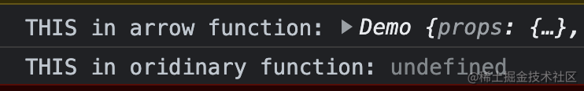

普通函数的this是根据调用对象来决定的，所以当我们`reactIns.ordinaryFunMethod()`这样调用时，`ordinaryFunMethod`中的this指向`reactIns`，没有问题会输出`THIS in oridinary function: ReactDemo {arrowFunMethod: ƒ}`，但是如果我们像上面那样赋值之后直接调用`ordinaryFunWithoutCaller()`，由于此时没有调用对象，所以this会指向undeined

上边的类的写法其实只是个语法糖，实际上会长这个样子：

```js
'use strict'
function ReactDemo() {
  // ✅推荐
  this.arrowFunMethod = () => {
    console.log('THIS in arrow function:', this)
  }
}
// ❌this指向丢失
ReactDemo.prototype.ordinaryFunMethod = function ordinaryFunMethod() {
  console.log('THIS in oridinary function:', this)
}
const reactIns = new ReactDemo()
```

js的Class中，方法如果使用箭头函数的写法，会直接将方法赋给实例，变成了实例的一个属性，并且最重要的是：它是在「构造函数的作用域Constructor」被定义的。而普通方法的形式将会挂载到原型链上边。所以当我们调用`arrowFunMethod`时，this指向实例，调用`ordinaryFunMethod`时，this指向Class ReactDemo。

JS Class中的普通方法会被挂载到prototype上，箭头函数会被放到construtor中。Vue会将constructor中的属性作为Vue实例的data，prototype中的属性作为Vue实例的methods并通过bind修改this指向到Vue实例。那最终就是导致我调用这个箭头函数的时候，他的this指向应该是指向的Class

**在Vue中，要求使用普通方法来写：**

```vue
const Demo = Vue.createApp({
  data() {
      return {}
  },
  methods:{
      // ❌this指向丢失
      arrowFunMethod:()=>{
          console.log('THIS in arrow function:',this)
          this.someState = 'arrow state'
      },
      // ✅推荐
      ordinaryFunMethod(){
          console.log('THIS in oridinary function:',this)
          this.someState = 'ordinary state'
      }
  },
  template:`<div></div>`
})
Demo.mount('#root')
```

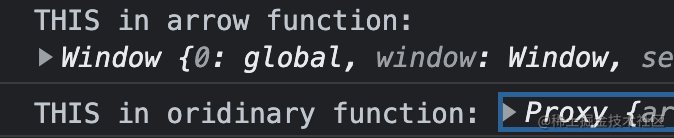

这主要是因为Vue对于组件方法的处理：

```js
function initMethods(vm: Component, methods: Object) {
  for (const key in methods) {
    vm[key] = bind(methods[key], vm)
  }
}
```

这里Vue会给每个方法绑定this到vue实例上，但是箭头函数是没有this的，也就无从修改。因此箭头函数中的this要去父级作用域中查找也就是window对象。

**总结：**「为什么react中用箭头函数，vue中用普通函数」

这种差异是由于我们写的react是一个类，而vue是一个对象导致的。在类中定义只有箭头函数才能根据作用域链找到组件实例；在对象中，只有拥有自身this的普通函数才能被修改this指向，被vue处理后绑定到组件实例。

#### Bugs

1. vue.runtime.esm.js:4560 [Vue warn]: Error in setup: "Error: [vue-composition-api] No vue dependency found."

   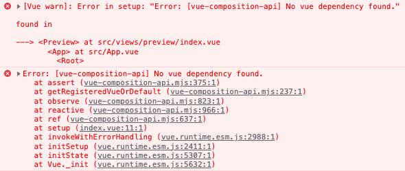

   没有注册，需要在入口文件main.js中注册`Vue.use(VueCompositionAPI)`

## React

[React]: ../react/react.md

### 性能优化

参考：[「react进阶」年终送给react开发者的八条优化建议](https://juejin.cn/post/6908895801116721160#heading-21)

1. 尽量不在js/ts文件中调用jsx

   ```js
   // js/ts
   import Images from '@/components/Images'
   return Images({ data: val })
   //这样会导致调用的组件(B)与调用js/ts的组件(A)成为平级关系，而非父子关系，因此，当B更新状态时，必然会引起A的更新，这样可能会带来不必要的更新。建议使用jsx来处理。
   ```

   ```jsx
   // jsx
   const Formater = ({ val, type }) => {
     try {
       // 1.时间：
       // 1.1毫秒转时间
       if (type === 1) {
         return val ? day(parseInt(val, 10)).format('YYYY-MM-DD HH:mm:ss') : ''
       }
       // 1.2日期格式化
       if (type === 2) {
         return val ? day(val).format('YYYY-MM-DD HH:mm:ss') : ''
       }
   
       // 2.金额：
       // 2.1分转元
       if (type === 3) {
         return `¥ ${number.fenToYuan(val, 2)}`
       }
   
       // 3.富文本：
       // 3.1图片
       if (type === 4) {
         return <Images data={val} />
       }
   
       return val
     } catch (err) {
       return 'err: 格式化方式有误'
     }
   }
   ```

   

   


### Code Block

1. useStateCallBack

   封装useState使其支持回调

   ```jsx
   import React from "react";
   
   function useStateCallback(data) {
     const [state, setState] = React.useState(data);
   
     const cbQueueRef = React.useRef([]);
   
     function setStateAndCallback(value, cb) {
       cbQueueRef.current = [...cbQueueRef.current, cb];
   
       setState(value);
     }
   
     React.useEffect(() => {
       if (cbQueueRef.current.length > 0) {
         cbQueueRef.current.forEach((fn) => {
           if (typeof fn === "function") {
             fn(state);
             cbQueueRef.current.shift();
           }
         });
       }
     }, [state]);
   
     return [state, setStateAndCallback];
   }
   
   export { useStateCallback };
   ```


### Bugs

##### 元素切换导致页面抖动

在切换tab时，由于在数据加载出来之前，使用了spin组件去占位，等数据加载出来又变为原先的组件，导致页面会抖动。

解决办法：不要销毁原先的组件。


## Umi

### API

##### history

跳转并关闭当前页面

```js
history.push({
  pathname: "/sale/order-list",
  needClose: true, // 关闭当前页
  refresh: true // 干啥的？没试过
})
```

##### useParams

获取路由中的参数

```jsx
// route
{
  path: '/entity-storage/entity-info/:id?',
  name: '仓储实物',
  hideInMenu: true,
  component: '@/pages/entityInfo'
}
// use
import { Link, useParams } from 'umi'
const params = useParams()
const {id} = params
```

##### useModel

1. 用于全局共享数据。

   ```jsx
   // src/models/useCommon.js
   import { useState, useEffect } from 'react'
   import { getBusinessTypeList } from '@/services/common'
   
   const clubInfoTypes = [
     { value: '0', label: '普通商品' },
     { value: '1', label: '拍卖商品' },
     { value: '2', label: '一元购商品' },
     { value: '3', label: '无价商品' },
     { value: '4', label: '圈子商品' },
     { value: '5', label: '秒杀商品' },
     { value: '6', label: '满减商品' }
   ]
   
   export default function useCommon() {
     const [businessTypes, setBusinessTypes] = useState([])
   
     useEffect(() => {
       getBusinessTypeList().then((res) => {
         const list = res.list.map((item) => ({
           value: item.code,
           label: item.name
         }))
         setBusinessTypes(list)
       })
     }, [])
   
     return { businessTypes, clubInfoTypes }
   }
   
   // src/pages/clubList/index.jsx
   const { businessTypes, clubInfoTypes } = useModel('useCommon')
   ```

2. 全局初始化数据

   ```jsx
   // app.jsx
   export async function getInitialState() {
     return {
       outerNet: true,
     }
   }
   
   // use
   import { useModel } from 'umi'
   const { initialState: { outerNet } } = useModel('@@initialState')
   ```

   

##### useLocation

获取location对象，可以从中获取`hash`、`pathname`、`query`、`search`。

从`location`对象中获取的`query`对象，是同一个对象，前提是在跳转路由或修改`query`时保持原对象的地址引用。

```jsx
const location = useLocation()
const { query } = location

onClick={() => {
  query.code = Math.random()
  history.push({
    query: query,
  })
}}
```


### Umijs/plugins

##### plugin-access

https://umijs.org/zh-CN/plugins/plugin-access

###### 路由校验

在route.js中添加access属性，无权限将无法访问该页面。

```
{
  path:'/tempCaptcha',
  name:'临时验证码',
  icon:'AuditOutlined',
  component:'./tempCaptcha',
  access:'REY15011'
},
```

src目录下有一个access.js用于处理校验逻辑。

###### 组件校验

https://gitlab.zhuanspirit.com/zz-fe-trade/distribution_kit/tree/master/src/components/CheckAuth

```jsx
import CheckAuth from '@/components/CheckAuth'
<CheckAuth permissionCode="COUNT_CREATE">
  <Button type="primary" htmlType="submit" style={{ width: 102 }}>
    创建
  </Button>
</CheckAuth>
```

###### 验证流程

1.获取权限信息。进入到转转页面并登陆后，会发送一个请求getUesrAllResource获取当前用户的所有权限menuList。

2.设置权限集合对象。umi定义`src/access.ts` 为权限定义文件，该文件放回一个对象，以{‘权限码’：boolean}存储权限信息。

3.路由校验。在约定式路由文件中添加access属性，值就是权限码，如果权限集合中该值为undefined或false，则无法访问。

```
export const routes =  [
  {
    path: '/pageA',
    component: 'PageA',
    access: 'canReadPageA', // 权限定义返回值的某个 key
  }
]
```

4.组件校验。

```jsx
umi提供了<Access />组件，但是我们对其进行了封装：
<CheckAuth permissionCode="COUNT_CREATE" />
```

```js
// CheckAuth/index.jsx
import React from 'react'
import { useAccess, Access } from 'umi'
import { BTN_AUTH_CODE } from './config'

const CheckAuth = ({ children, permissionCode }) => {
  // useAccess 用于获取access.ts返回的权限集合
  const access = useAccess()
  // 根据BTN_AUTH_CODE中定义的各个组件所需要的权限，去access权限集合中查找是否拥有该权限
  const accessible = access[BTN_AUTH_CODE[permissionCode]]
	// accessible属性用于校验权限 boolean
  return <Access accessible={accessible}>{children}</Access>
}

export default CheckAuth
```

```js
// CheckAuth/config.js
/**
 * 按钮权限码-常量
 * 由pm提供实际权限码
 */
export const BTN_AUTH_CODE = {
//	'权限码的别名'  ： '实际生效的权限码'
  COUNT_SWITCH_UIDANDTEL: 'UC-switchUidAndMobile',
  COUNT_CREATE: 'UC-creatNewUid',
  COUNT_SWITCH_ZZANDZLJ: 'UC-switchZzUidAndZljUid',
  COUNT_UNBIND_MOBILE: 'UC-unBindUserMobile', // 解绑手机
  COUNT_BIND_MOBILE: 'UC-bindUserMobile', // 换绑手机
  COUNT_UPDATE_NAME: 'UC-updateUserNickName', // 修改昵称
  COUNT_WITHDRAW_ACCOUNT: 'UC-withdrawUserAccunt', // 注销账号
  COUNT_SHOW_USER_MOBILE: 'UC-showUserMobile' // 手机号明文
}
```


## FAQ：

#### 代理静态资源到本地后，一直 restart 刷新页面

[代理静态资源到本地后，一直 restart 刷新页面](https://umijs.org/docs/introduce/faq#%E4%BB%A3%E7%90%86%E9%9D%99%E6%80%81%E8%B5%84%E6%BA%90%E5%88%B0%E6%9C%AC%E5%9C%B0%E5%90%8E%E4%B8%80%E7%9B%B4-restart-%E5%88%B7%E6%96%B0%E9%A1%B5%E9%9D%A2)

[建议提供socket retry开关，而且retry次数有bug](https://github.com/umijs/umi/issues/365)

[umi dev 之后页面一直在不停地刷新怎么办？](https://github.com/umijs/umi/issues/1863)

[线上资源代理到本地，umi dev 之后页面一直在不停地刷新](https://github.com/umijs/umi/issues/2097)

[用域名不带端口号访问，页面会不断刷新](https://github.com/umijs/umi/issues/8470)

```
1.启动时设置SOCKET_SERVER
"dev": "SOCKET_SERVER=http://127.0.0.1:6001 umi dev",
2.配置.env文件
PORT=6002
SOCKET_SERVER=http://127.0.0.1:6002
```


## Qiankun

#### JS隔离

##### 快照沙箱

原理：在沙箱激活时，将此时的window状态记录下来，等到沙箱关闭时，再将window恢复，同时记录发生变化的属性，等到再次打开沙箱时，将这些变化再次恢复到window中，以便沙箱能恢复到上次关闭时的状态。

缺点：

- 会改变全局window的属性，如果同时运行多个微应用，多个应用同时改写window上的属性，势必会出现状态混乱，这也就是为什么快照沙箱无法支持多各微应用同时运行的原因。关于这个问题，下文中**支持多应用的代理沙箱**可以很好的解决这个问题；
- 会通过`for(prop in window){}`的方式来遍历window上的所有属性，window属性众多，这其实是一件很耗费性能的事情。关于这个问题**支持单应用的代理沙箱**和**支持多应用的代理沙箱**都可以规避。

```JS
class SnapshotSandBox{
    windowSnapshot = {};
    modifyPropsMap = {};
    // 沙箱激活时
    active(){
      	// 遍历激活时window对象的属性，并记录下来作为快照，留着以后恢复和对比使用
        for(const prop in window){
            this.windowSnapshot[prop] = window[prop];
        }
      	// 如果是再次激活（非首次激活），将上一次激活期间对window的属性操作恢复至上一次沙箱关闭时的状态
        Object.keys(this.modifyPropsMap).forEach(prop=>{
            window[prop] = this.modifyPropsMap[prop];
        });
    }
    inactive(){
        for(const prop in window){
          	// 沙箱关闭时，如果某个window属性在激活期间发生了改变，则记录下来，并利用激活时的快照将其恢复如初
            if(window[prop] !== this.windowSnapshot[prop]){
                this.modifyPropsMap[prop] = window[prop];
                window[prop] = this.windowSnapshot[prop];
            }
        }
    }
}
// 验证:
let snapshotSandBox = new SnapshotSandBox();
snapshotSandBox.active();
window.city = 'Beijing';
console.log("window.city-01:", window.city);
snapshotSandBox.inactive();
console.log("window.city-02:", window.city);
snapshotSandBox.active();
console.log("window.city-03:", window.city);
snapshotSandBox.inactive();

//输出：
//window.city-01: Beijing
//window.city-02: undefined
//window.city-03: Beijing
```

> 注：**沙箱激活** 就是此时我们的微应用处于运行中，这个阶段有可能对window上的属性进行操作改变；**沙箱失活** 就是此时我们的微应用已经停止了对window的影响


##### 代理沙箱

原理：内部创建一个fakeWindow，使用proxy来处理沙箱内部对window的改变，完全不存在状态恢复的逻辑，同时也不需要记录属性值的变化，因为所有的变化都是沙箱内部的变化，和window没有关系，window上的属性至始至终都没有受到过影响。

```JS
class ProxySandBox{
    proxyWindow;
    isRunning = false;
    active(){
        this.isRunning = true;
    }
    inactive(){
        this.isRunning = false;
    }
    constructor(){
        const fakeWindow = Object.create(null);
        this.proxyWindow = new Proxy(fakeWindow,{
            set:(target, prop, value, receiver)=>{
                if(this.isRunning){
                    target[prop] = value;
                }
            },
            get:(target, prop, receiver)=>{
                return  prop in target ? target[prop] : window[prop];
            }
        });
    }
}
// 验证：
let proxySandBox1 = new ProxySandBox();
let proxySandBox2 = new ProxySandBox();
proxySandBox1.active();
proxySandBox2.active();
proxySandBox1.proxyWindow.city = 'Beijing';
proxySandBox2.proxyWindow.city = 'Shanghai';
console.log('active:proxySandBox1:window.city:', proxySandBox1.proxyWindow.city);
console.log('active:proxySandBox2:window.city:', proxySandBox2.proxyWindow.city);
console.log('window:window.city:', window.city);
proxySandBox1.inactive();
proxySandBox2.inactive();
console.log('inactive:proxySandBox1:window.city:', proxySandBox1.proxyWindow.city);
console.log('inactive:proxySandBox2:window.city:', proxySandBox2.proxyWindow.city);
console.log('window:window.city:', window.city);
// 输出：
// active:proxySandBox1:window.city: Beijing
// active:proxySandBox2:window.city: Shanghai
// window:window.city: undefined
// inactive:proxySandBox1:window.city: Beijing
// inactive:proxySandBox2:window.city: Shanghai
// window:window.city: undefined


```

子应用在使用window时，是如何将其指向proxyWindow的？

```js
window.proxy = proxy; // 这里的proxy就是我们通过参数传入的proxyWindow对象
return `;(function(window, self, globalThis){;${scriptText}\n${sourceUrl}}).bind(window.proxy)(window.proxy, window.proxy, window.proxy);`; // 这里与实际代码相比做了一定简化
```

通过代码可以看出，每个子应用会单独创建一个作用域，作用域提供了一个window参数，这个window参数其实就是创建作用域时传入的proxyWindow。这样，只用在子应用中通过window.xxx的形式去访问，都会优先访问proxyWindow中的属性，找不到时会从globalWindow中查找；

# 组件库

## Antd-Design

### 组件使用

[Antd]: ../antd/antd.md


### 组件库设计

参考：[每个前端都值得拥有自己的组件库](https://juejin.cn/post/6983854006124675108#heading-32)、[前端组件化实战之 Button](https://juejin.cn/post/6990511054224621598)

#### 1.基于 Lerna 的多包管理架构

[Lerna]: https://lerna.js.org/#command-run	"Lerna 是一个管理工具，用于管理包含多个软件包（package）的 JavaScript 项目。由 Lerna 管理的仓库我们一般称之为单体仓库（monorepo）。"

**为什么要使用Lerna呢？**

Long long ago ， 当一个项目包含多个子包的时候，为了使每个子包能够相对独立，需要将各个子包分别放在多个仓库中进行管理。这就带来一些问题。发布package时需要手动修改版本号，当package数量增多且package之间有依赖的时候，就会导致即使我们只修改了一个package，但是其他依赖该package的项目也需要进行更新发布，带来庞大的机械工作量。

However ，程序员怎们能在机械、重复的工作上浪费大量精力呢！于是乎就有了Lerna，可以在一个项目中管理多个package。它的**好处**如下：

- 组件级别解耦，独立版本控制，每个组件都有版本记录可追溯
- 组件单独发布，支持灰度、版本回滚以及平滑升降级
- 按需引用，用户安装具体某个组件包，无需配置即可实现按需加载的效果
- 关注点分离，降低大型复杂度、组件之间依赖清晰且可控制
- 单一职责原则，降低开源基友的参与和贡献难度


#### 2.规范

规范化提交和代码规范化可以有效降低代码的维护成本与阅读成本。


#### 3.组件开发

##### 3.1 组件主题化

在开发组件之前，需要将色彩、布局这些以 css 变量或css in js的形式提供给使用者和开发者。

> css in js不是一个库，而是一种技术，就是将css写在js中，而非css、less文件中。


基于 CSS in JS 的主题化设计一般是基于 React Context 实现，需要提供 ThemeProvider 传入主题上下文，ThemeConsumer、WithTheme（高阶类组件）、withTheme（高阶函数组件） 或 useTheme（React Hooks）作为消费者获取上下文。或者直接使用第三方库来快速开发 [cssinjs/theming](https://link.juejin.cn/?target=https%3A%2F%2Fgithub.com%2Fcssinjs%2Ftheming)。

基于theming 的 `createTheming` 函数创建自定义主题上下文：

```tsx
import { createTheming } from 'theming';
const context = React.createContext(defaultTheme);// 存放我们的预定义样式
const theming = createTheming(context);

export const { ThemeProvider, withTheme, useTheme } = theming;
```


##### 3.2 自定义组件（Button）

如果是在其他组件的基础上进行二次封装，需要继承props。

```ts
import { TouchableHighlightProps } from 'react-native';
interface ButtonProps extends TouchableHighlightProps {
}
```


###### 3.2.1 样式

假设我们的Button有五种类型可以选择：`default`、`primary`、`info`、`warning`、`danger`

那Button组件的基本定义如下：

```ts
// ...
import React, { FunctionComponent } from 'react';
import { Text, View } from 'react-native';

interface ButtonProps {
  type?: 'default' | 'primary' | 'info' | 'warning' | 'danger';
}

const Button: FunctionComponent<ButtonProps> = props => {
  // ...
};
// ...

```

组件为了适应主题化需求，样式不能是写死在组件里的，而是要通过上下文获取样式常量。我们思路是首先使用 `useTheme` 从上下文中获取主题，然后由于样式定义较多，我们为每个组件编写一个 `useStyle` hook 放在单独的 style.ts 文件中：

```ts
export const useStyle = props => {
  const theme = useTheme<Theme>(); // 通过上下文获取预定义样式

  const getBackgroundColor = () => { // 根据传入的type prop返回不同的css样式
    switch (props.type) {
      case 'primary':
        return theme['success-color'];
      case 'info':
        return theme['primary-color'];
      case 'warning':
        return theme['warning-color'];
      case 'danger':
        return theme['danger-color'];
      default:
        return theme.white;
    }
  };

  const getTextColor = () => {	// 根据传入的type prop返回不同的css样式
    if (props.type === 'default') {
      return theme.black;
    } else {
      return theme.white;
    }
  };

  const getBorderRadius = () => {	// 根据传入的prop返回不同的border样式
    if (props.round) {
      return theme['border-radius-max'];
    }
    if (props.square) {
      return 0;
    }
    return theme['border-radius-sm'];
  };

  const styles = StyleSheet.create({	// 最终返回该组件全部的css样式
    container: {
      alignItems: 'center',
      backgroundColor: getBackgroundColor(),
      borderColor: getBorderColor(),
      borderRadius: theme['border-radius-sm'],
      borderWidth: theme['border-width-base'],
      flexDirection: 'row',
      flex: 1,
      justifyContent: 'center',
      opacity: 1,
      paddingHorizontal: 15,
    },
    indicator: {
      marginRight: theme['padding-xs'],
    },
    textStyle: {
      color: getTextColor(),
      fontSize: 14,
    },
    wrapper: {
      borderRadius: theme['border-radius-sm'],
      height: 44,
    },
  });
  return styles;
};

```

除了上述的type、round、square属性，还可以自定义一些其他属性，来达到传入不同props返回不同css的效果。

在组件中，通过useStyle来获取的css：

```ts
const Button: FunctionComponent<ButtonProps> = props => {
  const styles = useStyle(props);
  const { style, ...restProps } = props;
  return (
    <TouchableHighlight style={[styles.wrapper, style]} {...restProps}>
      <View style={styles.container}>
        // 判断用户传入的元素是字符串还是组件
        {typeof props.children === 'string' ? (
          <Text style={styles.textStyle}>{props.children}</Text>
        ) : (
          props.children
        )}
      </View>
    </TouchableHighlight>
  );
};

```

###### 3.2.2 自定义样式

如果用户想要在某个type类型的按钮上修改一些样式，比如按钮的背景颜色，那么我们就可以提供一个属性bgColor去处理。

```ts
// 在getBackgroundColor函数的合适位置进行逻辑判断即可
const getBackgroundColor = () => { 
  	if (props.bgColor) {
  		return props.bgColor;
		}
    switch (props.type) {
      case 'primary':
        return theme['success-color'];
      case 'info':
        return theme['primary-color'];
      case 'warning':
        return theme['warning-color'];
      case 'danger':
        return theme['danger-color'];
      default:
        return theme.white;
    }
  };
```

###### 3.2.3 事件

对于按钮，默认只有一个点击事件。现在我们想要给Button按钮多添加一个双击事件，需要提供一个onDoubleClick属性。用户在使用时需要给这个属性提供一个事件处理函数和一个延迟时间。

```ts
const Button: FunctionComponent<ButtonProps> = props => {
  const styles = useStyle(props);
  const { style, ...restProps } = props;
  let lastTime = 0;
	let clickCount = 1;
	let timeout = null;
  
  const _onClick = (event: GestureResponderEvent) => {
  	const now = Date.now();
  	if (timeout) {
   	 clearTimeout(timeout);
  	}
  	timeout = setTimeout(() => {
   	 props.onClick(event);
   	 clickCount = 1;
    	lastTime = 0;
  	}, props.delayDoubleClick);
    // 根据延迟时间，如果判断为双击，则取消点击事件处理函数的定时器，立刻触发双击事件的处理函数
  	if (clickCount === 2 && now - lastTime <= props.delayDoubleClick || 200) {
    	clearTimeout(timeout);
    	clickCount = 1;
    	lastTime = 0;
    	props.onDoubleClick(event);
  	} else {
    	clickCount++;
    	lastTime = now;
  	}
	};
  
  return (
    <TouchableHighlight 
    	style={[styles.wrapper, style]}
			onClick={_onClick}	// 点击事件
			{...restProps} 
		>
      <View style={styles.container}>
        // 判断用户传入的元素是字符串还是组件
        {typeof props.children === 'string' ? (
          <Text style={styles.textStyle}>{props.children}</Text>
        ) : (
          props.children
        )}
      </View>
    </TouchableHighlight>
  );
};
```


#### 4. 按需引入

`import { button, Select } from 'element-ui'`

```js
// 不使用`babel-plugin-component`
var a = require('element-ui');
var Button = a.Button;
var Select = a.Select;
// 结果：引入了所有的组件
```

```js
// 使用`babel-plugin-component`
import Button from 'element-ui/lib/button'
import Select from 'element-ui/lib/select'
// 结果：只引入了两个组件
```

`babel-plugin-component`库的作用其实就是在编译阶段修改引入路径以达到只引入我们需要的文件的效果。


#### 5. 组件库文档

[react-markdown]: https://github.com/remarkjs/react-markdown

通过第三方库，可以将md文件转换成react组件与我们的demo一同展示。

```jsx
import React from 'react'
import ReactMarkdown from 'react-markdown'
import ReactDom from 'react-dom'
import remarkGfm from 'remark-gfm'

const markdown = `A paragraph with *emphasis* and **strong importance**.

> A block quote with ~strikethrough~ and a URL: https://reactjs.org.

* Lists
* [ ] todo
* [x] done

A table:

| a | b |
| - | - |
`

ReactDom.render(
  <ReactMarkdown children={markdown} remarkPlugins={[remarkGfm]} />,
  document.body
)
```


# Node

[node]: ../node/node.md

# 兼容性

### 无痕浏览器

1. 不可使用localStoage

   这个错误通常是因为浏览器在无痕模式下不允许使用localStorage，而你的代码中可能在无痕模式下调用了localStorage。因为localStorage的作用是在浏览器本地存储数据，而无痕模式下浏览器不会存储任何数据，所以就会报错。

   你可以尝试在使用localStorage前先检查是否存在，或者使用try...catch语句来捕获异常。另外，你也可以考虑使用sessionStorage或者IndexedDB来代替localStorage，因为它们在无痕模式下都可以正常使用。

   另外需要注意的是，使用localStorage存储敏感信息是不安全的，因为localStorage中的数据可以被其他恶意脚本读取。如果需要存储敏感信息，建议使用加密存储或者服务器端存储来确保安全性。

### 微信浏览器

1. 微信浏览器中底部白边

   企微浏览器中，设置height：100vh时屏幕最下方会有一个额外的白边，导致页面发生滚动
   因此设置容器touchmove.prevent，在输入表单时键盘会顶起页面，输入完后需要使用代码复原页面位置
   否则页面会整体向上偏移，漏出下边的白边且用户无法手动滚动页面
   目前只在ihone x这种类似机型中发现（底部有黑色工具条的机型）
   
```jsx
     fixScroll() {
       // 需要放到dom更新后执行
       this.$nextTick(() => {
         window.scrollTo({
           top: 0,
           behavior: 'smooth'
         })
       })
     }
```

企微浏览器中，设置height：100vh时屏幕最下方会有一个额外的白边，导致页面发生滚动
   因此设置容器touchmove.prevent，在输入表单时键盘会顶起页面，输入完后需要使用代码复原页面位置
   否则页面会整体向上偏移，漏出下边的白边且用户无法手动滚动页面
   目前只在ihone x这种类似机型中发现（底部有黑色工具条的机型）


# 项目实践

## 企微扫码登录

参考：[企微扫码登录教程](https://developer.work.weixin.qq.com/tutorial/detail/56)

**转转后台扫码登录流程：**

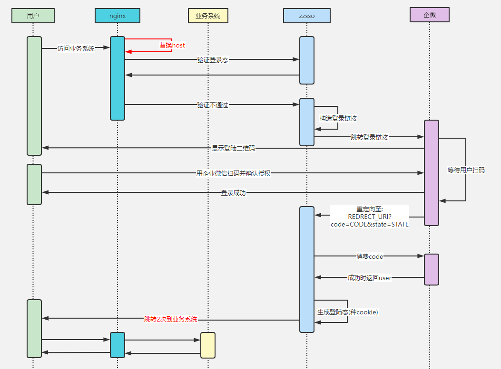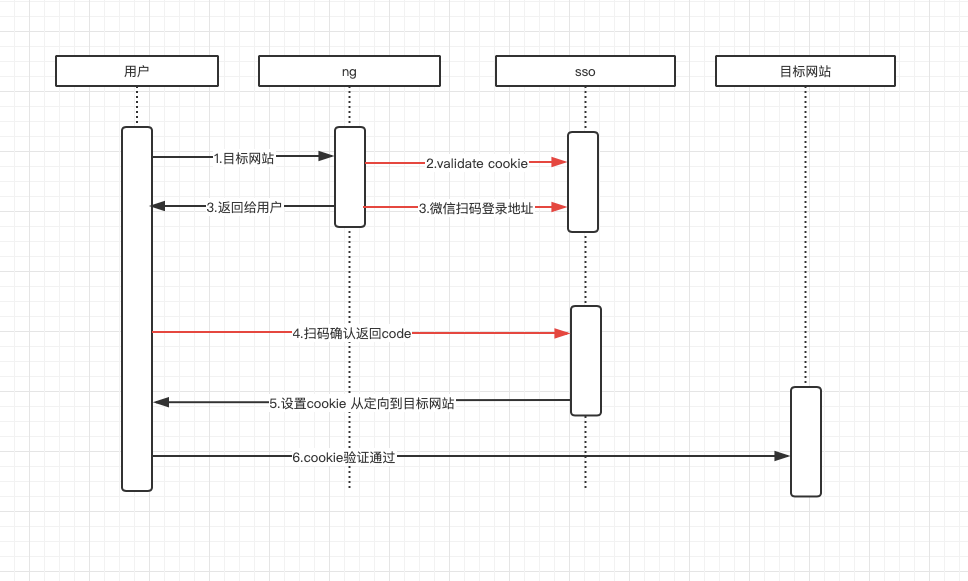

登录流程：

用户访问某系统，运维拦截并调用后端登录校验接口/login，发现其没有登录，将页面转发到登录系统/user/login，并带上scheme, host, urlParam（这些参数就是打碎了的目标页面链接，前端将其组装成redire_uri，并传入给企微sdk）；用户扫码登录，企业微信方收到确定登录的请求，会生成code然后将code拼接到之前传给他的redire_uri上并跳转，此时ng会请求/login接口，/login发现url上带有企业微信的code于是会消费code，然后再向浏览器中植入cookie，此时登录完成。
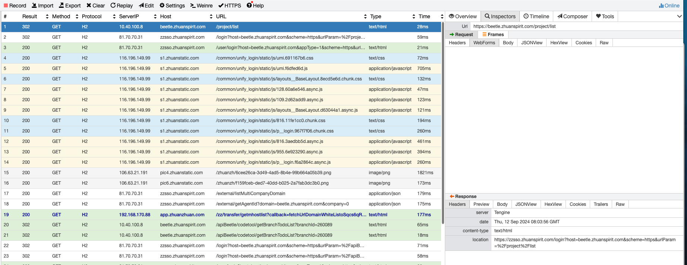

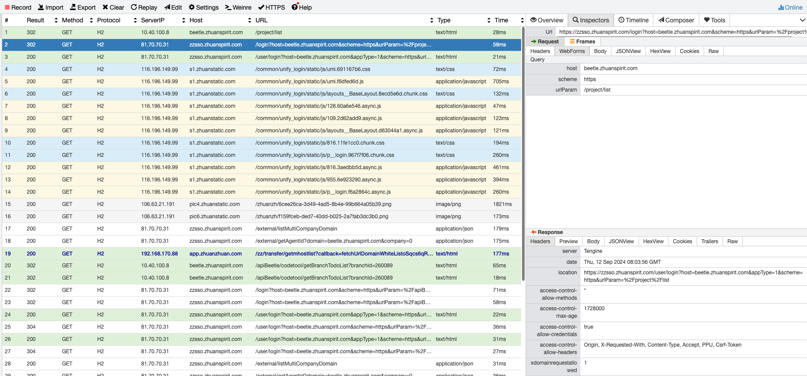

**扫码登录逻辑**

1.前端根据scheme, host, urlParam构造重定向链接并传给wxSDK(老逻辑中，这一步由于urlParam不包含hash部分所以这一步会丢失hash)

2.用户扫码后，SDK根据传入的redirectUrl拼接上appid和code生成新的链接并重定向到新链接页面；
   ng发现要访问的页面未登录，会302至zzsso.zhuanspirit.com/login接口；


3.zzsso.zhuanspirit.com/login接口受理请求后，发现参数中携带了code&appid参数，于是会去企微侧消费code获取用户信息，然后再次重定向至实际的系统页面，并植入cookie


共用zzsso域名扫码登陆逻辑：

1. 访问

   https://wmswv.zhuanspirit.com/

2. 重定向到

   https://zzsso.zhuanspirit.com/user/login?appType=2&host=zzsso.zhuanspirit.com&loginType=1&scheme=https&targetHost=wmswv.zhuanspirit.com&urlParam=%2Fredirect%3Fredirect%3Dhttps%3A%2F%2Fwmswv.zhuanspirit.com%252F

3. 扫码完成后，会跳转至

   https://zzsso.zhuanspirit.com/redirect?redirect=https://wmswv.zhuanspirit.com%2F&code=_EGC0aRJTmQge5Dc5K_6CerO5zAPxf7Y8SIJ4yne6MQ&appid=ww8469a6417268da6f

   

4. 架构发现/redirect请求中有code参数，于是转发至/login接口

   https://zzsso.zhuanspirit.com/login?host=zzsso.zhuanspirit.com&targetHost=zzsso.zhuanspirit.com&scheme=https&urlParam=%2Fredirect%3Fredirect%3Dhttps%3A%2F%2Fwmswv.zhuanspirit.com%252F%26code%3D%5FEGC0aRJTmQge5Dc5K%5F6CerO5zAPxf7Y8SIJ4yne6MQ%26appid%3Dww8469a6417268da6f&redirect=https://wmswv.zhuanspirit.com%2F&code=_EGC0aRJTmQge5Dc5K_6CerO5zAPxf7Y8SIJ4yne6MQ&appid=ww8469a6417268da6f

5. /login接口校验完成后，又会重定向回原先的/redirect，并植入cookie

   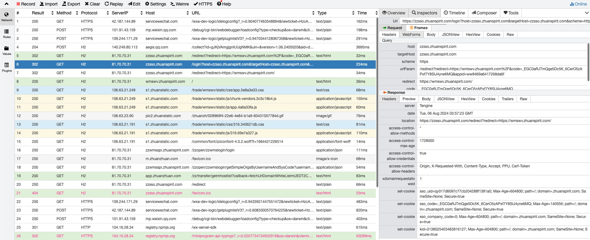

6. 第二次的/redirect请求不包含code参数，于是直接重定向至redirect参数所指的页面中

   https://zzsso.zhuanspirit.com/redirect?redirect=https://wmswv.zhuanspirit.com/


**测试环境搭建**

1. 前后端部署同一台测试机器（eg. 192.168.152.40）

2. qa平台发布host到192.168.152.40

   | 传统路由IP | 流量路由IP | 域名                   | 服务             |
   | ---------- | ---------- | ---------------------- | ---------------- |
   | 127.0.0.1  | 127.0.0.1  | tzzsso.zhuanspirit.com | zhuanzhuan_zzsso |

3. 同步ng： vim /opt/soft/nginx/conf.d/zzsso_zhuanspirit_com.conf

   修改 server_name [zzsso.zhuanspirit.com](http://zzsso.zhuanspirit.com/) [zzsso.zhuaninc.com](http://zzsso.zhuaninc.com/); -> server_name [tzzsso.zhuanspirit.com](http://tzzsso.zhuanspirit.com/) [tzzsso.zhuaninc.com](http://tzzsso.zhuaninc.com/); 

4. 配置代理

   192.168.152.40 beetle.zhuanspirit.com 

5. 这样，当我们访问beetle的时候才能正常重定向走到我们部署的测试服务上

# 前端基础

## HTML

### 标签

1. a

   **target="_blank"时需要配合`rel="noreferrer"`**

   ```html
   <a href='#' target='_blank' rel="noreferrer">预览合同</a>
   ```

   现在，许多主流的互联网服务提供商都会在网页的链接地址中加入`target=”_blank”`属性，而这绝对是一种非常不安全的行为。不仅如此，`target=”_blank”`属性还将会使广大互联网用户暴露在钓鱼攻击的风险之下。

   如果只是加上 `target="_blank"`，打开新窗口后，新页面能通过`window.opener`获取到来源页面的`window对`象，即使跨域也一样。

   某些属性的访问被拦截，是因为跨域安全策略的限制。 但是，比如修改`window.opener.location`的值，指向另外一个地址。

   即可以造成刚刚还是在某个网站浏览，随后打开了新窗口，结果这个新窗口神不知鬼不觉地把原来的网页地址改了。此时，就可以通过页面伪装，比如伪装成登陆页等，来让用户输入账号密码，从而到达黑客的目的。

   另外`target="_blank"`新打开的窗口和跟原来的页面窗口共用一个进程，非常容易使原来页面的性能受影响

   `target="_blank"`关乎前端安全，是为了防止页面滥用`window.opener`，使用`rel=noopener`，这样做保证了`window.opener`是`null`

   

   **CSS实现禁用**

   ```css
    pointerEvents: 'none';
    color: '#999';
   ```

1. input

   accept-type：

   ```js
   // Excel文件
   const xls = 'application/vnd.ms-excel'
   const xlsx = 'application/vnd.openxmlformats-officedocument.spreadsheetml.sheet'
   ```

   

## CSS

### 基础属性

1. background

   ```css
   background: bg-color bg-image position/bg-size bg-repeat bg-origin bg-clip bg-attachment initial|inherit;
   
   background: url('https://pic1.zhuanstatic.com/zhuanzh/6a332ebf-f766-4982-9bb2-4d428b6993e5.png') no-repeat center/cover;
   ```

2. pointerEvents

   ```css
   pointerEvents: 'none'
   // 会阻断事件捕获，子元素也不会成为事件元素，但是如果子元素设置poinrerEvents:'all',会冒泡到设置了pointerEvents: 'none'的父元素上。
   ```

3. white-space

   ```css
   white-space: 'pre-wrap'
   // 保留空白及换行符
   ```

   

### 组合技

1. 文本省略

   ```css
   //1:单行文本溢出
   .textTruncate {
        overflow: hidden;
        white-space: nowrap;
        text-overflow: ellipsis;
   }
   
   //2:按行数-多行文本溢出(兼容性不好)
   .mulLineTruncate {
     overflow: hidden;
     display: -webkit-box;
     text-overflow: ellipsis;
     -webkit-line-clamp: 2;
     -webkit-box-orient: vertical;
   }
   //3:按高度-多行文本溢出(没有省略号)
   .mulLineTruncate {
     max-height: 40px;
     overflow: hidden;
     line-height: 20px;
   }
   //4:解决3方案没有省略号的情况
   .mulLineTruncate {
     position: relative;
     max-height: 40px;
     overflow: hidden;
     line-height: 20px;
     &::after {
       position: absolute;
       right: 0;
       bottom: 0;
       padding: 0 20px 0 10px;
       content: '...';
     }
   }
   ```

   

   ```css
   overflow: hidden;
   text-overflow: ellipsis;
   white-space: nowrap;
   ```

   **bugs:**

   1. Flex布局中使用单行文本省略不生效

      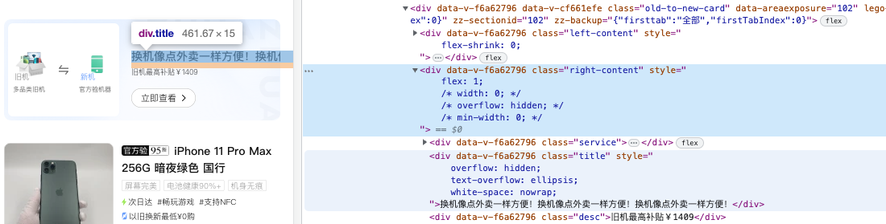

      flex布局与`white-space:nowrap`同时使用时，如果某个元素使用了`flex:1`，会导致该属性失效，并且`white-space:nowrap`会把元素撑开。

      两种解决方法：

      1. 在使用了`flex:1`的元素上，加上`min-width:0` 或 `width:0`或`overflow:hidden`

      2. 用多行文本省略的方式替代

2. a标签禁用

   ```css
    pointerEvents: none;
    color: #999;
   ```

3. 背景图片渐变透明

   ```css
   background: no-repeat center top / 100% 100%;
   background-image: linear-gradient(to top, rgba(255, 255, 255, 1), rgba(255, 255, 255, 0)), url(1.jpg);
   ```

4. 图片底部间隙

   ```css
   font-size: 0;
   line-height: 1;
   // 或
   display: block;
   ```

5. flex-direction:column之后宽度自动变为100%的解决办法

   ```
   align-self: baseline;
   ```

6. 隐藏滚动条

   ```css
    .list::-webkit-scrollbar {
     display: none;
     width: 0;
     height: 0;
     color: transparent;
   }
   ```

7. ios 圆角切割失效解决

   ```css
   overflow: hidden;
   border-radius: 10px;
   -webkit-backface-visibility: hidden;
   -webkit-transform: translate3d(0, 0, 0);
   ```

8. 移动端1px边框

   ```css
   div {
     position: relative;
   
     &::after {
       content: " ";
       pointer-events: none;
       border: 0 solid #dcdfe6;
       border-bottom-width: 1px;
       position: absolute;
       top: -50%;
       bottom: -50%;
       left: -50%;
       right: -50%;
       border-radius: 32px; // 圆角需要给设计稿的2倍
       transform: scale(.5);
   	}
   }
   ```

9. 兼容iphoneX底部导航条

   ```css
   .footer-menu {
     padding-bottom: constant(safe-area-inset-bottom); /* 兼容旧版本 iOS */
     padding-bottom: env(safe-area-inset-bottom); /* 推荐使用 */
     padding: 16px 48px calc(env(safe-area-inset-bottom) + 18px);
   }
   ```

   ```js
   // 通过js获取
   const safeAreaPadding = getComputedStyle(document.querySelector('.footer-menu')).getPropertyValue('padding-bottom');
   alert(safeAreaPadding);
   // 需要给html设置viewport-fit=cover
   <meta name="viewport" content="width=device-width, initial-scale=1.0, maximum-scale=1.0, user-scalable=no, viewport-fit=cover">
   
   ```

   

### 选择器

1.选择前一个兄弟元素/父级选择器

当蓝色有`collapsed`时，修改红色样式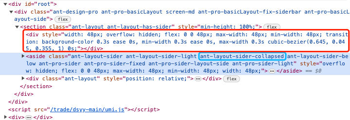

```
.ant-layout:has(.ant-layout-sider-collapsed) > div:first-child
```

2.选择非末尾元素的子元素

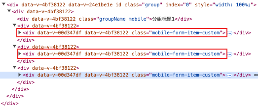

```
div:not(:last-child):has(>.mobile-form-item-custom) .mobile-form-item-custom::after
```

3.选择除了第一个的元素

```
.z-checker-item+.z-checker-item {
    margin-left: 0.21rem;
}
```


### CSS Modules

**1.局部作用域**

```
import React from 'react';
import style from './App.css';

export default () => {
  return (
    <h1 className={style.title}>
      Hello World
    </h1>
  );
};

.title {
  color: red;
}
```

构建工具会将类名`style.title`编译成一个哈希字符串。

```markup
<h1 class="_3zyde4l1yATCOkgn-DBWEL">
  Hello World
</h1>

._3zyde4l1yATCOkgn-DBWEL {
  color: red;
}
```

**2.全局作用域**

CSS Modules 允许使用`:global(.className)`的语法，声明一个全局规则。凡是这样声明的`class`，都不会被编译成哈希字符串。

所以在我们想要修改antd组件的样式时需要在被修改的类名上包裹:global标识以防止其被编译为hash，同时为了防止样式污染，需要在最外层在套一个局部类名。

```
// 局部作用域写法 等同:local(.title)
.title {
  color: red;
}

// 全局作用域写法，类名不会被编译为hash
:global(.title) {
  color: green;
}
```

```
import styles from './App.css';
// 类名使用普通写法就会引用全局clas
<h1 className="title">
	Hello World
</h1>
```

**3.Class组合**

在 CSS Modules 中，一个选择器可以继承另一个选择器的规则，这称为"组合"（["composition"](https://github.com/css-modules/css-modules#composition)）。

在[`App.css`](https://github.com/ruanyf/css-modules-demos/blob/master/demo04/components/App.css)中，让`.title`继承`.className` 。

```
.className {
  background-color: blue;
}

.title {
  composes: className;
  color: red;
}
```

**4.输入其他模块**

选择器也可以继承其他CSS文件里面的规则。

```
// another.css
.className {
  background-color: blue;
}
```

App.css可以继承`another.css`里面的规则。

```
.title {
  composes: className from './another.css';
  color: red;
}
```

### Bugs: 

1. ios下圆角失效

   ```css
   overflow: hidden;
   border-radius: 16px;
   // 添加以下任意一个即可
   transform: scale(1);
   // or
   transform: translateZ(1px);
   // or
   isolation: isolate;
   // or
   position: relative; z-index: 0;
   ```

2. z-image在ios展示异常

   定高不定宽时，ios机型下图片宽度会比实际大，两侧都有很大的空白，需要给z-image下img增加`width: auto`

   ```css
   .z-image img {
     width: auto
   } 
   ```

2. fixed元素定位和大小异常

   虽然 fixed 元素通常不受父元素的影响，但如果父元素有 transform、filter、perspective 等 CSS 属性，这些属性会创建一个新的包含块（containing block），从而影响 fixed 元素的定位和尺寸。

   解决：父元素不要使用transform，如果使用的是trasnform + top:50%来居中，可以改为flex
   
   ```css
   .parent {
   	position: absolute;
   	height: 100%;
     display: flex;
     align-items: center;
   }
   ```
   
   


## JS

#### URLSearchParams

```js
// 获取search对象(不可使用location.href)
Object.fromEntries((new URLSearchParams(location.search)).entries())
// {query: 'abcd'}

// 根据URLSearchParams获取search 字符串
(new URLSearchParams(location.search)).toString()
// 'query=abcd'
```


#### Number

1.数字格式化

```js
Number.toLocaleString()

(1000).toLocaleString('', {
  style: 'currency',
  currency: 'USD', // 'HKD' 'CNY'
}) // 'US$1,000.00'  'HK$1,000.00'  '¥1,000.00'
```


#### Array

##### filter

1. 过滤数组空值

   ```
   [].filter(Boolean)
   ```


#### Object

##### fromEntries

静态方法将键值对列表转换为一个对象。`Object.fromEntries()` 是 [`Object.entries()`](https://developer.mozilla.org/zh-CN/docs/Web/JavaScript/Reference/Global_Objects/Object/entries) 的逆操作

```js
const entriesMap = new Map([
  ['foo', 'bar'],
  ['baz', 42],
]);
const entriesArr = [
  ['foo', 'bar'],
  ['baz', 42],
];

const obj = Object.fromEntries(entriesMap);
const obj2 = Object.fromEntries(entriesArr);

console.log(obj);
console.log(obj2);
// Expected output: Object { foo: "bar", baz: 42 }
// Expected output: Object { foo: "bar", baz: 42 }
```


#### 运算符

1. 空值合并运算符`??`

   **空值合并操作符**（**`??`**）是一个逻辑操作符，当左侧的操作数为 [`null`](https://developer.mozilla.org/zh-CN/docs/Web/JavaScript/Reference/Global_Objects/null) 或者 [`undefined`](https://developer.mozilla.org/zh-CN/docs/Web/JavaScript/Reference/Global_Objects/undefined) 时，返回其右侧操作数，否则返回左侧操作数。

   与[逻辑或操作符（`||`）](https://developer.mozilla.org/en-US/docs/Web/JavaScript/Reference/Operators#logical_or_2)不同，逻辑或操作符会在左侧操作数为[假值](https://developer.mozilla.org/zh-CN/docs/Glossary/Falsy)时返回右侧操作数。也就是说，如果使用 `||` 来为某些变量设置默认值，可能会遇到意料之外的行为。比如为假值（例如，`''` 或 `0`）时。见下面的例子。

   ```
   const foo = null ?? 'default string';
   console.log(foo);
   // expected output: "default string"
   
   const baz = 0 ?? 42;
   console.log(baz);
   // expected output: 0
   ```

   

   在处理输入框相关业务时，往往会判断输入框未输入值的场景。

   ```
   // BAD
   if(value !== null && value !== undefined && value !== ''){
       //...
   }
   							
   // GOOD
   if(value??'' !== ''){
     //...
   }
   ```

   

#### 事件

1. hover事件能触发被overflow：hidden的元素

   当父元素设置了overflow：hidden和hover时，子元素超出父元素的地方也能被hover事件监听到。

#### 异步函数与遍历

1. forEach不支持传入异步函数，需要使用for循环替代

2. map传入异步函数需要配合Promise.all

   ```js
   list = await Promise.all(
     array.map(async (item) => {
       return {
         ...item,
         y_path: await this.getImage(item.path)
       };
     })
   );
   ```

#### 常用方法

1. 仅分隔字符串一次

   ```js
   function splitStringOnce(str, delimiter) {
       const index = str.indexOf(delimiter);
       if (index === -1) {
           return [str];
       }
       return [str.slice(0, index), str.slice(index + 1)];
   }
   ```

1. 判断当前页面是否被嵌入到iframe中

   ```js
   function isEmbeddedInIframe(): boolean {
       // 判断当前页面是否在一个iframe中
       return window.top !== window.self;
   }
   ```

1. 预加载图片

   ```js
   const preloadImg = (imgList: string[]) => {
     for (const imgUrl of imgList) {
       const img = new Image()
       img.src = imgUrl
     }
   }
   ```

1. 判断变量类型

   在JavaScript中，判断一个变量是对象还是数组可以通过多种方法。以下是几种常见的方法：

   1. 使用 Array.isArray() 方法
     Array.isArray() 是专门用来判断一个变量是否为数组的方法。如果变量是数组，则返回 true，否则返回 false。

     ```js
     let arr = [1, 2, 3];
     let obj = { key: 'value' };
     
     console.log(Array.isArray(arr)); // true
     console.log(Array.isArray(obj)); // false
     ```

     

   2. 使用 typeof 和 instanceof 结合
     typeof 可以用来判断基本数据类型，但对于数组和对象，typeof 都会返回 "object"。因此，可以结合 instanceof 来进一步判断。

     ```js
     let arr = [1, 2, 3];
     let obj = { key: 'value' };
     
     console.log(typeof arr); // "object"
     console.log(typeof obj); // "object"
     
     console.log(arr instanceof Array); // true
     console.log(obj instanceof Array); // false
     ```

     

   3. 使用 Object.prototype.toString.call()
     Object.prototype.toString.call() 可以返回一个表示对象类型的字符串，通过这个字符串可以判断变量的具体类型。

     ```js
     let arr = [1, 2, 3];
     let obj = { key: 'value' };
     
     console.log(Object.prototype.toString.call(arr)); // "[object Array]"
     console.log(Object.prototype.toString.call(obj)); // "[object Object]"
     
     function isArray(value) {
         return Object.prototype.toString.call(value) === '[object Array]';
     }
     
     function isObject(value) {
         return Object.prototype.toString.call(value) === '[object Object]';
     }
     
     console.log(isArray(arr)); // true
     console.log(isObject(obj)); // true
     ```

     

   4. 使用 constructor 属性
     每个对象都有一个 constructor 属性，指向创建该对象的构造函数。可以通过 constructor 属性来判断变量的类型。

     ```js
     let arr = [1, 2, 3];
     let obj = { key: 'value' };
     
     console.log(arr.constructor === Array); // true
     console.log(obj.constructor === Object); // true
     ```

     


## TS

1. 给Promise增加类型声明

   如果不给Promise声明，ts会推断其返回值为unknow，可能会导致类型错误

   ```ts
   new Promise<{code: string}>(resolve => setTimeout(() => resolve({ code: '0' }), 2000))
   
   function myFunction(): Promise<string> {
     return new Promise<string>((resolve) =>
       setTimeout(() => resolve('0'), 2000)
     );
   }
   ```


## DOM

### 查

#### 获取dom

1. ```js
   # iframe的document对象
   const iframeDoc = iframe.contentDocument || iframe?.contentWindow.document
   ```

2. 

### 改

#### 修改属性

1. `element.setAttribute("height", "200px");`

2. `element.height = 200;`

3. `element.classList.add("class-name");`

#### 修改样式

1. `element.style.height = '200px';`

2. `element.style.setProperty('height', '200px');`

3. `element.style.cssText = 'height: 200px; width: 100px; background-color: blue;';`

   ```js
   // 将css对象转为样式文本，如果传入selector就使用selector再包裹一层
   styleObjToString(styleObj, selector = '') {
     const cssStr = Object.keys(styleObj).reduce((acc, key) => {
       const kebabCaseKey = key.replace(/([A-Z])/g, '-$1').toLowerCase()
       return `${acc}${kebabCaseKey}:${styleObj[key]};`
     }, '')
     return selector ? `${selector}{${cssStr}}` : cssStr
   }
   ```


### 常用计算

1. 页面是否到底

   ```js
   const aleardyBottom = () => {
     const windowHeight = document.documentElement.clientHeight || document.body.clientHeight;
     const scrollTop = document.documentElement.scrollTop || document.body.scrollTop; //滚动高度
     const documentHeight = document.documentElement.scrollHeight || document.body.scrollHeight; //页面高度
   
     return windowHeight + scrollTop >= documentHeight
   }
   ```

   


## ES6


## 代码执行

1. 方法内部的变量，可以直接使用

# Bugs

###### 1. options请求失败

1. 避免发送OPTIONS，不在header中添加额外字段，post不使用application/json

2. 403:https://blog.csdn.net/qq_18671415/article/details/109275495

###### 2. less文件cz校验不通过

报错：`Unknown rule order/properties-alphabetical-order`

解决：注释掉`.stylelintrc.js中的 *// 'order/properties-alphabetical-order': null`

###### 3. 项目运行node-sass报错

```shell
Error: ENOENT: no such file or directory, scandir ‘…/node_modules/[node](https://so.csdn.net/so/search?q=node&spm=1001.2101.3001.7020)-sassÏ/vendor’

# 解决：
npm rebuild node-sass
```

###### 4.编译报错

```shell
ERROR in ./node_modules/@babel/runtime/helpers/esm/get.js 1:0-44
Module not found: Error: Can't resolve './superPropBase' in '/Users/andy/clarity/node_modules/@babel/runtime/helpers/esm'
Did you mean 'superPropBase.js'?

# 解决：升级@babel/runtime
npm i @babel/runtime@7.12.0
```

###### 5.升级mac os 导致命令行报错

[终端cd命令报错](https://blog.csdn.net/Someday_spark/article/details/127692327)

[mac配置repo问题](https://blog.csdn.net/Someday_spark/article/details/127692327)

```shell
# 报错：
xcode-select: Failed to locate 'python', requesting installation of command line developer tools.
# 解决：
> PATH="/usr/bin/Python3:${PATH}"
> export PATH
> alias python="/usr/bin/Python3"
```

```shell
# 报错：
python: error: Failed to locate 'python'
xcode-select: Failed to locate 'python', requesting installation of command line developer tools.
# 解决：
1.到官网下载一个和自己Xcode版本匹配的命令行工具https://developer.apple.com/download/all/
2.查看终端路径
> xcode-select-p
3.软链python3到python
> sudo ln -s ${2中的路径}/usr/bin/python3 ${2中的路径}/usr/bin/python
```

###### 6.Mac查看并修改文件权限

vi编辑文件的时候，提示`W10,Warning: Changing a readonly file`

```shell
#1.查看该文件的权限
> ls -l /etc/docker/daemon.json
# oputput: -rw-r--r--  1 root  wheel  78  2  7 11:04 /etc/docker/daemon.json

#2.修改该文件权限
> sudo chmod o+w /etc/docker/daemon.json

#3.查看修改结果
> ls -l /etc/docker/daemon.json
# oputput: -rw-r--rw-  1 root  wheel  78  2  7 11:04 /etc/docker/daemon.json
```

###### 7.app无写入权限

将app拖动至应用程序中

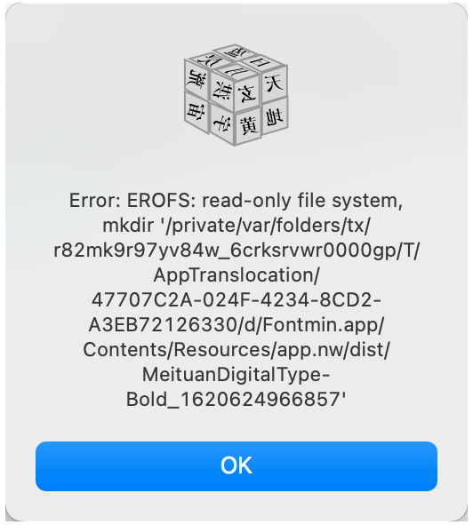

###### 8.umi3项目编译报错

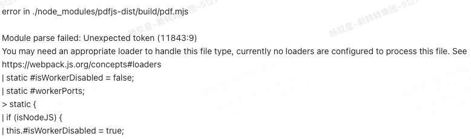

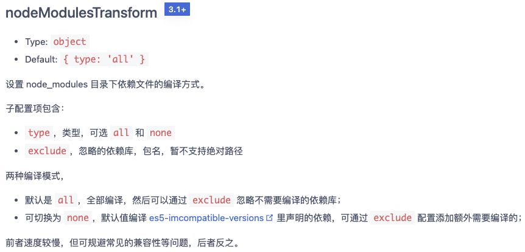

```js
// file: /config/config.js
export default defineConfig({
  nodeModulesTransform: {
    type: 'none',
    exclude: ['pdfjs-dist'],
  }
})
  
```


###### 9. window系统浏览器无法拖拽上传文件

需要修改注册表，不限制这些操作的权限。按下window + r，输入regedit，打开注册表编辑器，搜索
HKEY_LOCAL_MACHINE\SOFTWARE\Microsoft\Windows\CurrentVersion\Policies\System
将EnableLUA将1改成0，并重启电脑，会发现问题解决。

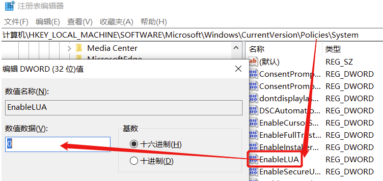


# Something Good

#### ajax请求重定向302

大多数 302 的使用场景都是比较简单直接且同步的 —— 即用户在浏览器里输入一个URL，这个URL的背后服务器返回一个302状态和Location header，浏览器就自动重定向到Location指定的新地址上。

但是随着Ajax的广泛使用，尤其是SPA（单页面应用）的流行，越来越多的网络请求都是通过Ajax发起的，而Ajax的目标URL如果返回 302 就开始带来一些问题。

1. 用户打开目标网站，假设为http://domain/index.html
2. 某个动作触发了ajax请求http://domain/login
3. 后端返回 302 ，Location 值为http://github.com/login/oauth/authorize?client_id=xxx
4. 浏览器**自动**把 Ajax 的目标url 切成新的地址，即 发生 Ajax 请求到http://github.com/login/oauth/authorize?client_id=xxx
5. 由于这是个Ajax请求，且用户处在 domain 的域名上，而请求地址为 github 域名，因此这是个跨域请求
6. 显然 github 不可能随便对其他域名打开 CORS 限制，因此这个 ajax 就失败了。

**解决：**

1.如果使用的是fetch，可以配置redirect:manual (手动处理重定向)

2.其他则需要后端配合，比如jsonp或返回特殊的http状态码而不是302


#### 获取经纬度

```js
const options = {
  enableHighAccuracy: true, // 使用最高精度
  timeout: 5000, // 如果5s内没有获取到位置，则视为超时
};

function success(pos) {
  var crd = pos.coords;
  document.querySelector("#latitude").textContent = crd.latitude;
  document.querySelector("#longitude").textContent = crd.longitude;
}

function error(err) {
  const errorEle = document.createElement("p");
  errorEle.innerText = `定位失败：ERROR(${err.code}): ${err.message}`;
  document.body.appendChild(errorEle);
}

navigator.geolocation.getCurrentPosition(success, error, options);
```


修改同源iframe页面中的样式

```js
this.$nextTick(() => {
  const iframe: any = document.querySelector('iframe#iframe-page')
  iframe.onload = () => {
    const iframeDoc = iframe.contentDocument || iframe?.contentWindow.document
    // iframe 加载完毕，可以在这里执行样式覆盖等操作
    const style = document.createElement('style')
    const btnStyle = {
      height: 88 / 75 + 'rem',
      background: '#111',
      borderRadius: 8 / 75 + 'rem',
      fontWeight: 500,
      color: '#FFE9C5'
    }
    style.textContent = this.styleObjToString(btnStyle, '#app .z-button.z-button--primary')
    const head = iframeDoc.getElementsByTagName('head')[0]

    head.appendChild(style)
  }
})
```


#### 将HTML字符串在新页面展示

```js
// 假设后端返回的 HTML 字符串保存在 responseHtml 中
const responseHtml = '<h1>Hello, world!</h1>';

// 创建一个新的 HTML 页面
const displayHtml = `
  <!DOCTYPE html>
  <html>
  <head>
    <meta charset="UTF-8">
    <title>Display HTML</title>
  </head>
  <body>
    ${responseHtml}
  </body>
  </html>
`;

// 使用 Blob 对象创建一个临时的 URL
const blob = new Blob([displayHtml], { type: 'text/html' });
const url = URL.createObjectURL(blob);

// 在新的窗口或标签页中打开 URL
window.open(url);
```

