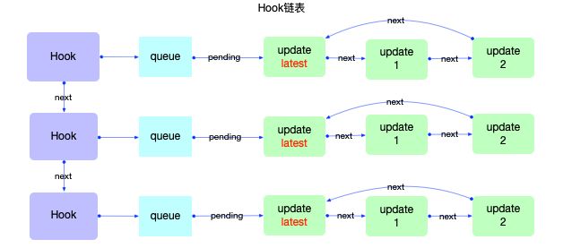
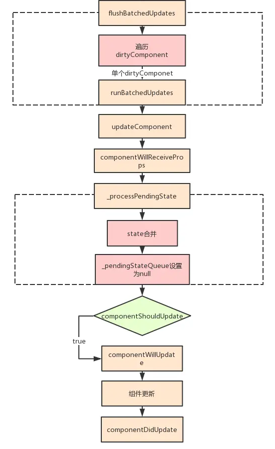
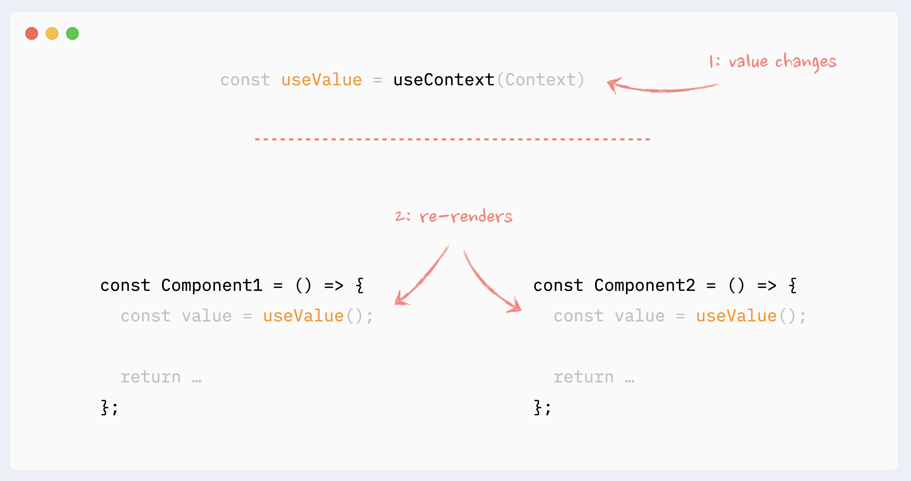
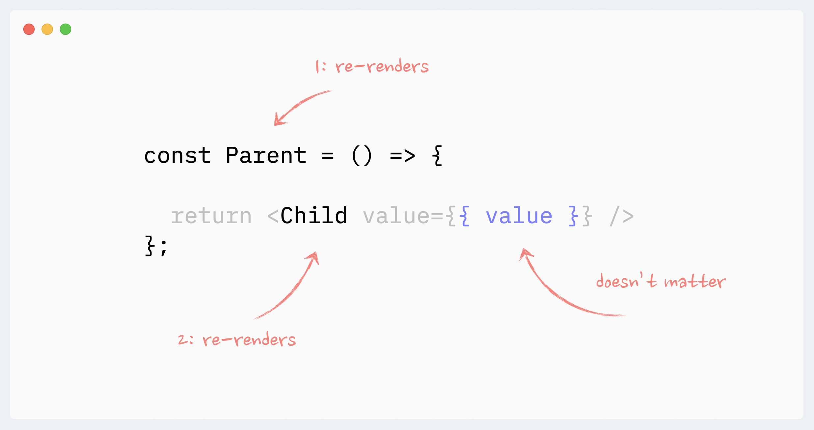
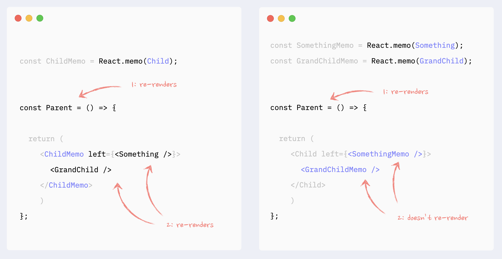
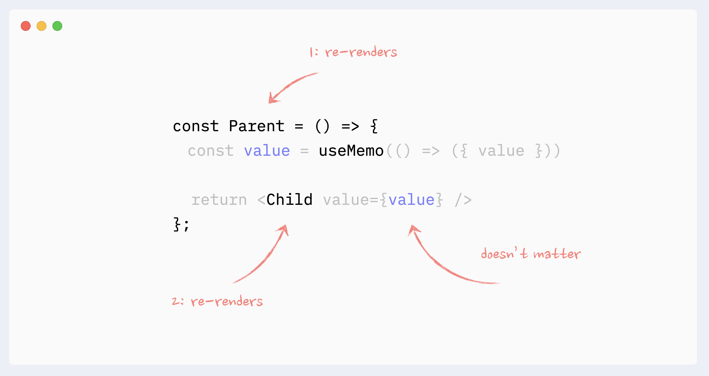
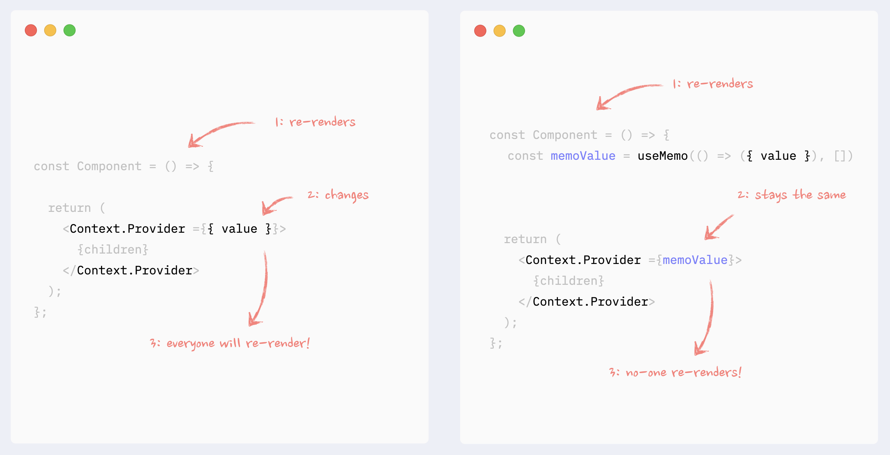

[图解react](https://7km.top/main/macro-structure/)

## Fiber


React18可以通过DOM.__reactFiber{xxx} 其中xxx为随机字符串

## 核心概念

### 2.状态管理

#### 2.1 对state进行保留和重置

##### [相同位置的相同组件会使得 state 被保留下来](https://zh-hans.react.dev/learn/preserving-and-resetting-state#same-component-at-the-same-position-preserves-state)

**只要一个组件还被渲染在 UI 树的相同位置，React 就会保留它的 state。** 如果它被移除，或者一个不同的组件被渲染在相同的位置，那么 React 就会丢掉它的 state。

需要注意的通过`if`和三目运算符进行判断时会被认为是同一位置，而通过`&&`分别判断时会被认为是不同位置。

可以看下面这个例子，每一个`{}`被视为一个位置


### 3. 元素渲染

#### 3.1 组件更新的时机

触发组件更新的操作：

- 组件执行了setState

- 组件的父组件执行了rerender

  当父组件的状态发生改变时，就会以该组件为根重新渲染整个组件树，即使子组件的`props`没有发生改变。这似乎很傻，因此react暴露了`shouldComponentUpdate`方法给我们手动控制组件是否渲染：

  ```js
  shouldComponentUpdate(nextProps, nextState) {
    if (this.props.color !== nextProps.color) {
      return true;
    }
    if (this.state.count !== nextState.count) {
      return true;
    }
    return false;
  }
  ```


### 5. state & 生命周期

生命周期图谱：[速查表](https://projects.wojtekmaj.pl/react-lifecycle-methods-diagram/)

#### 5.1 props 和 state 可能会异步更新

​		https://juejin.cn/post/6927516663826874376

​		因为 `this.props` 和 `this.state` 可能会异步更新，所以你不要依赖他们的值来更新下一个状态。

> props的更新也是异步的，因此也不能用props的值来计算state

例如，此代码可能会无法更新计数器：

```
// Wrong
this.setState({
  counter: this.state.counter + this.props.increment,
});
```

要解决这个问题，可以让 `setState()` 接收一个函数而不是一个对象。这个函数用上一个 state 作为第一个参数，将此次更新被应用时的 props 做为第二个参数：

```
// Correct
this.setState((preState, props) => ({
  counter: preState.counter + props.increment
}));
```

​		如何判断setState是同步更新还是异步更新？：

**在React内部机制能检测到的地方， setState就是异步的；**大部分开发中用到的都是React封装的事件，比如onChange、onClick、onTouchMove等，这些事件处理程序中的setState都是异步处理的。

**在React检测不到的地方，例如setInterval,setTimeout里，setState就是同步更新的。**

#### 5.2 state的更新会合并

```
this.setState({firstName:"yang"})
this.setState({lastName:"Shuangxing"})
			↓↓↓
Object.assign(previousState,{firstName:"yang"},{lastName:"Shuangxing"})
```

**更多相关内容 ==> API REFERENCE ==> React.Component**

#### 5.3 setState的回调

```
this.setState({count:0},()=>{//当本次state更新后触发})
```


### 6. 事件处理

#### 6.1 React 事件与DOM事件

传统的HTML

```
<button onclick="activateLasers()"></button>
```

React的JSX

```
<button onClick={activateLasers()}></button>
```

阻止事件的默认行为，原生JS可以`return false`，react必须在事件处理函数中显示地`e.preventDefault()`.

#### 6.2 React事件处理函数的this

在 JavaScript 中，class 的方法默认不会绑定 `this`。事件处理函数默认this指向undefined，如果需要在事件处理函数中使用this：

```
//在constructor中bind
this.handleClick = this.handleClick.bind(this)
```

```
//在使用时bind
<button onClick={this.handleClick.bind(this)}></button>
```

```
//箭头函数
<button onClick={()=>this.handleClick()}></button>
```

```
//public class fields 语法
handleClick = () => {
   console.log('this is:', this);
}
```

#### 6.3 向事件处理函数传递参数

```
<button onClick={(e) => this.deleteRow(id, e)}>Delete Row</button>
<button onClick={this.deleteRow.bind(this, id)}>Delete Row</button>
```

上述两种方式是等价的，分别通过箭头函数和 `Function.prototype.bind`来实现。

在这两种情况下，React 的事件对象 `e` 会被作为第二个参数传递。如果通过箭头函数的方式，事件对象必须显式的进行传递，而通过 `bind` 的方式，事件对象以及更多的参数将会被隐式的进行传递。

### 7.条件渲染


### 8. 列表 & key

#### 8.1 key的绑定位置

key需要绑定在被多次渲染的元素上。通常，是在map()方法中的元素上。

```jsx
const numbers = [1, 2, 3, 4, 5];
const listItems = numbers.map((number) =>
  <li key={number.toString()}>{number}</li>
);
ReactDOM.render(
  <ul>{listItems}</ul>,
  document.getElementById('root')
);
```


#### 8.2 key无法使用

key只是用来告诉React区别各个兄弟节点的，不能在组件中使用key属性，当然，我们也读取不到。


### 9. 表单

#### 9.1 受控组件

在HTML中表单元素通常自己维护state，并根据用户输入进行更新。我们需要表单与组件的state构建联系以方便我们使用表单中的数据。使用“双向数据绑定”原理即可解决。

```
//监听到表单元素改变时，更新state
handleChange(e){
        this.setState({
            value:e.target.value
        })
    }
//渲染时使用state中的数据填充表单的value属性
render(){
        return (
            <div>
                <input 
                type='text' 
                value={this.state.value}
                onChange={this.handleChange.bind(this)}
                />
            </div>
        )
    }
```

#### 9.2 同时控制多个表单元素

给每个表单元素添加name属性，利用一个handleEvent，在接收到event事件时判断name来选择修改对应的state中的value。

```
class Reservation extends React.Component {
  constructor(props) {
    super(props);
    this.state = {
      isGoing: true,
      numberOfGuests: 2
    };

    this.handleInputChange = this.handleInputChange.bind(this);
  }

  handleInputChange(event) {
    const target = event.target;
    const value = target.name === 'isGoing' ? target.checked : target.value;
    const name = target.name;

    this.setState({
      [name]: value
    });
  }

  render() {
    return (
      <form>
        <label>
          参与:
          <input
            name="isGoing"
            type="checkbox"
            checked={this.state.isGoing}
            onChange={this.handleInputChange} />
        </label>
        <br />
        <label>
          来宾人数:
          <input
            name="numberOfGuests"
            type="number"
            value={this.state.numberOfGuests}
            onChange={this.handleInputChange} />
        </label>
      </form>
    );
  }
}
```

### 11. 组合 vs 继承

#### 11.1 插槽

在react中我们需要自己定义插槽。

第一种,props.children

```
<Parent>
	<h2>子组件1</h2>
	<h2>子组件2</h2>
</Parent>
function Parent(props){
	return (
		<div>
			<h1>父组件</h1>
			{props.children}
		</div>
	)
}
```

第二种，具名插槽

```
<Parent 
	first={<h2>子组件1</h2>} 
	second={<h2>子组件2</h2>}
</Parent>
function Parent(props){
	return (
		<div>
			<h1>父组件</h1>
			{props.first}
			{props.second}
		</div>
	)
}
```


## Redux

```
cnpm i redux --save
```


### 核心概念

​		Store：数据仓库，保存数据的地方。

​		State：是一个对象，数据仓库的所有数据都放到一个state里。

​		Action：一个动作，用于修改数据。

​		Dispatch：将动作触发成方法。

​		Reducer：一个函数，通过获取动作，改变数据，生成一个新的state。

​		state没有setter，即我们无法直接去修改state中的数据。需要更新数据时，需要发起一个action。这样做得好处就是我们可以清晰地知道应用中到底发生了什么。

### 使用流程

```js
import { createStore } from "redux";

// 1.创建reducer,第一个参数为默认state
//   第二个action用于接收动作参数
const reducer = function (state = { num: 0 }, action) {
  switch (action.type) {
    case "add":
      state.num++;
      break;
    case "reduce":
      state.num--;
      break;
  }
  //使用react-redux的Provider时可能数据不会自动更新
  //需要return {...state}
  return state;
};
// 2.用reducer创建store
const store = createStore(reducer);

//函数式计算器
const Counter = function () {
	// 3.使用store中的数据
  let state = store.getState();
  return (
    <div>
      <h1>计数数量：{state.num}</h1>
      <button onClick={add}> 计数 +1 </button>||
      <button onClick={reduce}> 计数 -1 </button>
    </div>
  );
};
function add() {
  // 4.通过仓库的方法dispatch进行修改数据
  //   对象中除了type必须外，还可以添加其他参数
  store.dispatch({ type: "add" });
}
function reduce() {。
  //通过仓库的方法dispatch进行修改数据
  store.dispatch({ type: "reduce" });
}
ReactDOM.render(<Counter></Counter>, document.getElementById("root"));

// 5.使用subscribe方法监听state的变化。
store.subscribe(() => {
  ReactDOM.render(<Counter></Counter>, document.getElementById("root"));
});
```

### react-redux

```
cnpm i redux-redux --save
```

不是redux的内置库，需要额外安装。

#### 使用流程

```js
// index.js
import React from "react";
import ReactDOM from "react-dom";
import { createStore } from "redux";
import { Provider } from "react-redux";
import math from "./recuders/math";
import Counter from "./components/Counter";

const store = createStore(math);

ReactDOM.render(
  <Provider store={store}>
    <Counter></Counter>
  </Provider>,
  document.getElementById("root")
);
// Counter.js
import { connect } from "react-redux";
import { addAction, squareAction } from "../actions/action";

const Counter = (props) => {
  const { count, add, square } = props;
  return (
    <div>
      <div>
        <h1>计数数量：{count}</h1>
        <button
          onClick={() => {
            add(1);
          }}
        >
          计数 +1
        </button>
        <button
          onClick={() => {
            add(2);
          }}
        >
          计数 +2
        </button>
        <button
          onClick={() => {
            square();
          }}
        >
          平方
        </button>
      </div>
    </div>
  );
};

const mapStateToProps = (state) => {
  return {
    count: state.count,
  };
};
const mapDispatchToProps = (dispatch) => {
  return {
    add: (num) => {
      dispatch(addAction(num));
    },
    square: () => {
      dispatch(squareAction());
    },
  };
};

export default connect(mapStateToProps, mapDispatchToProps)(Counter);
// math.js
const math = (state = { count: 0 }, action) => {
  switch (action.type) {
    case "add":
      state.count = state.count + action.num;
      break;
    case "square":
      state.count *= state.count;
      break;
  }
  return { ...state };
};
export default math;
// action.js
const addAction = (num) => {
  return {
    type: "add",
    num,
  };
};
const squareAction = () => {
  return {
    type: "square",
  };
};
export { addAction, squareAction };
```


## 高级指引


### 代码分割 React.lazy

异步加载组件（懒加载）。对于加载耗时的组件使用，可以通过我们自定义的占位符来代替耗时的组件，提高用户体验。

```js
import React, { Suspense } from "react";
// 需要懒加载的组件使用React.lazy引入
const AnotherRow = React.lazy(() => import("./AnotherRow"));

//return中将懒加载组件用Suspense包裹，并提供(must)一个占位符。
return(
	<Suspense fallback={<div>Loading...</div>} >
        <AnotherRow />
    </Suspense>
)
```

如果模块加载失败（如网络问题），它会触发一个错误。可以通过异常捕获边界技术来处理这些情况以获得更好的用户体验。

**基于路由的代码分割**

在使用路由切换页面时，有一个加载切换过程往往能提高用户体验。

```js
<Router>
  <Suspense 
	fallback={<div className="loading">loading...</div>}
  >
    <Link to="/">Home</Link>
    <Link to="/me">Me</Link>
    <Route path="/" exact component={Home}></Route>
    <Route path="/me" component={Me}></Route>
  </Suspense>
</Router>
```

**命名导出**

`React.lazy` 目前只支持默认导出（default exports）。如果你想被引入的模块使用命名导出（named exports），你可以创建一个中间模块，来重新导出为默认模块。这能保证 tree shaking 不会出错，并且不必引入不需要的组件。


### Context

当组件层级过多时，如果要传参到底层组件，需要将上层组件通过props层层传递到底层组件。这无疑让代码变得很冗余。

通过Context我们在上层组件将参数注入到组件树，这样无论在组件树的那一层都可以直接获得这个参数。

```js
const ThemeContext = React.createContext('light');
class App extends React.Component {
  render() {
    // 使用一个 Provider 来将当前的 theme 传递给以下的组件树。
    // 无论多深，任何组件都能读取这个值。
    // 在这个例子中，我们将 “dark” 作为当前的值传递下去。
    return (
      <ThemeContext.Provider value="dark">
        <Toolbar />
      </ThemeContext.Provider>
    );
  }
}

// 中间的组件再也不必指明往下传递 theme 了。
function Toolbar() {
  return (
    <div>
      <ThemedButton />
    </div>
  );
}

class ThemedButton extends React.Component {
  // 指定 contextType 读取当前的 theme context。
  // React 会往上找到最近的 theme Provider，然后使用它的值。
  // 在这个例子中，当前的 theme 值为 “dark”。
  static contextType = ThemeContext;
  render() {
    return <Button theme={this.context} />;
  }
}
```

**context的缺点**

Context 主要应用场景在于*很多*不同层级的组件需要访问同样一些的数据。请谨慎使用，因为这会使得组件的复用性变差。

如果你只是想避免层层传递一些属性，组件组合（slot）有时候是一个比 context 更好的解决方案。

```js
function Page(props) {
  const user = props.user;
  const userLink = (
    <Link href={user.permalink}>
      <Avatar user={user} size={props.avatarSize} />
    </Link>
  );
  return <PageLayout userLink={userLink} />;
}

// 现在，我们有这样的组件：
<Page user={user} avatarSize={avatarSize} />
// ... 渲染出 ...
<PageLayout userLink={...} />
// ... 渲染出 ...
<NavigationBar userLink={...} />
// ... 渲染出 ...
{props.userLink}
```

**API**

1. React.createContext

   ```
   const MyContext = React.createContext(defaultValue);
   ```

   **只有**当组件所处的树中没有匹配到 Provider 时，其 `defaultValue` 参数才会生效。将 `undefined` 传递给 Provider 的 value 时，消费组件的 `defaultValue` 不会生效。

2. Context.Provider

   ```
   <MyContext.Provider value={/* 某个值 */}>
   ```

   每个 Context 对象都会返回一个 Provider React 组件，它允许消费组件订阅 context 的变化。

   当 Provider 的 `value` 值发生变化时，它内部的所有消费组件都会重新渲染。这里使用的是Object.is()算法。因此当value的值是一个对象时`<MyContext.Provider value={{something: 'something'}}>`这种代码在Provider重新渲染时也会重新渲染所有下面的consumers组件，因为value总是被赋值为新的对象。

   为防止这种情况，将value状态提升到父节点的state里：

   ```js
   this.state = {
      value: {something: 'something'},
   }
   <Provider value={this.state.value}>
   ```

3. Class.contextType

   ```js
   class MyClass extends React.Component {}
   MyClass.contextType = MyContext;
   //如果你正在使用实验性的 public class fields 语法，你可以使用 static 这个类属性来初始化你的 contextType。
   class MyClass extends React.Component {
     static contextType = MyContext;
     render() {
       let value = this.context;
       /* 基于这个值进行渲染工作 */
     }
   }
   ```

   挂载在 class 上的 `contextType` 属性会被重赋值为一个由 `React.createContext()`创建的 Context 对象。这能让你使用 `this.context` 来消费最近 Context 上的那个值。

4. Context.Consumer

   ```
   <MyContext.Consumer>
     {value => /* 基于 context 值进行渲染*/}
   </MyContext.Consumer>
   ```

   在函数式组件中完成订阅 context。

### 错误边界

捕获并打印发生在其子组件树任何位置的 JavaScript 错误，并且，它会渲染出备用 UI。

> 错误边界**无法**捕获以下场景中产生的错误：
>
> - 事件处理
> - 异步代码（例如 `setTimeout` 或 `requestAnimationFrame` 回调函数）
> - 服务端渲染
> - 它自身抛出来的错误（并非它的子组件）

如果一个 class 组件中定义了 `static getDerivedStateFromError()`或 `componentDidCatch()` 这两个生命周期方法中的任意一个（或两个）时，那么它就变成一个错误边界。当抛出错误后，请使用 `static getDerivedStateFromError()` 渲染备用 UI ，使用 `componentDidCatch()` 打印错误信息。

```js
class ErrorBoundary extends React.Component {
  constructor(props) {
    super(props);
    this.state = { hasError: false };
  }

  static getDerivedStateFromError(error) {
    // 更新 state 使下一次渲染能够显示降级后的 UI
    return { hasError: true };
  }

  componentDidCatch(error, errorInfo) {
    // 你同样可以将错误日志上报给服务器
    logErrorToMyService(error, errorInfo);
  }

  render() {
    if (this.state.hasError) {
      // 你可以自定义降级后的 UI 并渲染
      return <h1>Something went wrong.</h1>;
    }

    return this.props.children; 
  }
}
```

然后你可以将它作为一个常规组件去使用：

```js
<ErrorBoundary>
  <MyWidget />
</ErrorBoundary>
```


### Refs & DOM

ref 的值根据节点的类型而有所不同：

- 当 `ref` 属性用于 HTML 元素时，构造函数中使用 `React.createRef()` 创建的 `ref` 接收底层 DOM 元素作为其 `current` 属性。
- 当 `ref` 属性用于自定义 class 组件时，`ref` 对象接收组件的挂载实例作为其 `current` 属性。
- **你不能在函数组件上使用 `ref` 属性**，因为他们没有实例（但是可以在函数组件内部使用）。

#### 为DOM元素添加ref:

​	this.textInput指向其对应的input DOM。

```js
class CustomTextInput extends React.Component {
  constructor(props) {
    super(props);
    // 创建一个 ref 来存储 textInput 的 DOM 元素
    this.textInput = React.createRef();
    this.focusTextInput = this.focusTextInput.bind(this);
  }

  focusTextInput() {
    // 直接使用原生 API 使 text 输入框获得焦点
    // 注意：我们通过 "current" 来访问 DOM 节点
    this.textInput.current.focus();
  }

  render() {
    // 告诉 React 我们想把 <input> ref 关联到
    // 构造器里创建的 `textInput` 上
    return (
      <div>
        <input
          type="text"
          ref={this.textInput} />
        <input
          type="button"
          value="Focus the text input"
          onClick={this.focusTextInput}
        />
      </div>
    );
  }
}
```

#### 为class组件添加Ref:

​		textInput指向对应的组件实例，通过可以通过访问组件实例去调用其内部方法。

```js
class AutoFocusTextInput extends React.Component {
  constructor(props) {
    super(props);
    this.textInput = React.createRef();
  }

  componentDidMount() {
    this.textInput.current.focusTextInput();
  }

  render() {
    return (
      <CustomTextInput ref={this.textInput} />
    );
  }
}
```

#### 为函数组件添加Ref:

​		默认情况下，不能在函数组件上使用ref属性，因为它没有实例。

​		可以通过React.forwardRef进行转发。在父组件中创建ref，并将ref属性添加到函数组件上。通过React.forwardRef创建子组件并接收ref参数，在子组件的renturn中的DOM上绑定ref。这样父组件就可以获得子组件的DOM。

```js
const FancyButton = React.forwardRef((props, ref) => (
  <button ref={ref} className="FancyButton">
    {props.children}
  </button>
));
```

#### 在高阶组件中转发refs：

```js
function logProps(Component) {
  class LogProps extends React.Component {
    componentDidUpdate(prevProps) {
      console.log('old props:', prevProps);
      console.log('new props:', this.props);
    }

    render() {
      const {forwardedRef, ...rest} = this.props;

      // 将自定义的 prop 属性 “forwardedRef” 定义为 ref
      return <Component ref={forwardedRef} {...rest} />;
    }
  }

  // 注意 React.forwardRef 回调的第二个参数 “ref”。
  // 我们可以将其作为常规 prop 属性传递给 LogProps，例如 “forwardedRef”
  // 然后它就可以被挂载到被 LogProps 包裹的子组件上。
  return React.forwardRef((props, ref) => {
    return <LogProps {...props} forwardedRef={ref} />;
  });
}
```


#### 回调Ref：

​		不同于传递 `createRef()` 创建的 `ref` 属性，你会传递一个函数。这个函数中接受 React 组件实例或 HTML DOM 元素作为参数，以使它们能在其他地方被存储和访问。

​		不仅可以在类组件中使用，函数式组件中也可以使用，需要提前定义let targetNode.

```
//传入的函数，即为设置ref指向的方法
return (
	<div ref={(el)=>{
		this.targetNode = el;
	}}>
		hello world
	</div>
)
```

值得注意的是回调型ref得到的值是dom节点（如1），而不是一个对象。

### 高阶组件

​		参数是组件，返回值是组件，本身是个纯函数。

```js
// 父组件
function App() {
  return (
      <FooWithSize />
      <SubWithSize />
  );
}
// 高阶组件处理函数，除了Component，还可以传入其他参数
// 将相同的逻辑代码放在return的类中，不考虑组件的渲染，
// 在render中直接返回组件，并将state以prop的形式传入。
const withSize = (Componet) => {
  return class WithSize extends React.Component {
    state = {
      xPos: document.documentElement.clientWidth,
      yPos: document.documentElement.clientHeight,
    };
    getPos() {
      this.setState({
        xPos: document.documentElement.clientWidth,
        yPos: document.documentElement.clientHeight,
      });
    }
    componentDidMount() {
      window.addEventListener("resize", this.getPos.bind(this));
    }
    componentWillUnmount() {
      window.removeEventListener("resize", this.getPos.bind(this));
    }
    render() {
      return <Componet {...this.state} />;
    }
  };
};
// 提取相同逻辑之后的两个组件
class Foo extends React.Component {
  render() {
    return (
      <h2>
        X: {this.props.xPos} --- Y: {this.props.yPos}
      </h2>
    );
  }
}
class Sub extends React.Component {
  render() {
    return (
      <h2 style={{ color: "#ff9999" }}>
        X: {this.props.xPos} --- Y: {this.props.yPos}
      </h2>
    );
  }
}
// 通过高阶组件处理函数处理之前的组件，并生成高阶组件。
const FooWithSize = withSize(Foo);
const SubWithSize = withSize(Sub);
// 导出
export { FooWithSize, SubWithSize };
```

#### 一、不要改变原始组件。使用组合

不要试图在高阶组件中修改原组件,比如

```js
function logProps(InputComponent) {
  InputComponent.prototype.componentDidUpdate = function(prevProps) {
    console.log('Current props: ', this.props);
    console.log('Previous props: ', prevProps);
  };
  // 返回原始的 input 组件，暗示它已经被修改。
  return InputComponent;
}
```

#### 二、约定：将不相关的props属性传递给包裹组件

```js
render() {
  // 过滤掉非此 HOC 额外的 props，且不要进行透传
  const { extraProp, ...passThroughProps } = this.props;

  // 将 props 注入到被包装的组件中。
  // 通常为 state 的值或者实例方法。
  const injectedProp = someStateOrInstanceMethod;

  // 将 props 传递给被包装组件
  return (
    <WrappedComponent
      injectedProp={injectedProp}
      {...passThroughProps}
    />
  );
}
```

#### 注意事项

##### 不要在render方法中使用HOC

```js
render() {
  // 每次调用 render 函数都会创建一个新的 EnhancedComponent
  // EnhancedComponent1 !== EnhancedComponent2
  const EnhancedComponent = enhance(MyComponent);
  // 这将导致子树每次渲染都会进行卸载，和重新挂载的操作！
  return <EnhancedComponent />;
}
```

##### 务必复制静态方法

```js
// 定义静态函数
WrappedComponent.staticMethod = function() {/*...*/}
// 现在使用 HOC
const EnhancedComponent = enhance(WrappedComponent);

// 增强组件没有 staticMethod
typeof EnhancedComponent.staticMethod === 'undefined' // true
```

为了解决这个问题，你可以在返回之前把这些方法拷贝到容器组件上：

```js
function enhance(WrappedComponent) {
  class Enhance extends React.Component {/*...*/}
  // 必须准确知道应该拷贝哪些方法 :(
  Enhance.staticMethod = WrappedComponent.staticMethod;
  return Enhance;
}
```

除了导出组件，另一个可行的方案是再额外导出这个静态方法。

```js
// 使用这种方式代替...
MyComponent.someFunction = someFunction;
export default MyComponent;

// ...单独导出该方法...
export { someFunction };

// ...并在要使用的组件中，import 它们
import MyComponent, { someFunction } from './MyComponent.js';
```

##### Refs 不会被传递

​		ref与key属性一样，会被React特殊处理不会向下传递。

### 深入JSX

#### React必须在作用域内

​		JSX语法是React.createElement的语法糖，依次在文件中如果使用了JSX语法就需要引入React库。

#### Props 默认值为 “True”

​		以下两者等价。

```
<MyTextBox autocomplete />
<MyTextBox autocomplete={true} />
```

#### 属性展开

​		保留当前组件㤇需要接收的props，并将剩余props传递下去

```js
const Button = props => {
  const { kind, ...other } = props;
  return <button {...other} />;
};
```

#### JSX中的子元素

​		包含在开始和结束标签之间的 JSX 表达式内容将作为特定属性 `props.children` 传递给外层组件。

​		React组件能够返回存储在数组中的一组元素：

```js
render() {
  // 不需要用额外的元素包裹列表元素！
  return [
    // 不要忘记设置 key :)
    <li key="A">First item</li>,
    <li key="B">Second item</li>,
    <li key="C">Third item</li>,
  ];
}
```

#### 在 JSX 类型中使用点语法

```jsx
import React from 'react';

const MyComponents = {
  DatePicker: function DatePicker(props) {
    return <div>Imagine a {props.color} datepicker here.</div>;
  }
}

function BlueDatePicker() {
  return <MyComponents.DatePicker color="blue" />;
}
```


#### 布尔类型、Null 以及 Undefined 将会忽略

​		以下JSX表达式都不会被渲染。

```jsx
<div></div>
<div>{false}</div>
<div>{null}</div>
<div>{undefined}</div>
<div>{true}</div>
```

​		我们会经常使用&&来进行条件渲染，但是需要注意的是，我们应该使&&左侧总是返回一个布尔值，避免falsy值。

```jsx
// 左侧0被判断为false，返回左侧的值0，虽然false不会被渲染但是0会被渲染到页面中。
<div>
  {props.messages.length &&
    <MessageList />
  }
</div>
```


#### 动态选择被渲染的组件

```jsx
const components = {
  photo: PhotoStory,
  video: VideoStory
};

function Story(props) {
  // 正确！JSX 类型可以是大写字母开头的变量。
  const SpecificStory = components[props.storyType];
  return <SpecificStory story={props.story} />;
}
```


### createPortal

`createPortal` 允许你将 JSX 作为 children 渲染至 DOM 的不同部分。

#### 渲染到DOM的不同部分

*portal* 允许组件将它们的某些子元素渲染到 DOM 中的不同位置。这使得组件的一部分可以“逃脱”它所在的容器。例如组件可以在页面其余部分上方或外部显示模态对话框和提示框。

portal 只改变 DOM 节点的所处位置。在其他方面，portal 中的 JSX 将作为实际渲染它的 React 组件的子节点。该子节点**可以访问由父节点树提供的 context 对象**、**事件将仍然从子节点冒泡到父节点树**。

```jsx
import { createPortal } from 'react-dom';

function MyComponent() {
  return (
    <div style={{ border: '2px solid black' }}>
      <p>这个子节点被放置在父节点 div 中。</p>
      {createPortal(
        <p>这个子节点被放置在 document body 中。</p>,
        document.body
      )}
    </div>
  );
}
```

#### [将 React 组件渲染到非 React 服务器标记中](https://zh-hans.react.dev/reference/react-dom/createPortal#rendering-react-components-into-non-react-server-markup)

portal 可以将React组件渲染到非React应用的部分，并且处于React应用之外的React组件也可以共享状态。


### Profiler

测量渲染一个 React 应用多久渲染一次以及渲染一次的“代价”。


### 协调

#### diff算法

在调用render方法时，会构建一颗React树，通过比较新旧两颗树来判断如何高效地更新UI。

每次调用render，都会产生一次diff比较。

1. 比对不同类型的元素。首先比较根元素类型，不同则直接销毁旧树，包括根节点及其以下的子组件，它们的状态也会被销毁。

2. 比对同一类型的元素。同一类型则比较其属性。

3. 比对同类型的组件元素。当一个组件更新时，组件实例保持不变，React 将更新该组件实例的 props 以跟最新的元素保持一致，并且调用该实例的 `componentWillReceiveProps()` 和 `componentWillUpdate()` 方法。

   下一步，调用 `render()` 方法，diff 算法将在之前的结果以及新的结果中进行递归。

4. 对子节点进行递归。默认条件下，对于列表这样的元素结构进行比较时，如果在列表头部插入一个元素，比较时一一对应比较会导致所有元素都会被更新，难以复用导致性能下降。

   使用key属性，用来标识每个节点，在比较时会将相同key的节点进行比较，这样即使在头部插入节点，react也会正确地判断一个节点是否可以复用。

### Render Props

大致原理就是首先定义一个实现某个功能的组件A。组件B想要使用组件A提供的功能，比如鼠标坐标，这个属性在A的state中存储，因此需要在A的render中预留出位置`{this.props.render(this.state)}`将B组件渲染出来并传入A的state。

在C中使用实现了A功能的B组件。render中:

```
return(
	<A render={(A.state)=>{
		<B needProps={A.state}/>
	}}/>		
)
```

这里的render并不是指定的，可以为它更换任意属性名（记得A中也需要一起更改），比如更换成children：

```jsx
// A.js
return(
    <div>{this.props.children(this.state)}</div>
)
// C.js 
return(
	<A children={(A.state)=>{
		<B needProps={A.state}/>
	}}/>		
)
// 其实这里的处理是非常灵活的
// 你也可以如此实现
// A.js
return(
    <div>{this.props.children(this.state)}</div>
)
// C.js
return(
  <A>
    {(A.state)=>{
	  <B needProps={A.state}/>
	}}
  <A/>		
)
```


## 脱围机制

### 使用ref操作DOM

在通过ref操作DOM时需要注意，ref的赋值总是在React的提交阶段，而代码的执行是在渲染阶段（React需要执行代码来得到组件的结构）。

当我们在某个事件处理函数中执行如下代码，来使得页面滚动到我们刚刚添加的元素所在的位置时，会有一个问题——页面滚动的位置，总是倒数第二个元素，而不是我们刚刚添加的倒数第一个元素！

这是因为`setTodos`之后，页面的DOM还没有更新，`listRef`所对应的DOM也还没有更新，因此`scrollIntoView`认为的最后一个元素并非我们希望的`newTodo`所对应的元素

```jsx
setTodos([ ...todos, newTodo]);
listRef.current.lastChild.scrollIntoView({
  behavior: 'smooth',
  block: 'nearest'
});
```

为了解决这个问题，我们除了可以通过`effect`在dom更新之后进行处理，还可以[用flushSync同步更新state](https://zh-hans.react.dev/learn/manipulating-the-dom-with-refs#flushing-state-updates-synchronously-with-flush-sync)

```js
flushSync(() => {
  setTodos([ ...todos, newTodo]);
});
listRef.current.lastChild.scrollIntoView();
```

### 如何从快照中脱围

[完整代码示例](https://codesandbox.io/s/ng7dx4?file=/src/App.js&utm_medium=sandpack)

有这样一个例子，你希望在组件挂载后开启一个定时器，同时支持用户修改步进。

版本一❌：当前这样的情况，会导致每次执行`onTick`时，方法内部的`count`和`increment`都是那一时刻的快照（`count:0;increment:1`），所以计数器会卡在1的位置不动。

```jsx
function onTick() {
	setCount(count + increment);
}

useEffect(() => {
  const id = setInterval(onTick, 1000);
  return () => clearInterval(id);
  // eslint-disable-next-line react-hooks/exhaustive-deps
}, []);
```

版本二❌：我们知道是因为我们禁用了`linter`的检查，从而忘记将`effect`中使用到的变量放进`deps`中了，于是我们可能这样进行修改：

```jsx
function onTick() {
	setCount(count + increment);
}

useEffect(() => {
  const id = setInterval(onTick, 1000);
  return () => clearInterval(id);
  // eslint-disable-next-line react-hooks/exhaustive-deps
}, [onTick]);
```

这样由于每次onTick都会返回一个新的函数，导致每次修改步进的时候，都会`clearInterval&setInterval`，因此当我们快速点击修改步进时，计数器也会卡住不动，直到我们点击完成后1s，计数器才恢复正常。

版本三✅：正确的做法时，将onTick放入到[`useEffectEvent`](#useEffectEvent)中，不过该hook还在实验中，未在稳定版本中发布

版本四✅：利用`useRef`，拿到最新的值（存储state）

```jsx
const [count, setCount] = useState(0);
const [increment, setIncrement] = useState(1);
const countRef = useRef(count);
const incrementRef = useRef(increment);

countRef.current = count;
incrementRef.current = increment;

function onTick() {
  setCount(countRef.current + incrementRef.current);
}

useEffect(() => {
  const id = setInterval(onTick, 1000);
  return () => clearInterval(id);
  // eslint-disable-next-line react-hooks/exhaustive-deps
}, []);
```

版本五✅：利用`useRef`，拿到最新的值（存储处理函数）

```jsx
const onTickRef = useRef();

function onTick() {
  setCount(count + increment);
}

onTickRef.current = onTick;

useEffect(() => {
  const id = setInterval(() => onTickRef.current(), 1000);
  return () => clearInterval(id);
  // eslint-disable-next-line react-hooks/exhaustive-deps
}, []);
```

**注意：**上述代码里必须使用`() => onTickRef.current()`的写法，以保证每次执行时都声明新的作用域，重新获取最新的`onTickRef.current`，否则还是无法达到预期效果

以下这些写法由于没有每次获取最新的onTickRef.current，所以**无法脱围**

```jsx
// ❌每次执行的都是同一个函数，不是最新的函数
useEffect(() => {
  const id = setInterval(onTickRef.current, 1000);
  return () => clearInterval(id);
  // eslint-disable-next-line react-hooks/exhaustive-deps
}, []);

// ❌存储了onTickRef.current，没有读取最新的值
useEffect(() => {
  const tick = onTickRef.current
  const id = setInterval(() => tick(), 1000);
  return () => clearInterval(id);
  // eslint-disable-next-line react-hooks/exhaustive-deps
}, []);
```


## API REFERENCE

### React

#### React.PureComponent

​		当赋予React组件相同的props和state，render()函数会渲染相同的内容，那么在某些情况下使用React.PureComponent可提高性能。

#### React.memo

​		高阶组件，只适用于函数组件。

​		如果你的函数组件在给定相同 props 的情况下渲染相同的结果，那么你可以通过将其包装在 `React.memo` 中调用，以此通过记忆组件渲染结果的方式来提高组件的性能表现。


### React.Component

#### render()

​		如果 `shouldComponentUpdate()` 返回 false，则不会调用 `render()`。

#### constructor()

​		如果不初始化 state 或不进行方法绑定，则不需要为 React 组件实现构造函数。

​		避免将props的值赋值给state：

```
constructor(props) {
 super(props);
 // 不要这样做
 this.state = { color: props.color };
}
```

​		更新 prop 中的 `color` 时，并不会影响 state。因为color是简单数据。

#### componentDidMount()

​		在此处调用setState()将额外触发一次渲染，此渲染会在浏览器更新屏幕之前，用户不会看到，但仍会导致性能问题。通常，你应该在 `constructor()` 中初始化 state。

#### componentDidUpdate()

​		首次渲染不会执行此方法。

#### componentWillUnmount()

​		清除 timer，取消网络请求或清除在 `componentDidMount()` 中创建的订阅等。


## HOOK

Hook 是一些可以让你在函数组件里“钩入” React state 及生命周期等特性的函数。

### Hook原理

#### Hook与Fiber

使用`Hook`最终也是为了控制`fiber节点`的`状态`和`副作用`. 从`fiber`视角, 状态和副作用相关的属性如下：

```tsx
export type Fiber = {|
  // 1. fiber节点自身状态相关
  pendingProps: any,
  memoizedProps: any,
  updateQueue: mixed,
  memoizedState: any,

  // 2. fiber节点副作用(Effect)相关
  flags: Flags,
  nextEffect: Fiber | null,
  firstEffect: Fiber | null,
  lastEffect: Fiber | null,
|};
```

`Hook`的数据结构:

```tsx
type Update<S, A> = {|
  lane: Lane,
  action: A,
  eagerReducer: ((S, A) => S) | null,
  eagerState: S | null,
  next: Update<S, A>,
  priority?: ReactPriorityLevel,
|};

type UpdateQueue<S, A> = {|
  pending: Update<S, A> | null,
  dispatch: ((A) => mixed) | null,
  lastRenderedReducer: ((S, A) => S) | null,
  lastRenderedState: S | null,
|};

export type Hook = {|
  memoizedState: any, // 当前状态，保持在内存中的局部状态.
  baseState: any, // 基状态，hook.baseQueue中所有update对象合并之后的状态
  baseQueue: Update<any, any> | null, // 基队列，存储update对象的环形链表, 只包括高于本次渲染优先级的update对象
  queue: UpdateQueue<any, any> | null, // 更新队列，存储update对象的环形链表, 包括所有优先级的update对象
  next: Hook | null, // next指针，next指针, 指向链表中的下一个hook.
|};
```



注意: 其中`hook.queue`与`fiber.updateQueue`虽然都是`update环形链表`, 尽管`update对象`的数据结构与处理方式都高度相似, 但是这 2 个队列中的`update对象`是完全独立的. `hook.queue`只作用于`hook对象`的状态维护, 切勿与`fiber.updateQueue`混淆.

#### RenderWithHooks

##### 1. 设置全局变量

```js
renderLanes = nextRenderLanes; // 当前渲染优先级
currentlyRenderingFiber = workInProgress; // 当前fiber节点, 也就是function组件对应的fiber节点

// 清除当前fiber的遗留状态
workInProgress.memoizedState = null;
workInProgress.updateQueue = null;
workInProgress.lanes = NoLanes;
```


##### 2. 调用function,生成子级ReactElement对象

```js
// 指定dispatcher, 区分mount和update
ReactCurrentDispatcher.current =
  current === null || current.memoizedState === null
    ? HooksDispatcherOnMount
    : HooksDispatcherOnUpdate;
// 执行function函数, 其中进行分析Hooks的使用
let children = Component(props, secondArg);
```

执行Component时遇到Hooks时：

`useState, useEffect`在`fiber`初次构造时分别对应`mountState`和`mountEffect->mountEffectImpl`

`useState, useEffect`在`fiber`对比更新时分别对应`updateState->updateReducer`和`updateEffect->updateEffectImpl`


##### 3. 重置全局变量,并返回

```js
// 执行function之后, 还原被修改的全局变量, 不影响下一次调用
renderLanes = NoLanes;
currentlyRenderingFiber = (null: any);

currentHook = null;
workInProgressHook = null;
didScheduleRenderPhaseUpdate = false;

return children;
```


#### 状态Hook的首次挂载

##### mountState 

```js
function mountState<S>(
  initialState: (() => S) | S,
): [S, Dispatch<BasicStateAction<S>>] {
  // 获取hook对象  
  const hook = mountWorkInProgressHook();
	// 设置hook初始值
  if (typeof initialState === 'function') {
    initialState = initialState();
  }
  hook.memoizedState = hook.baseState = initialState;
	// 初始化hook的更新队列
  const queue = {
    pending: null,
    interleaved: null,
    lanes: NoLanes,
    dispatch: null,
    lastRenderedReducer: basicStateReducer,
    lastRenderedState: initialState,
  };
  hook.queue = queue;
	// 设置dispatcher
  const dispatch = (queue.dispatch = dispatchSetState.bind(
    null,
    currentlyRenderingFiber,
    queue,
  ));
	// 返回state和dispatcher
  return [hook.memoizedState, dispatch];
}


const hook = mountWorkInProgressHook(); 

// 设置hook初始值
if (typeof initialState === 'function') {
  // $FlowFixMe: Flow doesn't like mixed types
  initialState = initialState();
}
hook.memoizedState = hook.baseState = initialState;
```

##### mountWorkInProgressHook

```js
function mountWorkInProgressHook(): Hook {
  // 创建hook对象
  const hook: Hook = {
    memoizedState: null,
    baseState: null,
    baseQueue: null,
    queue: null,
    next: null,
  };

  if (workInProgressHook === null) {
    // workInProgressHook为null说明此时还没有hooks链表，
    // 将新hook对象作为第一个元素挂载到fiber.memoizedState，
    // 并将workInProgressHook指向它。
    currentlyRenderingFiber.memoizedState = workInProgressHook = hook;
  } else {
    // workInProgressHook不为null说明已经有hooks链表，此时将
    // 新的hook对象连接到链表末尾，并将workInProgressHook指向它。
    workInProgressHook = workInProgressHook.next = hook;
  }
  // 返回的workInProgressHook即为新创建的hook
  return workInProgressHook;
}
```

`function`调用之后则会创建 4 个`hook`, 这时的内存结构如下:


#### 状态Hook的对比更新

以如下代码为例

```jsx
import React, { useState } from 'react';
export default function App() {
  const [count, dispatch] = useState(0);
  return (
    <button
      onClick={() => {
        dispatch(1);
        dispatch(3);
        dispatch(2);
      }}
    >
      {count}
    </button>
  );
}
```

初次渲染时`count = 0`, 这时`hook`对象的内存状态如下:


点击`button`, 通过`dispatch`函数进行更新, `dispatch`实际就是[dispatchAction](https://github.com/facebook/react/blob/v17.0.2/packages/react-reconciler/src/ReactFiberHooks.old.js#L1645-L1753):

##### dispatchAction

```js
function dispatchAction<S, A>(
  fiber: Fiber,
  queue: UpdateQueue<S, A>,
  action: A,
) {
  // 1. 创建update对象
  const eventTime = requestEventTime();
  const lane = requestUpdateLane(fiber); // Legacy模式返回SyncLane
  const update: Update<S, A> = {
    lane,
    action,
    eagerReducer: null,
    eagerState: null,
    next: (null: any),
  };

  // 2. 将update对象添加到hook.queue.pending队列
  const pending = queue.pending;
  if (pending === null) {
    // 首个update, 创建一个环形链表
    update.next = update;
  } else {
    update.next = pending.next;
    pending.next = update;
  }
  queue.pending = update;

  const alternate = fiber.alternate;
  if (
    fiber === currentlyRenderingFiber ||
    (alternate !== null && alternate === currentlyRenderingFiber)
  ) {
    // 渲染时更新, 做好全局标记
    didScheduleRenderPhaseUpdateDuringThisPass =
      didScheduleRenderPhaseUpdate = true;
  } else {
    // ...省略性能优化部分, 下文介绍

    // 3. 发起调度更新, 进入`reconciler 运作流程`中的输入阶段.
    scheduleUpdateOnFiber(fiber, lane, eventTime);
  }
}
```

逻辑十分清晰:

1. 创建`update`对象, 其中`update.lane`代表优先级
2. 将`update`对象添加到`hook.queue.pending`环形链表.
   - `环形链表`的特征: 为了方便添加新元素和快速拿到队首元素(都是`O(1)`), 所以`pending`指针指向了链表中最后一个元素.
3. 发起调度更新: 调用`scheduleUpdateOnFiber`, 进入`reconciler 运作流程`中的输入阶段.

注意: 本示例中虽然同时执行了 3 次 dispatch, 会请求 3 次调度, 由于调度中心的[节流优化](https://7km.top/main/scheduler##throttle-debounce), 最后只会执行一次渲染

在`fiber树构造(对比更新)`过程中, 再次调用`function`, 这时[useState](https://github.com/facebook/react/blob/v17.0.2/packages/react-reconciler/src/ReactFiberHooks.old.js#L1808)对应的函数是[updateState](https://github.com/facebook/react/blob/v17.0.2/packages/react-reconciler/src/ReactFiberHooks.old.js#L1138-L1142)

##### updateState

```js
function updateState<S>(
  initialState: (() => S) | S,
): [S, Dispatch<BasicStateAction<S>>] {
  return updateReducer(basicStateReducer, (initialState: any));
}
```

实际调用[updateReducer](https://github.com/facebook/react/blob/v17.0.2/packages/react-reconciler/src/ReactFiberHooks.old.js#L651-L783).

##### updateReducer

```js
function updateReducer<S, I, A>(
  reducer: (S, A) => S,
  initialArg: I,
  init?: (I) => S,
): [S, Dispatch<A>] {
  // 1. 获取workInProgressHook对象
  const hook = updateWorkInProgressHook();
  const queue = hook.queue;
  queue.lastRenderedReducer = reducer;
  const current = currentHook;
  let baseQueue = current.baseQueue;

  // 2. 链表拼接: 将 hook.queue.pending 拼接到 current.baseQueue
	// 注意：所有的更新都是在baseQueue上进行的
  const pendingQueue = queue.pending;
  if (pendingQueue !== null) {
    if (baseQueue !== null) {
      const baseFirst = baseQueue.next;
      const pendingFirst = pendingQueue.next;
      baseQueue.next = pendingFirst;
      pendingQueue.next = baseFirst;
    }
    current.baseQueue = baseQueue = pendingQueue;
    queue.pending = null;
  }
  // 3. 状态计算
  if (baseQueue !== null) {
    // 基更新队列，所以的更新都是在baseQueue上进行的
    const first = baseQueue.next; 
    // 基状态，所有的状态变更都是以baseState为基础的
    // 这个状态可能是上一轮更新后的状态，也可能是上一轮更新中，遇到的第一个低优先级任务（被跳过）时的状态
    let newState = current.baseState; 
    
    let newBaseState = null;
    let newBaseQueueFirst = null;
    let newBaseQueueLast = null;
    let update = first;

    do {
      const updateLane = update.lane;
      // 3.1 优先级提取update
      if (!isSubsetOfLanes(renderLanes, updateLane)) {
        // 优先级不够: 加入到baseQueue中, 等待下一次render
        const clone: Update<S, A> = {
          lane: updateLane,
          action: update.action,
          eagerReducer: update.eagerReducer,
          eagerState: update.eagerState,
          next: (null: any),
        };
        if (newBaseQueueLast === null) {
          newBaseQueueFirst = newBaseQueueLast = clone;
          newBaseState = newState;
        } else {
          newBaseQueueLast = newBaseQueueLast.next = clone;
        }
        currentlyRenderingFiber.lanes = mergeLanes(
          currentlyRenderingFiber.lanes,
          updateLane,
        );
        markSkippedUpdateLanes(updateLane);
      } else {
        // 优先级足够: 状态合并
        if (newBaseQueueLast !== null) {
          // 更新baseQueue
          // 什么时候会走到这呢？还是低优先级被跳过的时候，baseQueue才有值
					// 而一旦baseQueue有值（有低优先级任务任务被跳过）,之后所有的update（无论优先级是否足够）都会被添加到baseQueue中
          // 并且此处将lane设置为NoLane，这样下次再执行到该方法的isSubsetOfLanes(renderLanes, updateLane)时
					// 就一定会被判断为符合优先级
          const clone: Update<S, A> = {
            lane: NoLane,
            action: update.action,
            eagerReducer: update.eagerReducer,
            eagerState: update.eagerState,
            next: (null: any),
          };
          newBaseQueueLast = newBaseQueueLast.next = clone;
        }
        if (update.eagerReducer === reducer) {
          // 性能优化: 如果存在 update.eagerReducer, 直接使用update.eagerState.避免重复调用reducer
          newState = ((update.eagerState: any): S);
        } else {
          const action = update.action;
          // 调用reducer获取最新状态
          // 下边见useState的reducer（basicStateReducer）
          newState = reducer(newState, action);
        }
      }
      update = update.next;
    } while (update !== null && update !== first);

    // 3.2. 更新属性
    if (newBaseQueueLast === null) {
      // 说明没有低优先级任务被跳过，直接将最终的state作为baseState
      newBaseState = newState;
    } else {
      // 有低优先级任务被跳过，保存基更新队列，在下一轮更新中会将pending拼接到基更新队列中，重新再走一遍状态合并
      newBaseQueueLast.next = (newBaseQueueFirst: any);
    }
    // 只有当新旧state不同时，标记已完成
    if (!is(newState, hook.memoizedState)) {
      markWorkInProgressReceivedUpdate();
    }
    // 把计算之后的结果更新到workInProgressHook上
    hook.memoizedState = newState;
    hook.baseState = newBaseState;
    hook.baseQueue = newBaseQueueLast;
    queue.lastRenderedState = newState;
  }

  const dispatch: Dispatch<A> = (queue.dispatch: any);
  return [hook.memoizedState, dispatch];
}
```

`useState`也是`useReducer`的一种特殊情况, 也是最简单的情况。

```ts
function basicStateReducer<S>(state: S, action: BasicStateAction<S>): S {
  return typeof action === 'function' ? action(state) : action;
}
```

`updateReducer`函数, 代码相对较长, 但是逻辑分明:

1. 调用`updateWorkInProgressHook`获取`workInProgressHook`对象

2. 链表拼接: 将 `hook.queue.pending` 拼接到 `current.baseQueue`

   

3. 状态计算

   1. `update`优先级不够: 加入到 baseQueue 中, 等待下一次 render

   2. `update`优先级足够: 状态合并

   3. 更新属性

      

##### updateWorkInProgressHook

```js
function updateWorkInProgressHook(): Hook {
  // 1. 移动currentHook指针
  let nextCurrentHook: null | Hook;
  if (currentHook === null) {
    // 第一次进入的时候该全局变量为null（第一个hook执行）
    const current = currentlyRenderingFiber.alternate;
    if (current !== null) {
      // 以current.memoizedState开始
      nextCurrentHook = current.memoizedState;
    } else {
      nextCurrentHook = null;
    }
  } else {
    // 非第一次进入，获取next
    nextCurrentHook = currentHook.next;
  }

  // 2. 移动workInProgressHook指针
  let nextWorkInProgressHook: null | Hook;
  if (workInProgressHook === null) {
    // 第一次进入的时候该全局变量为null（第一个hook执行）
    // 以currentlyRenderingFiber.memoizedState开始(currentlyRenderingFiber就是wrokInProgress)
    // 但是，renderWithHooks中已经将workInProgerss.memoizedState设置为null了
    nextWorkInProgressHook = currentlyRenderingFiber.memoizedState;
  } else {
    nextWorkInProgressHook = workInProgressHook.next;
  }

  if (nextWorkInProgressHook !== null) {
    // 渲染时更新
  } else {
    currentHook = nextCurrentHook;
    // 3. 克隆currentHook作为新的workInProgressHook.
    // 随后逻辑与mountWorkInProgressHook一致
    const newHook: Hook = {
      memoizedState: currentHook.memoizedState,

      baseState: currentHook.baseState,
      baseQueue: currentHook.baseQueue,
      queue: currentHook.queue,

      next: null, // 注意next指针是null
    };
    if (workInProgressHook === null) {
      currentlyRenderingFiber.memoizedState = workInProgressHook = newHook;
    } else {
      workInProgressHook = workInProgressHook.next = newHook;
    }
  }
  return workInProgressHook;
}
```


##### 性能优化

`dispatchAction`函数中, 在调用`scheduleUpdateOnFiber`之前, 针对`update`对象做了性能优化.

1. `queue.pending`中只包含当前`update`时, 即当前`update`是`queue.pending`中的第一个`update`
2. 直接调用`queue.lastRenderedReducer`,计算出`update`之后的 state, 记为`eagerState`
3. 如果`eagerState`与`currentState`相同, 则直接退出, 不用发起调度更新.
4. 已经被挂载到`queue.pending`上的`update`会在下一次`render`时再次合并.


```js
function dispatchAction<S, A>(
  fiber: Fiber,
  queue: UpdateQueue<S, A>,
  action: A,
) {
  // ...省略无关代码 ...只保留性能优化部分代码:

  // 下面这个if判断, 能保证当前创建的update, 是`queue.pending`中第一个`update`. 为什么? 发起更新(scheduleUpdateOnFiber)之后fiber.lanes会被改动, 如果`fiber.lanes && alternate.lanes`没有被改动, 自然就是首个update
  if (
    fiber.lanes === NoLanes &&
    (alternate === null || alternate.lanes === NoLanes)
  ) {
    const lastRenderedReducer = queue.lastRenderedReducer;
    if (lastRenderedReducer !== null) {
      let prevDispatcher;
      const currentState: S = (queue.lastRenderedState: any);
      const eagerState = lastRenderedReducer(currentState, action);
      // 暂存`eagerReducer`和`eagerState`, 如果在render阶段reducer==update.eagerReducer, 则可以直接使用无需再次计算
      update.eagerReducer = lastRenderedReducer;
      update.eagerState = eagerState;
      if (is(eagerState, currentState)) {
        // 快速通道, eagerState与currentState相同, 无需调度更新
        // 注: update已经被添加到了queue.pending, 并没有丢弃. 之后需要更新的时候, 此update还是会起作用
        return;
      }
    }
  }
  // 发起调度更新, 进入`reconciler 运作流程`中的输入阶段.
  scheduleUpdateOnFiber(fiber, lane, eventTime);
}
```


##### 异步更新

上述示例都是为在`Legacy`模式下, 所以均为同步更新. 所以`update`对象会被全量合并,`hook.baseQueue`和`hook.baseState`并没有起到实质作用.

梳理一下`update`异步合并的逻辑.

假设有一个`queue.pending`链表, 其中`update`优先级不同, `绿色`表示高优先级, `灰色`表示低优先级, `红色`表示最高优先级.

在执行`updateReducer`之前, `hook.memoizedState`有如下结构(其中`update3, update4`是低优先级):


链表拼接:

- 和同步更新时一致, 直接把`queue.pending`拼接到`current.baseQueue`


状态计算:

- 只会提取`update1, update2`这 2 个高优先级的`update`, 所以最后`memoizedState=2`
- 保留其余低优先级的`update`, 等待下一次`render`
- 从第一个低优先级`update3`开始, 随后的所有`update`都会被添加到`baseQueue`, 由于`update2`已经是高优先级, 会设置`update2.lane=NoLane`将优先级升级到最高(红色表示).
- 而`baseState`代表第一个低优先级`update3`之前的`state`, 在本例中, `baseState=1`


`function`节点被处理完后, 高优先级的`update`, 会率先被使用(`memoizedState=2`). 一段时间后, 低优先级`update3, update4`符合渲染, 这种情况下再次执行`updateReducer`重复之前的步骤.

链表拼接:

- 由于`queue.pending = null`, 故拼接前后没有实质变化


状态计算:

- 现在所有`update.lane`都符合`渲染优先级`, 所以最后的内存结构与同步更新一致(`memoizedState=4,baseState=4`).


结论: 尽管`update`链表的优先级不同, 中间的`render`可能有多次, 但最终的更新结果等于`update`链表`按顺序合并`.


#### 副作用Hook的首次挂载

**以下代码是v17中的简洁代码，与v18中的不同，但原理一致**

常见的副作用Hook如useEffect和useLayoutEffect，他们所对应的方法都是mountEffectImpl，只是所传入参数略微不同。

##### mountEffectImpl

```js
function mountEffectImpl(fiberFlags, hookFlags, create, deps): void {
  // 1. 创建hook
  const hook = mountWorkInProgressHook();
  const nextDeps = deps === undefined ? null : deps;
  // 2. 设置workInProgress的副作用标记
  currentlyRenderingFiber.flags |= fiberFlags; // fiberFlags 被标记到workInProgress
  // 2. 创建Effect, 挂载到hook.memoizedState上
  hook.memoizedState = pushEffect(
    HookHasEffect | hookFlags, // hookFlags用于创建effect
    create,
    undefined,
    nextDeps,
  );
}
```

##### pushEffect

1. 创建effect 

2. 把effect对象添加到fiber的副作用链表中
2. 返回effect

```js
function pushEffect(tag, create, destroy, deps) {
  // 1. 创建effect对象
  const effect: Effect = {
    tag,
    create,
    destroy,
    deps,
    next: (null: any),
  };
  // 2. 把effect对象添加到环形链表末尾
  let componentUpdateQueue: null | FunctionComponentUpdateQueue =
    (currentlyRenderingFiber.updateQueue: any);
  if (componentUpdateQueue === null) {
    // 新建 workInProgress.updateQueue 用于挂载effect对象
    componentUpdateQueue = createFunctionComponentUpdateQueue();
    currentlyRenderingFiber.updateQueue = (componentUpdateQueue: any);
    // updateQueue.lastEffect是一个环形链表
    componentUpdateQueue.lastEffect = effect.next = effect;
  } else {
    const lastEffect = componentUpdateQueue.lastEffect;
    if (lastEffect === null) {
      componentUpdateQueue.lastEffect = effect.next = effect;
    } else {
      const firstEffect = lastEffect.next;
      lastEffect.next = effect;
      effect.next = firstEffect;
      componentUpdateQueue.lastEffect = effect;
    }
  }
  // 3. 返回effect
  return effect;
}
```

`effect`的数据结构:

```js
export type Effect = {|
  tag: HookFlags,
  create: () => (() => void) | void,
  destroy: (() => void) | void,
  deps: Array<mixed> | null,
  next: Effect,
|};
```

- `effect.tag`: 使用位掩码形式, 代表`effect`的类型

  ```js
  export const NoFlags = /*  */ 0b000;
  export const HasEffect = /* */ 0b001; // 有副作用, 可以被触发
  export const Layout = /*    */ 0b010; // Layout, dom突变后同步触发
  export const Passive = /*   */ 0b100; // Passive, dom突变前异步触发
  ```

- `effect.create`: 实际上就是通过`useEffect()`所传入的函数.

- `effect.deps`: 依赖项, 如果依赖项变动, 会创建新的`effect`.

`renderWithHooks`执行完成后, 我们可以画出`fiber`,`hook`,`effect`三者的引用关系:


现在`workInProgress.flags`被打上了标记, 最后会在`fiber树渲染`阶段的`commitRoot`函数中处理


##### 处理Effect回调

完成`fiber树构造`后, 逻辑会进入`渲染`阶段, 在`commitRootImpl`函数中, 整个渲染过程被 3 个函数分布实现:

1. [commitBeforeMutationEffects](https://github.com/facebook/react/blob/v17.0.2/packages/react-reconciler/src/ReactFiberWorkLoop.old.js#L2256-L2300)
2. [commitMutationEffects](https://github.com/facebook/react/blob/v17.0.2/packages/react-reconciler/src/ReactFiberWorkLoop.old.js#L2302-L2383)
3. [commitLayoutEffects](https://github.com/facebook/react/blob/v17.0.2/packages/react-reconciler/src/ReactFiberWorkLoop.old.js#L2385-L2432)

这 3 个函数会处理`fiber.flags`, 也会根据情况处理`fiber.updateQueue.lastEffect`

> 所有的effect遍历都是深度优先遍历，从子节点开始处理effect，最后才处理根节点的effect

##### commitBeforeMutationEffects

第一阶段: dom 变更之前, 处理副作用队列中带有`Passive`标记的`fiber`节点.

```js
function commitBeforeMutationEffects() {
  while (nextEffect !== null) {
    // ...省略无关代码, 只保留Hook相关

    // 处理`Passive`标记
    const flags = nextEffect.flags;
    if ((flags & Passive) !== NoFlags) {
      if (!rootDoesHavePassiveEffects) {
        rootDoesHavePassiveEffects = true;
        scheduleCallback(NormalSchedulerPriority, () => {
          flushPassiveEffects();
          return null;
        });
      }
    }
    nextEffect = nextEffect.nextEffect;
  }
}
```

注意: 由于`flushPassiveEffects`被包裹在`scheduleCallback`回调中, 由`调度中心`来处理, 且参数是`NormalSchedulerPriority`, 故这是一个异步回调.

由于`scheduleCallback(NormalSchedulerPriority,callback)`是异步的, `flushPassiveEffects`并不会立即执行. 此处先跳过`flushPassiveEffects`的分析, 继续跟进`commitRoot`.

##### commitMutationEffects

第二阶段: dom 变更, 界面得到更新.

```js
function commitMutationEffects(
  root: FiberRoot,
  renderPriorityLevel: ReactPriorityLevel,
) {
  // ...省略无关代码, 只保留Hook相关
  while (nextEffect !== null) {
    const flags = nextEffect.flags;
    const primaryFlags = flags & (Placement | Update | Deletion | Hydrating);
    switch (primaryFlags) {
      case Update: {
        // useEffect,useLayoutEffect都会设置Update标记
        // 更新节点
        const current = nextEffect.alternate;
        commitWork(current, nextEffect);
        break;
      }
    }
    nextEffect = nextEffect.nextEffect;
  }
}

function commitWork(current: Fiber | null, finishedWork: Fiber): void {
  // ...省略无关代码, 只保留Hook相关
  switch (finishedWork.tag) {
    case FunctionComponent:
    case ForwardRef:
    case MemoComponent:
    case SimpleMemoComponent:
    case Block: {
      // 在突变阶段调用销毁函数, 保证所有的effect.destroy函数都会在effect.create之前执行
      commitHookEffectListUnmount(HookLayout | HookHasEffect, finishedWork);
      return;
    }
  }
}

// 依次执行: effect.destroy
function commitHookEffectListUnmount(tag: number, finishedWork: Fiber) {
  const updateQueue: FunctionComponentUpdateQueue | null =
    (finishedWork.updateQueue: any);
  const lastEffect = updateQueue !== null ? updateQueue.lastEffect : null;
  if (lastEffect !== null) {
    const firstEffect = lastEffect.next;
    let effect = firstEffect;
    do {
      if ((effect.tag & tag) === tag) {
        // 根据传入的tag过滤 effect链表.
        const destroy = effect.destroy;
        effect.destroy = undefined;
        if (destroy !== undefined) {
          destroy();
        }
      }
      effect = effect.next;
    } while (effect !== firstEffect);
  }
}
```

调用关系: `commitMutationEffects->commitWork->commitHookEffectListUnmount`.

- 注意在调用`commitHookEffectListUnmount(HookLayout | HookHasEffect, finishedWork)`时, 参数是`HookLayout | HookHasEffect`.
- 而`HookLayout | HookHasEffect`是通过`useLayoutEffect`创建的`effect`. 所以`commitHookEffectListUnmount`函数只能处理由`useLayoutEffect()`创建的`effect`.
- 同步调用`effect.destroy()`.


##### commitLayoutEffects

第三阶段: dom 变更后

```js
function commitLayoutEffects(root: FiberRoot, committedLanes: Lanes) {
  // ...省略无关代码, 只保留Hook相关
  while (nextEffect !== null) {
    const flags = nextEffect.flags;
    if (flags & (Update | Callback)) {
      // useEffect,useLayoutEffect都会设置Update标记
      const current = nextEffect.alternate;
      commitLayoutEffectOnFiber(root, current, nextEffect, committedLanes);
    }
    nextEffect = nextEffect.nextEffect;
  }
}

function commitLifeCycles(
  finishedRoot: FiberRoot,
  current: Fiber | null,
  finishedWork: Fiber,
  committedLanes: Lanes,
): void {
  // ...省略无关代码, 只保留Hook相关
  switch (finishedWork.tag) {
    case FunctionComponent:
    case ForwardRef:
    case SimpleMemoComponent:
    case Block: {
      // 在此之前commitMutationEffects函数中, effect.destroy已经被调用, 所以effect.destroy永远不会影响到effect.create
      commitHookEffectListMount(HookLayout | HookHasEffect, finishedWork);

      schedulePassiveEffects(finishedWork);
      return;
    }
  }
}

function commitHookEffectListMount(tag: number, finishedWork: Fiber) {
  const updateQueue: FunctionComponentUpdateQueue | null =
    (finishedWork.updateQueue: any);
  const lastEffect = updateQueue !== null ? updateQueue.lastEffect : null;
  if (lastEffect !== null) {
    const firstEffect = lastEffect.next;
    let effect = firstEffect;
    do {
      if ((effect.tag & tag) === tag) {
        const create = effect.create;
        effect.destroy = create();
      }
      effect = effect.next;
    } while (effect !== firstEffect);
  }
}
```


#### 副作用Hook的对比更新

##### updateEffectImpl

```js
function updateEffectImpl(fiberFlags, hookFlags, create, deps): void {
  // 1. 获取当前hook
  const hook = updateWorkInProgressHook();
  const nextDeps = deps === undefined ? null : deps;
  let destroy = undefined;
  // 2. 分析依赖
  if (currentHook !== null) {
    const prevEffect = currentHook.memoizedState;
    // 继续使用先前effect.destroy
    destroy = prevEffect.destroy;
    if (nextDeps !== null) {
      const prevDeps = prevEffect.deps;
      // 比较依赖是否变化
      if (areHookInputsEqual(nextDeps, prevDeps)) {
        // 2.1 如果依赖不变, 新建effect(tag不含HookHasEffect)
        pushEffect(hookFlags, create, destroy, nextDeps);
        return;
      }
    }
  }
  // 2.2 如果依赖改变, 更改fiber.flag, 新建effect
  currentlyRenderingFiber.flags |= fiberFlags;

  hook.memoizedState = pushEffect(
    HookHasEffect | hookFlags,
    create,
    destroy,
    nextDeps,
  );
}
```

updateEffectImpl与mountEffectImpl逻辑有所不同: - 如果`useEffect/useLayoutEffect`的依赖不变, 新建的`effect`对象不带`HasEffect`标记.

注意: 无论依赖是否变化, 都复用之前的`effect.destroy`. 等待`commitRoot`阶段的调用.

如下图:

- 图中第 1,2 个`hook`其`deps`没变, 故`effect.tag`中不会包含`HookHasEffect`.
- 图中第 3 个`hook`其`deps`改变, 故`effect.tag`中继续含有`HookHasEffect`.
- 


##### 处理Effect回调

新的`hook`以及新的`effect`创建完成之后, 余下逻辑与初次渲染完全一致. 处理 Effect 回调时也会根据`effect.tag`进行判断: 只有`effect.tag`包含`HookHasEffect`时才会调用`effect.destroy`和`effect.create()`

##### 组件销毁

当`function`组件被销毁时, `fiber`节点必然会被打上`Deletion`标记, 即`fiber.flags |= Deletion`. 带有`Deletion`标记的`fiber`在commitMutationEffects被处理:

```js
// ...省略无关代码
function commitMutationEffects(
  root: FiberRoot,
  renderPriorityLevel: ReactPriorityLevel,
) {
  while (nextEffect !== null) {
    const primaryFlags = flags & (Placement | Update | Deletion | Hydrating);
    switch (primaryFlags) {
      case Deletion: {
        commitDeletion(root, nextEffect, renderPriorityLevel);
        break;
      }
    }
  }
}
```

在`commitDeletion`函数之后, 继续调用`unmountHostComponents->commitUnmount`, 在commitUnmount中, 执行`effect.destroy()`, 结束整个闭环.


### useState

```js
function Counter({initialCount}) {
  const [count, setCount] = useState(initialCount);
  return (
    <>
      Count: {count}
      <button onClick={() => setCount(initialCount)}>Reset</button>
      <button onClick={() => setCount(prevCount => prevCount - 1)}>-</button>
      <button onClick={() => setCount(prevCount => prevCount + 1)}>+</button>
    </>
  );
}
```

##### setState不会合并更新对象

与 class 组件中的 `setState` 方法不同，`useState` 不会自动合并更新对象。你可以用函数式的 `setState` 结合展开运算符来达到合并更新对象的效果。

```js
setState(prevState => {
  // 也可以使用 Object.assign
  return {...prevState, ...updatedValues};
});
```

##### 惰性初始state

`initialState` 参数只会在组件的初始渲染中起作用，后续渲染时会被忽略。如果初始 state 需要通过复杂计算获得，则可以传入一个函数，在函数中计算并返回初始的 state，此函数只在初始渲染时被调用

```js
const [state, setState] = useState(() => {
  const initialState = someExpensiveComputation(props);
  return initialState;
});

```

##### setState后回调

使用`class`组件时，`setState` 方法是异步的，你可以在`steState`的第二个参数中设置回调。

在函数式组件 + `hooks`的时候，我们可以使用useEffect实现：

```jsx
const [data, setData] = useState('Mike')
useEffect(() => {console.log(data)}, [data]) // 'newData'
```

或者封装一下useState

```jsx
import {useEffect, useState, useRef} from "react";
 
 
function useCallbackState (state) {
    const cbRef = useRef();
    const [data, setData] = useState(state);
 
    useEffect(() => {
        cbRef.current && cbRef.current(data);
    }, [data]);
 
    return [data, function (val, callback) {
        cbRef.current = callback;
        setData(val);
    }];
}
 
export {useCallbackState};
```

```jsx
// 使用
const [data,setData] = useCallbackState({});
 
setData({}, function (data) {
    console.log("啦啦啦，我是回调方法", data);
})
```


##### 函数式更新

​		如果新的 state 需要通过使用先前的 state 计算得出，那么可以将函数传递给 `setState`。该函数将接收先前的 state，并返回一个更新后的值。

```jsx
setCount(prevCount => prevCount + 1)
```


##### 跳过 state 更新

调用 State Hook 的更新函数(setState)并传入当前的 state 时，React 将**跳过子组件的渲染及 effect 的执行**。此处的比较使用Object.is()对复杂数据类型的引用地址进行比较，简单数据类型进行值比较。


##### [state如同一张快照](https://zh-hans.react.dev/learn/state-as-a-snapshot)

```jsx
export default function Counter() {
  const [number, setNumber] = useState(0);

  return (
    <>
      <h1>{number}</h1>
      <button onClick={() => {
        setNumber(number + 1);
        setNumber(number + 1);
        setNumber(number + 1);
      }}>+3</button>
    </>
  )
}
// 点击一次按钮，number会显示1，而不是3
```

```jsx
export default function Counter() {
  const [number, setNumber] = useState(0);

  return (
    <>
      <h1>{number}</h1>
      <button onClick={() => {
        setNumber(number + 5);
        setNumber(n => n + 1);
      }}>增加数字</button>
    </>
  )
}
// 点击一次按钮，number会显示6
```

这是事件处理函数告诉 React 要做的事情：

1. `setNumber(number + 5)`：`number` 为 `0`，所以 `setNumber(0 + 5)`。React 将 *“替换为 `5`”* 添加到其队列中。
2. `setNumber(n => n + 1)`：`n => n + 1` 是一个更新函数。 React 将 **该函数** 添加到其队列中。

在下一次渲染期间，React 会遍历 state 队列：

| 更新队列     | `n`           | 返回值      |
| ------------ | ------------- | ----------- |
| “替换为 `5`” | `0`（未使用） | `5`         |
| `n => n + 1` | `5`           | `5 + 1 = 6` |

React 会保存 `6` 为最终结果并从 `useState` 中返回。

### useReducer

useState是最简单的useReducer。[如何将useState改造为useReducer](https://zh-hans.react.dev/learn/extracting-state-logic-into-a-reducer#consolidate-state-logic-with-a-reducer)

编写 `reducers` 时最好牢记以下两点：

- **reducers 必须是纯粹的。** 这一点和 [状态更新函数](https://zh-hans.react.dev/learn/queueing-a-series-of-state-updates) 是相似的，`reducers` 是在渲染时运行的！（actions 会排队直到下一次渲染)。 这就意味着 `reducers` [必须纯净](https://zh-hans.react.dev/learn/keeping-components-pure)，即当输入相同时，输出也是相同的。它们不应该包含异步请求、定时器或者任何副作用（对组件外部有影响的操作）。它们应该以不可变值的方式去更新 [对象](https://zh-hans.react.dev/learn/updating-objects-in-state) 和 [数组](https://zh-hans.react.dev/learn/updating-arrays-in-state)。
- **每个 action 都描述了一个单一的用户交互，即使它会引发数据的多个变化。** 举个例子，如果用户在一个由 `reducer` 管理的表单（包含五个表单项）中点击了 `重置按钮`，那么 dispatch 一个 `reset_form` 的 action 比 dispatch 五个单独的 `set_field` 的 action 更加合理。如果你在一个 `reducer` 中打印了所有的 `action` 日志，那么这个日志应该是很清晰的，它能让你以某种步骤复现已发生的交互或响应。这对代码调试很有帮助！

### useEffect

useEffect会在浏览器完成布局与绘制之后才执行，然而在某些情况下，比如一个用户可见的DOM变更，为了使用户不会感到视觉上的不一致，就需要在浏览器执行下一次绘制前被同步执行。这种情况，使用useLayoutEffect。

useEffect：一定会被延迟在浏览器paint之后执行。

useLayoutEffect：会在DOM变更之后就执行，等到执行完毕后才会被浏览器paint。

```
useEffect(() => {
  document.title = `You clicked ${count} times`;
})
```

​		useEffectHook = componentDidMount + componentDidUpdate

**需要清除的 effect**

​		只需要在useEffect的参数中return 一个函数，在清除effect的时候会去执行该函数，因此需要解绑或清除的操作便可放在这里。

```
useEffect(() => {
  ChatAPI.subscribeToFriendStatus(friendID, handleStatusChange);
  return () => {
    ChatAPI.unsubscribeFromFriendStatus(friendID, handleStatusChange);
  };
});
```

​		effect 的清除阶段在每次重新渲染时都会执行，而不是只在卸载组件的时候执行一次。

案例1:Can not setState() on anunmounted component

​		这种错误一般出现在react组件已经从DOM中移除。我们在react组件中发送一些异步请求的时候，就可能会出现这样的问题。举个例子，我们在componentWillMount中发送异步请求，当请求成功返回数据，我们调用setState改变组件的状态。但是当请求到达之前，我们更换了页面或者移除了组件，就会报这个错误。这是因为虽然组件已经被移除，但是请求还在执行，所以会报setState() on anunmounted component的错误。

```
// 解决：在组件卸载前清除相关操作
useEffect(() => {
  form.setFieldsValue({
    logo: [
      {
        uid: '-1',
        name: logoName,
        status: 'done',
        url: logoUrl,
      },
    ],
  })
  return () => {
    // 不清除该方法会报错：Can't perform a React state update on an unmounted component.
    form.setFieldsValue = () => {} // 清除form.setFieldsValue
    refs.btn.onclick = null;  //清除dom上绑定的事件s
    clearInterval(timer); // 清除定时器
  }
}, [form, projectInfo])

```


#### Effect的第二个参数

##### 1.通过跳过 Effect 进行性能优化

在某些情况下，每次渲染后都执行清理或者执行 effect 可能会导致性能问题。在 class 组件中，我们可以通过在 `componentDidUpdate` 中添加对 `prevProps` 或 `prevState` 的比较逻辑解决：

```
componentDidUpdate(prevProps, prevState) {
  if (prevState.count !== this.state.count) {
    document.title = `You clicked ${this.state.count} times`;
  }
}
```

而useEffect的Hook API中，只需要给useEffect传入第二个参数即可。该参数是一个数组，如果数组中的元素在组件更新后没有发生变化，则React会跳过对effect的调用。

```
useEffect(() => {
  document.title = `You clicked ${count} times`;
}, [count]); // 仅在 count 更改时更新
```

如果想执行只运行一次的 effect（仅在组件挂载和卸载时执行），可以传递一个空数组（`[]`）作为第二个参数。

##### 2.运行时产生闭包

当 effect 执行时，我们会创建一个闭包，并将涉及到的 state 值保存在该闭包当中。

下面的例子中，因为“count” state没有被添加到effect的依赖列表中，当 count 更新时，effect并不会重新运行，闭包中保存的 count 值永远为0，所以会一直执行 setCount(0 + 1)。

```
function Counter() {
  const [count, setCount] = useState(0);

  useEffect(() => {
    const id = setInterval(() => {
      setCount(count + 1); // 这个 effect 依赖于 `count` state
    }, 1000);
    return () => clearInterval(id);
  }, []); // 🔴 Bug: `count` 没有被指定为依赖

  return <h1>{count}</h1>;
}
```

##### 3.第二个参数是默认值可能会导致死循环

比如当你封装了一个可以被Form.Item包裹的表单控件时，假设外部没有传入params，那么每次在组件更新，params的地址都不同，会导致effect重复执行，然后又继续触发onChange（更新value），导致循环更新。

```jsx
const Demo = ({value, onChange, params = []}) => {

  useEffect(() => {
    // do something that will update the component
    // eg. FormItem component`s onChange will update the value
    onChange(params);
  }, [params])
  
  return <></>
}
```

##### 4.普通js对象不会生效

当依赖数组的变量不是由`React`创建的或者是`ref.current`时，`effect`不会感知到其变化；

即使`ref.current`的值的确发生了变化，`effect`也不会做出相应，但是当你通过其他方式调用了`setState`导致了组件重新渲染，`effect`会对`ref.current`前后的值进行对比，如果值确实发生了变化，那么`effect`会执行

##### 5.依赖state和state.value不是同一件事

当依赖`state`时，`state`只要发生变化（因为setState时总会传入一个新的对象），就会触发`effect`执行。当依赖的是`state.value`时，只有当`value`确实变化时，才会重新执行`effect`

```js
export default function Timer() {
  const [count, setCount] = useState({ value: 0 });
  const ref = useRef(1);
  
  useEffect(() => {
    console.log("useEffect1", count);
  }, [count]);

  useEffect(() => {
    console.log("useEffect2", count);
  }, [count.value]);

  useEffect(() => {
    console.log("useEffect3", ref);
  }, ref);
  
  useEffect(() => {
    console.log("useEffect3", ref);
  }, ref.current);

  const onClick = () => {
    setCount({ 
      value: 2, // 第一次点击会触发useEffect1 和 useEffect2；之后只会触发useEffect1
    });
  };

  const onClick2 = () => {
    ref.current = 2; // 不会触发useEffect3 和 useEffect4
  }; 

  return (
    <div>
      <h1>计数器: {count.value}</h1>
      <button onClick={onClick}>重置</button>
      <button onClick={onClick2}>重置</button>
    </div>
  );
}
```

数组也是一样

```jsx
const [count, setCount] = useState({ value: 0, arr: [] });

useEffect(() => {
  console.log("useEffect4", count); // 每次点击都会触发，因为每次arr的地址引用都变了
}, [count.arr]);

useEffect(() => {
  console.log("useEffect5", count); // 只有第一次点击会触发，之后由于count.arr[0]一直都是3，所以后续不会再触发
}, [count.arr[0]]);

const onClick3 = () => {
  setCount((pre) => {
    const preArr = pre.arr;
    return { ...pre, arr: [3, ...preArr] };
  });
};
```

##### 6.[全局变量或可变值可以作为依赖项么](https://zh-hans.react.dev/learn/lifecycle-of-reactive-effects#can-global-or-mutable-values-be-dependencies)

### useLayoutEffect


#### 与useEffect的细节与误区

1. `useEffect(function(){}, [])`中的函数是[异步执行](https://github.com/facebook/react/blob/v17.0.2/packages/react-reconciler/src/ReactFiberWorkLoop.old.js#L2290-L2295), 因为它经过了调度中心(具体实现可以回顾[调度原理](https://7km.top/main/scheduler)).

2. `useLayoutEffect`和`Class组件`中的`componentDidMount,componentDidUpdate`

   从调用时机上来讲是等价的, 因为他们都在`commitRoot->commitLayoutEffects`函数中被调用.

   - 误区: 虽然官网文档推荐尽可能使用标准的 `useEffect` 以避免阻塞视觉更新 , 所以很多开发者使用`useEffect`来代替`componentDidMount,componentDidUpdate`是不准确的, 如果完全类比, `useLayoutEffect`比`useEffect`更符合`componentDidMount,componentDidUpdate`的定义.


### useContext

```
const value = useContext(MyContext);
```

​		接收一个 context 对象（`React.createContext` 的返回值）并返回该 context 的当前值。当前的 context 值由上层组件中距离当前组件最近的 `<MyContext.Provider>` 的 `value` prop 决定。

### useRef

#### 当做class的实例变量

「ref」 对象是一个 `current` 属性可变且可以容纳任意值的通用容器，类似于一个 class 的实例属性。

通常你应该在事件处理器和 effects 中修改 refs。

```jsx
function Timer() {
  const intervalRef = useRef();

  useEffect(() => {
    const id = setInterval(() => {
      // ...
    });
    intervalRef.current = id;
    return () => {
      clearInterval(intervalRef.current);
    };
  });

  // ...
}
 // ...
  function handleCancelClick() {
    clearInterval(intervalRef.current);
  }
  // ...
```

#### 回调Ref

当 ref 对象内容发生变化时，`useRef` 并*不会*通知你。变更 `.current` 属性不会引发组件重新渲染。如果想要在 React 绑定或解绑 DOM 节点的 ref 时运行某些代码，则需要使用[回调 ref来实现。

```jsx
function MeasureExample() {
  const [height, setHeight] = useState(0);

  const measuredRef = useCallback(node => {
    if (node !== null) {
      setHeight(node.getBoundingClientRect().height);
    }
  }, []);

  return (
    <>
      <h1 ref={measuredRef}>Hello, world</h1>
      <h2>The above header is {Math.round(height)}px tall</h2>
    </>
  );
}
```

#### 如何使用 ref 回调管理 ref 列表

当我们需要给一个渲染列表中的每个元素绑定ref时，由于useRef只能声明在组件的顶层，我们不可以这样做：

```jsx
// Bad
<ul>
  {items.map((item) => {
    // 行不通！
    const ref = useRef(null);
    return <li ref={ref} />;
  })}
</ul>
```

正确的做法如下：

```jsx
export default function CatFriends() {
  const itemsRef = useRef(null);
  
  function getMap() {
    if (!itemsRef.current) {
      // 首次运行时初始化 Map。
      itemsRef.current = new Map();
    }
    return itemsRef.current;
  }

  return (
    <ul>
      {[1,2,3].map((cat) => (
        <li
          key={cat}
          ref={(node) => {
            const map = getMap();
            if (node) {
              map.set(cat, node);
            } else {
              map.delete(cat);
            }
          }}
        >
          
        </li>
      ))}
    </ul>
  );
}
// 其中ref回调部分可以改用实验性版本
ref={(node) => {
  const map = getMap();
  map.set(cat, node);
  
  return () => {
    // Remove from the Map
    map.delete(cat);
  };
}}
```


#### 如何获取上一轮的 props 或 state？

`useRef()` 和自建一个 `{current: ...}` 对象的唯一区别是，`useRef` 会在每次渲染时返回同一个 ref 对象。

根据此特点，我们们可以如此做：

```jsx
function Counter() {
  const [count, setCount] = useState(0);
  const prevCountRef = useRef();
  const prevCount = prevCountRef.current;

  useEffect(() => {
    prevCountRef.current = count;
  });

  return <h1>Now: {count}, before: {prevCount}</h1>;
}
```

#### useImperativeHandle

自定义暴露给父组件的实例值，应当与forwardRef一起使用。

```jsx
function FancyInput(props, ref) {
  const inputRef = useRef();
  useImperativeHandle(ref, () => ({
    focus: () => {
      inputRef.current.focus();
    }
  }));
  return <input ref={inputRef} ... />;
}
FancyInput = forwardRef(FancyInput);
```


### useCallback

useCallback:是为了性能的优化:

1.useCallback会返回一个函数的memoized(记忆的)值

2.在依赖不变的情况下,多次定义的时候,返回的值是相同的

```
const memoizedCallback = useCallback(
  () => {
    doSomething(a, b);
  },
  [a, b],
);
```

获取 DOM 节点的位置或是大小的基本方式是使用 [callback ref](https://zh-hans.reactjs.org/docs/refs-and-the-dom.html#callback-refs)。每当 ref 被附加到一个另一个节点，React 就会调用 callback。

```jsx
function MeasureExample() {
  const [height, setHeight] = useState(0);

  const measuredRef = useCallback(node => {
    if (node !== null) {
      setHeight(node.getBoundingClientRect().height);
    }
  }, []);

  return (
    <>
      <h1 ref={measuredRef}>Hello, world</h1>
      <h2>The above header is {Math.round(height)}px tall</h2>
    </>
  );
}
```


### useMemo

类似于Vue中的 computed。当a,b不发生改变时，会直接返回memoized值。

主要区别是 useMemo将调用fn函数并返回其结果。而useCallback将返回fn函数而不调用它。

保存一个值：useMemo

保存一个函数：useCallback

```jsx
const memoizedValue = useMemo(() => computeExpensiveValue(a, b), [a, b]);
```

##### memo不更新导致state引用旧值

`memo`不更新，则其内部使用的`state`也仍然是之前的旧值

下边这个例子，无论你Add多少次，点击Console按钮打印`count`值一直都会是1，除非使用`ref`进行脱围

```jsx
import { useState, useMemo, useRef } from "react";

export default () => {
  const [count, setCount] = useState(1);
  const countRef = useRef(count);
  countRef.current = count;

  const printCount = useMemo(() => {
    return () => {
      console.log("count", count);
      console.log("countRef", countRef.current);
    };
  }, []);

  return (
    <>
      <button onClick={() => setCount((pre) => pre + 1)}>Add</button>
      <button onClick={() => printCount()}>Console</button>
    </>
  );
};

```


### useEffectEvent

**[实验性Hook，暂未发布](https://zh-hans.react.dev/learn/separating-events-from-effects#declaring-an-effect-event)**

#### 分离effect和event

一个将这个非响应式逻辑和周围响应式 Effect 隔离开来的方法。你可以将 Effect Event 看成和事件处理函数相似的东西。主要区别是事件处理函数只在响应用户交互的时候运行，而 Effect Event 是你在 Effect 中触发的。

先看下边这个问题：当theme变化时，会重新连接聊天室并触发`Notification`，这不是我们期望的，我们期望的是只在`roomId`变化时才重新连接，并根据`theme`来展示对应的样式

```jsx
function ChatRoom({ roomId, theme }) {
  useEffect(() => {
    const connection = createConnection(serverUrl, roomId);
    connection.on('connected', () => {
      showNotification('Connected!', theme);
    });
    connection.connect();
    return () => connection.disconnect();
  }, [roomId, theme]);

  return <h1>Welcome to the {roomId} room!</h1>
}
```

因此我们需要使用 [`useEffectEvent`](https://zh-hans.react.dev/reference/react/experimental_useEffectEvent) 这个特殊的 Hook 从 Effect 中提取非响应式逻辑：

```jsx
function ChatRoom({ roomId, theme }) {
  const onConnected = useEffectEvent(() => {
    showNotification('Connected!', theme);
  });

  useEffect(() => {
    const connection = createConnection(serverUrl, roomId);
    connection.on('connected', () => {
      onConnected();
    });
    connection.connect();
    return () => connection.disconnect();
  }, [roomId]); // ✅ 声明所有依赖项
  // ...
```

这里的 `onConnected` 被称为 **Effect Event**。它是 Effect 逻辑的一部分，但是其行为更像事件处理函数。它内部的逻辑不是响应式的，而且能一直“看见”最新的 props 和 state.

这个方法解决了问题。注意你必须从 Effect 依赖项中 **移除** `onConnected`。**Effect Event 是非响应式的并且必须从依赖项中删除**。

**注意，当effect中有异步操作时：**

最好将`useEffectEvent`中所需的`state`传入到`useEffectEvent`中，因为`useEffectEvent`总是能拿到最新的`state`，所以**无法真实的反应事件发生那一刻的状态**。

比如我希望在连接后三秒才弹出提示

```jsx
connection.on('connected', () => {
  setTimeout(() => {
    onConnected();
  }, 3000)
});
```

如果在这3秒内，我修改了`theme`，那最终提示弹出时，会使用修改后的`theme`；如果你希望弹出的样式与聊天室连接时设置的样式保持一致，那么就需要将`theme`作为参数传入到`useEffectEvent`中

```jsx
function ChatRoom({ roomId, theme }) {
  const onConnected = useEffectEvent((myTheme) => {
    showNotification('Connected!', myTheme); // 使用传入的theme,以真实反映事件发生时的状态
  });

  useEffect(() => {
    const connection = createConnection(serverUrl, roomId);
    connection.on('connected', () => {
      onConnected(theme); // 传入此时此刻的theme值
    });
    connection.connect();
    return () => connection.disconnect();
  }, [roomId]);
  // ...
```


### Hook FAQ

#### Hook使用规则

Hook 就是 JavaScript 函数，但是使用它们会有两个额外的规则：

- 只能在**函数最外层**调用 Hook。不要在循环、条件判断或者子函数中调用。
- 只能在 **React 的函数组件**中调用 Hook。不要在其他 JavaScript 函数中调用。（还有一个地方可以调用 Hook —— 就是自定义的 Hook 中）

React 怎么知道哪个 state 对应哪个 `useState`？

​		答案是 React 靠的是 Hook 调用的顺序。正因如此，才有了Hook使用规则的第一条。如果放在了条件判断中导致某个hook没有被调用，那在他之后的hook都会导致错位产生bug。


### 自定义Hook

自定义 Hook 是一个函数，其名称以 “`use`” 开头，函数内部可以调用其他的 Hook。

**定义hook**

```js
import { useState, useEffect } from 'react';

function useFriendStatus(friendID) {
  const [isOnline, setIsOnline] = useState(null);

  useEffect(() => {
    function handleStatusChange(status) {
      setIsOnline(status.isOnline);
    }

    ChatAPI.subscribeToFriendStatus(friendID, handleStatusChange);
    return () => {
      ChatAPI.unsubscribeFromFriendStatus(friendID, handleStatusChange);
    };
  });

  return isOnline;
}
```

**使用自定义hook**

```js
function FriendStatus(props) {
  const isOnline = useFriendStatus(props.friend.id);

  if (isOnline === null) {
    return 'Loading...';
  }
  return isOnline ? 'Online' : 'Offline';
}
```

```js
function FriendListItem(props) {
  const isOnline = useFriendStatus(props.friend.id);

  return (
    <li style={{ color: isOnline ? 'green' : 'black' }}>
      {props.friend.name}
    </li>
  );
}
```


## OtherHooks

### useImmer

[Immer文档](https://immerjs.github.io/immer/zh-CN/produce)、[use-immer文档](https://github.com/immerjs/use-immer)

针对多层嵌套的复杂state进行更新时，会使用很多扩展运算符`...`导致代码极其冗余，此时可以使用`useImmer`来减少冗余。

通过useImmer可以直接修改immer提供给我们的state副本，而不必关心未修改的部分。

### useImmerReducer

[useimmerreducer文档](https://github.com/immerjs/use-immer#useimmerreducer)、[使用示例](https://zh-hans.react.dev/learn/extracting-state-logic-into-a-reducer#writing-concise-reducers-with-immer)


## 合成事件

React在根节点监听事件，通过事件委托来劫持所有的原生事件，并将其与React进行关联。

### 为不同的事件设定不同的更新优先级

首先在构造监听器listener时，就会根据eventName来将事件分类三类

```js
// createEventListenerWrapperWithPriority
export function createEventListenerWrapperWithPriority(
  targetContainer: EventTarget,
  domEventName: DOMEventName,
  eventSystemFlags: EventSystemFlags,
): Function {
  const eventPriority = getEventPriority(domEventName);
  let listenerWrapper;
  switch (eventPriority) {
    case DiscreteEventPriority:
      listenerWrapper = dispatchDiscreteEvent;
      break;
    case ContinuousEventPriority:
      listenerWrapper = dispatchContinuousEvent;
      break;
    case DefaultEventPriority:
    default:
      listenerWrapper = dispatchEvent;
      break;
  }
  return listenerWrapper.bind(
    null,
    domEventName,
    eventSystemFlags,
    targetContainer,
  );
}
```

1. DiscreteEvent：优先级最高, 包括`click, keyDown, input`等事件, [源码](https://github.com/facebook/react/blob/v17.0.2/packages/react-dom/src/events/DOMEventProperties.js#L45-L80)

   对应的`listener`是[dispatchDiscreteEvent](https://github.com/facebook/react/blob/v17.0.2/packages/react-dom/src/events/ReactDOMEventListener.js#L121-L142)

2. UserBlockingEvent：优先级适中, 包括`drag, scroll`等事件, [源码](https://github.com/facebook/react/blob/v17.0.2/packages/react-dom/src/events/DOMEventProperties.js#L100-L116)

   对应的`listener`是[dispatchUserBlockingUpdate](https://github.com/facebook/react/blob/v17.0.2/packages/react-dom/src/events/ReactDOMEventListener.js#L144-L180)

3. ContinuousEvent：优先级最低,包括`animation, load`等事件, [源码](https://github.com/facebook/react/blob/v17.0.2/packages/react-dom/src/events/DOMEventProperties.js#L119-L145)

   对应的`listener`是[dispatchEvent](https://github.com/facebook/react/blob/v17.0.2/packages/react-dom/src/events/ReactDOMEventListener.js#L182-L271)

三者都是对`dispatchEvent`的包装，以`dispatchDiscreteEvent`为例，他会先设置当前事件的优先级，然后调用`dispatchEvent`

其中`setCurrentUpdatePriority`设置的优先级会在后续的事件处理函数中，作为当前的更新优先级——参考`requestUpdateLane`

```js
function dispatchDiscreteEvent(
  domEventName,
  eventSystemFlags,
  container,
  nativeEvent,
) {
  const previousPriority = getCurrentUpdatePriority();
  const prevTransition = ReactCurrentBatchConfig.transition;
  ReactCurrentBatchConfig.transition = null;
  try {
    setCurrentUpdatePriority(DiscreteEventPriority);
    dispatchEvent(domEventName, eventSystemFlags, container, nativeEvent);
  } finally {
    setCurrentUpdatePriority(previousPriority);
    ReactCurrentBatchConfig.transition = prevTransition;
  }
}
```


## Something Good

### 组件拆分

##### 1.对于纯样式组件，将JSX作为`children`传递

```jsx
// Bad
const App = () => <Layout posts={posts} />
const Layout = ({posts}) => <section><Post posts={posts}/></section>

// Good
const App = () => <Layout><Post posts={posts}/></Layout>
const Layout = ({children}) => <section>{children}</section>
```


### setState原理(Fiber架构之前)

参考：[setState机制](https://www.jianshu.com/p/cfb3b6a9dc2d)


**变量解释 ： **

- `partialState`：`setState`传入的第一个参数，对象或函数

- `_pendingStateQueue`：当前组件等待执行更新的`state`队列

- `isBatchingUpdates`：react用于标识当前是否处于批量更新状态，所有组件公用

- `dirtyComponent`：当前所有处于待更新状态的组件队列

- `transcation`：react的事务机制，在被事务调用的方法外包装n个`waper`对象，并一次执行：`waper.init`、被调用方法、`waper.close`

- `FLUSH_BATCHED_UPDATES`：用于执行更新的`waper`，只有一个`close`方法

**执行过程 ： **

- 1.将setState传入的`partialState`参数存储在当前组件实例的`_pendingStateQueue`中。

- 2.判断当前React是否处于批量更新状态，如果是，将当前组件标记为dirtyCompontent,并加入待更新的组件队列中。

- 3.如果未处于批量更新状态，将`isBatchingUpdates`设置为true，用事务再次调用前一步方法，保证当前组件加入到了待更新组件队列中。

- 4.调用事务的`waper`方法，遍历待更新组件队列依次执行更新。

- 5.执行生命周期`componentWillReceiveProps`。

- 6.将组件的state暂存队列中的`state`进行合并，获得最终要更新的state对象，并将`_pendingStateQueue`置为空。

- 7.执行生命周期`shouldComponentUpdate`，根据返回值判断是否要继续更新。

- 8.执行生命周期`componentWillUpdate`。

- 9.执行真正的更新，`render`。

- 10.执行生命周期`componentDidUpdate`


React源码版本：15.6.0 

#### PART 1 : setState


该部分主要是调用setState后，组件内部的一些收集工作。

##### 1. setState

```js
ReactComponent.prototype.setState = function(partialState, callback) {
  this.updater.enqueueSetState(this, partialState);  // 调用enqueueSetState
  if (callback) {
    this.updater.enqueueCallback(this, callback, 'setState'); // 将callback添加到队列中
  }
};
```

##### 2. enqueueSetState

```js
enqueueSetState: function(publicInstance, partialState) {
  // 获取实例
  var internalInstance = getInternalInstanceReadyForUpdate( 
    publicInstance,
    'setState',
  );
  
  // 将state添加到实例的 待合并state队列中
  var queue =       
    internalInstance._pendingStateQueue ||  
    (internalInstance._pendingStateQueue = []);
  queue.push(partialState);
  
  // 调用enqueueUpdate
  enqueueUpdate(internalInstance);
},
```


#### PART 2 : equeueUpdate


该部分主要是React批量更新策略的实现。

##### 1. enqueueUpdate

```js
// 直接调用了ReactUpdates.enqueueUpdate方法
function enqueueUpdate(internalInstance) {
  ReactUpdates.enqueueUpdate(internalInstance);
}
```

```js
function enqueueUpdate(component) {
	// 如果当前不处于批量更新模式，调用batchingStrategy.batchedUpdates
  if (!batchingStrategy.isBatchingUpdates) {
    batchingStrategy.batchedUpdates(enqueueUpdate, component);
    return;
  }
	// 如果当前处于批量更新模式，将组件实例push到dirtyComponents
  dirtyComponents.push(component);
}
```

##### 2. batchingStrategy.batchedUpdates

```js
var ReactDefaultBatchingStrategy = {
  isBatchingUpdates: false,

  batchedUpdates: function(callback, a, b, c, d, e) {
    // 暂存之前的 isBatchingUpdates
    var alreadyBatchingUpdates = ReactDefaultBatchingStrategy.isBatchingUpdates;
		// 一旦调用batchedUpdates，则将isBatchingUpdates设置为true
    ReactDefaultBatchingStrategy.isBatchingUpdates = true;

    if (alreadyBatchingUpdates) {
      // 如果在调用该方法时，已经处于批量更新模式
      return callback(a, b, c, d, e);
    } else {
      // 如果在调用该方法时，未处于批量更新模式
      return transaction.perform(callback, null, a, b, c, d, e);
    }
  },
};

module.exports = ReactDefaultBatchingStrategy;
```


#### PART 3 : Transaction


**给目标函数添加一系列的前置和后置函数，对目标函数进行功能增强或者代码环境保护**。

Transaction示例图:

```
 *                       wrappers (injected at creation time)
 *                                      +        +
 *                                      |        |
 *                    +-----------------|--------|--------------+
 *                    |                 v        |              |
 *                    |      +---------------+   |              |
 *                    |   +--|    wrapper1   |---|----+         |
 *                    |   |  +---------------+   v    |         |
 *                    |   |          +-------------+  |         |
 *                    |   |     +----|   wrapper2  |--------+   |
 *                    |   |     |    +-------------+  |     |   |
 *                    |   |     |                     |     |   |
 *                    |   v     v                     v     v   | wrapper
 *                    | +---+ +---+   +---------+   +---+ +---+ | invariants
 * perform(anyMethod) | |   | |   |   |         |   |   | |   | | maintained
 * +----------------->|-|---|-|---|-->|anyMethod|---|---|-|---|-|-------->
 *                    | |   | |   |   |         |   |   | |   | |
 *                    | |   | |   |   |         |   |   | |   | |
 *                    | |   | |   |   |         |   |   | |   | |
 *                    | +---+ +---+   +---------+   +---+ +---+ |
 *                    |  initialize                    close    |
 *                    +-----------------------------------------+

```

1. `anyMethod`: 代表要被包裹的任意方法；
2. `wrapper`: 核心概念之一，简单理解为表示一层包裹容器，每个`wrapper`**可选地**包含一个`initialize`（前置方法）和一个`close`(后置方法)，分别会在每次`anyMethod`函数执行之前或者之后执行；
3. `perform`是执行"包裹"动作的`api`，通常写成`transaction.perform(anyMethod)`的形式，表示给`anyMethod`加上一层`wrapper`;
4. 可以有多个`wrapper`,执行时按照"包裹"的顺序，依次执行对应的前置和后置函数;

##### 对queueUpdate进行wrapper包装

```js
transaction.perform(callback, null, a, b, c, d, e);

var transaction = new ReactDefaultBatchingStrategyTransaction();
// 定义复位 wrapper
var RESET_BATCHED_UPDATES = {
  initialize: emptyFunction,
  close: function () {
    ReactDefaultBatchingStrategy.isBatchingUpdates = false;
  }
};

// 定义批更新 wrapper
var FLUSH_BATCHED_UPDATES = {
  initialize: emptyFunction,
  close: ReactUpdates.flushBatchedUpdates.bind(ReactUpdates)
};

var TRANSACTION_WRAPPERS = [FLUSH_BATCHED_UPDATES, RESET_BATCHED_UPDATES];

function ReactDefaultBatchingStrategyTransaction() {
  this.reinitializeTransaction();
}

Object.assign(ReactDefaultBatchingStrategyTransaction.prototype, Transaction, {
  getTransactionWrappers: function () {
    return TRANSACTION_WRAPPERS;
  }
});
```


#### PART 4 : flushBatchedUpdates



##### 1. flushBatchedUpdates

```js
var flushBatchedUpdates = function () {
  // 循环遍历处理完所有dirtyComponents
  while (dirtyComponents.length || asapEnqueued) {
    if (dirtyComponents.length) {
      // getPooled & release 解释见下
      var transaction = ReactUpdatesFlushTransaction.getPooled();
      // close前执行完runBatchedUpdates方法
      transaction.perform(runBatchedUpdates, null, transaction); // 这里有个close方法用于执行callback
      ReactUpdatesFlushTransaction.release(transaction);
    }
  }
};
```

**PooledClass - 实例池**

`getPooled()` 和`release()`。这两个函数是从`PooledClass` 继承而来，用于实现实例池：

a）如果从来没有分配过（`ReactUpdatesFlushTransaction`）实例，`getPooled()`创建一个新实例；

b）如果池里已经有实例了，`getPooled()` 直接从池里返回已经分配好的实例；

c）`release()` 并不是真的释放掉内存，而是将实例放回池子里。

和其他的各种“池”一样，这个实例池的目的也是减少不必要的资源（这里是内存）创建，和回收开销。


##### 2. runBatchedUpdates

```jsx
function runBatchedUpdates(transaction) {
  var len = transaction.dirtyComponentsLength;
  dirtyComponents.sort(mountOrderComparator);

  for (var i = 0; i < len; i++) {
    // dirtyComponents中取出一个component
    var component = dirtyComponents[i];

    // 取出dirtyComponent中的未执行的callback,下面就准备执行它了
    var callbacks = component._pendingCallbacks;
    component._pendingCallbacks = null;

    // 执行updateComponent 
    ReactReconciler.performUpdateIfNecessary(component, transaction.reconcileTransaction);

    // 入队之前未执行的callback 
    if (callbacks) {
      for (var j = 0; j < callbacks.length; j++) {
        transaction.callbackQueue.enqueue(callbacks[j], component.getPublicInstance());
      }
    }
  }
}
```


##### 3. ReactReconciler.performUpdateIfNecessary

```js
performUpdateIfNecessary: function(transaction) {
  if (this._pendingElement != null) {
    ReactReconciler.receiveComponent(this,this._pendingElement,transaction,this._context);
  } else if (this._pendingStateQueue !== null || this._pendingForceUpdate) {
    this.updateComponent(transaction,this._currentElement,this._currentElement,this._context,this._context);
  } else {
    this._updateBatchNumber = null;
  }
},
```


```js
  /**
   * Perform an update to a mounted component. The componentWillReceiveProps and
   * shouldComponentUpdate methods are called, then (assuming the update isn't
   * skipped) the remaining update lifecycle methods are called and the DOM
   * representation is updated.
   *
   * By default, this implements React's rendering and reconciliation algorithm(协调算法).
   * Sophisticated clients may wish to override this.
   */
  updateComponent: function() { 
    ...
    // 合并state
  	var nextState = this._processPendingState(nextProps, nextContext);
    ...
    if (shouldUpdate) {
      // 更新组件
      this._performComponentUpdate(
      	nextParentElement,
        nextProps,
        nextState,
        nextContext,
        transaction,
        nextUnmaskedContext,)
    }
  }

```

```js
// 合并state
_processPendingState: function(props, context) {
    var inst = this._instance;
    var queue = this._pendingStateQueue;   // 该队列就是之前存储待合并state的队列
    this._pendingStateQueue = null;

    if (!queue) {
      return inst.state;
    }
		// 解释问题：想要根据当前state来设置新state，使用func作为setState参数
    var nextState = Object.assign({}, inst.state);
    for (var i = 0; i < queue.length; i++) {
      var partial = queue[i];
      Object.assign(
        nextState,
        typeof partial === 'function'
          ? partial.call(inst, nextState, props, context) // 如果是func，则能在每一次调用时拿到最新的state
          : partial,   // 如果是普通的对象，则会被直接合并
      );
    }

    return nextState;
  },
// 
state = { index : 0 }
onClick = () => {
    this.setState({ index: this.state.index + 1 });
    this.setState({ index: this.state.index + 1 });
}
onClick = () => {
    this.setState((prevState, props) => {
      return {index: prevState.index + 1};
    });
    this.setState((prevState, props) => {
      return {index: prevState.index + 1};
    });
}
```

```js
// 更新组件
function _performComponentUpdate(
    nextElement,
    nextProps,
    nextState,
    nextContext,
    transaction,
    unmaskedContext
  ) {
		// 调用生命周期函数：componentWillUpdate
    if (inst.componentWillUpdate) {
      inst.componentWillUpdate(nextProps, nextState, nextContext);
    }
		
    // render操作, 不展开了，可以单开一个章节来讲
    this._updateRenderedComponent(transaction, unmaskedContext);
		
    // 调用生命周期函数：componentDidUpdate
    if (hasComponentDidUpdate) {
      transaction.getReactMountReady().enqueue(
        inst.componentDidUpdate.bind(inst, prevProps, prevState, prevContext),
        inst
      );
    }
}
```


##### 4. runBatchedUpdates后的close

```js
var transaction = ReactUpdatesFlushTransaction.getPooled();
transaction.perform(runBatchedUpdates, null, transaction);

// ReactUpdatesFlushTransaction的wrapper定义
var UPDATE_QUEUEING = {
  initialize: function() {
    this.callbackQueue.reset();
  },
  close: function() {
    this.callbackQueue.notifyAll();
  },
};

// callbackQueue.notifyAll定义
/**
 * Invokes all enqueued callbacks and clears the queue. This is invoked after
 * the DOM representation of a component has been created or updated.
 */
notifyAll() {
		for (var i = 0; i < callbacks.length; i++) {
      callbacks[i].call(contexts[i], arg);
    }
}
```


问题：

```
  state : { index:0 }
  componentDidMount() {
    this.setState(
      (preState) => ({ index: preState.index + 1 }),
      () => {
        console.log(this.state.index);
      }
    );
    this.setState(
      (preState) => ({ index: preState.index + 1 }),
      () => {
        console.log(this.state.index);
      }
    );
  }
```

#### 补充

当setState处于React的事务中时，比如合成事件onClick 、生命周期函数，默认batchingStrategy.isBatchingUpdates = true。

当setState处于非React事务中时，比如原生事件onclick、setTimeout，默认batchingStrategy.isBatchingUpdates = false。


## 性能优化

参考：[React re-renders guide: everything, all at once](https://www.developerway.com/posts/react-re-renders-guide#)

### Re-renders reason

##### 1. state changes


##### 2. parent re-renders


##### 3. context changes



##### 4. hooks changes


##### 5. props changes

​	在未使用任何其他性能优化的方法时（如memo），props的更新并不能算是触发组件更新的原因。

​	因为props通常是父组件的state，当props更新时，往往是因为父组件的state change导致了父组件的更新，父组件更新则会触发子组件的re-render，而无论props的值是否发生改变。



### Preventing re-renders with composition

##### 1. Don't create components in render function

​	**函数式组件中的代码每次渲染都会重新执行，所以不要在方法体内创建组件！！！**


##### 2. moving state down

​	除非状态需要多个组件共享，否则尽可能将state控制在最小的组件中。

​	这样可以避免当state改变时，影响多个组件，即使这些组件并没有用到这个state。


##### 3. children as props

​	组件会重新渲染，关我props什么事？将子组件作为props传递，便可免于re-render。


### Preventing re-renders with React.memo


##### 1. component with props

​	当所有的props都被缓存才能使memo正常工作，除了基础数据类型（primitive values）。

​	因为这些数据在组件重新渲染时，前后的值相等，如 `"abc" === "abc"`。而引用类型则不一样，每次都会生成一个新的引用地址，如 `{name:"Bob"} !== {name: "Bob"}`。


##### 2. components as props or children



### Improving re-renders performance with useMemo/useCallback

##### 1. Unnecessary Memo

​	只缓存props而不对Child使用memo是无用的。

​	因为，在子组件未使用memo的情况下，父组件的re-render一定会触发子组件的re-render。



##### 2. Necessary useMemo/useCallback

​	如果一个子组件被包裹在Memo中，则其所有props都必须使用memo处理（基础数据类型的props除外）。


​	当hook的依赖项是一个复杂数据类型时，应该将依赖项用memo包裹一下。


##### 3. useMemo for expensive calculations

​	避免昂贵的计算：绝大多数情况下，安装和更新组件将是最昂贵的计算，而纯js操作的成本通常可以忽略不计。


### Improving re-render performance of lists


### Preventing re-renders caused by Context

##### 1. memoizing Provider value



##### 2. splitting data and API


##### 3. splitting data into chunks


##### 4. Context selectors

​	使用高阶组件时，需要将传入的组件用memo包裹一下。


## 问题记录


## yyzone支持页签方案调研

### 现状：

基于当前的页签路由能力以及yyzone架构

**可以做到的效果：**

1. 按照系统划分（以链接上的zzcode为维度），支持自选传统布局/Tab布局，方便灰度
2. 每个菜单对应一个Tab页
3. 切换Tab页保留之前页面的状态

**现有架构无法实现的：**

1. 详情页单独开一个Tab（history.push）
2. 原先新开一个浏览器tab展示的页面，单独在yyzone系统内开一个Tab(window.open)

基于实际使用情况以及产品（运营）的使用痛点——需要开多个详情页，然后对比填写，现有能力（指yyzone和脚手架）无法满足需求😭

### 解决思路一：分别维护yyzone路由和Tab页签

现有架构下，tab与路由是一一对应的，想要增加一个tab，势必要增加一条历史记录；但现在的yyzone路由是通过apollo配置的，一个菜单配置一个应用地址（通常是列表页），无法实现yyzone路由与**实际页面**的一一对应;


🛠️ 因此，大概需要做以下改造：

1. 将路由和tab分离，写一个middleware独立维护路由和tab页签的关系，使得路由和tab可以不一一对应；

2. 提供给iframe一个接口（通过postmessage），用于子应用在跳转时通知yyzone壳子来新增一个tab；

3. 改造所有的yyzone子应用，替换umi.history.push 和 window.open，封装一个统一的方法通过postmessage将需要打开的页面告知yyzone，然后由yyzone打开对应的页面；

💵​成本评估：

1. 现有脚手架中的TabsLayout插件无法复用；可借鉴其中部分代码，与路由相关的部分都需要去掉，通过middleware来处理，middleware成本跟重写一个TabsLayout差不多
2. 每个子应用需要替换history.push和window.open，改为postmessage通知yyzone壳子来处理新页面的打开

### 解决思路二：微前端

直接更换底层架构

🛠️ 改造点：

1. 重构yyzone项目
2. 子应用改造

💵成本评估：

可以借鉴门店的运营系统，与我们的场景十分类似
相关文档：https://dashen.zhuanspirit.com/pages/viewpage.action?pageId=517266519


### 扩展：KeepAlive的实现方式

无论是现在脚手架里提供的页签路由还是门店他们自己实现的页签，核心原理都是通过display:none的方式缓存组件；但在社区中了解后发现目前主要有三种实现方式：

#### Activity

React官方提供的能力，功能已经十分接近KeepAlive了，但目前仍处在实验阶段且优先级不高，无法在生产环境使用。


#### createPortal

`createPortal` 能把某个组件渲染到任意一个DOM节点上，甚至是内存中的DOM节点。 那么要实现 KeepAlive，我们可以让这个组件一直存在于 React 组件树中，但不让其存在于 DOM树中。

该方案相比`display:none`的方式，可以大幅减少dom数量对页面性能影响。

⚠️​但是，这种方式无法支持iframe的场景，每次从inactive变为active时，都会重新加载iframe中的页面；


#### display:none

能较好的支持各种场景，缺点就是页面性能方面不如前两者；


