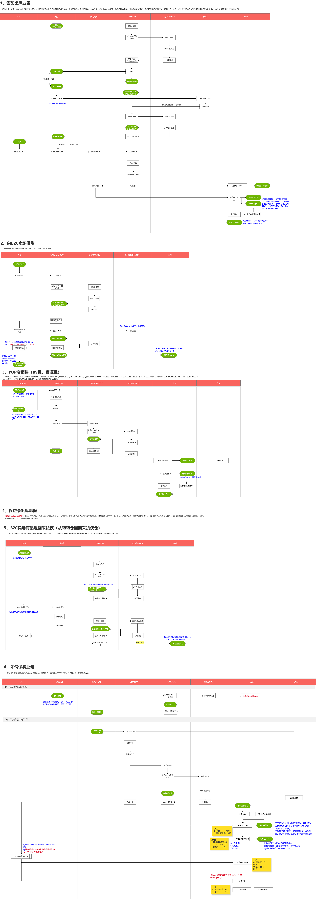
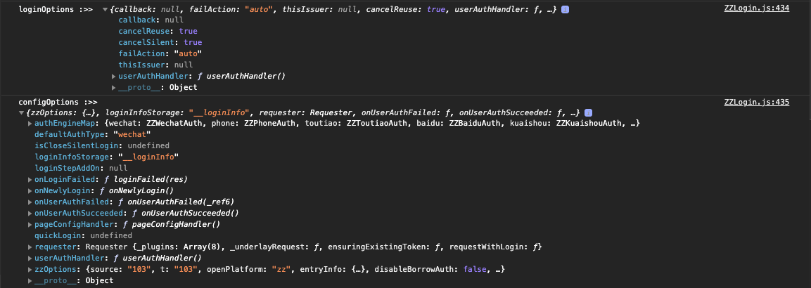
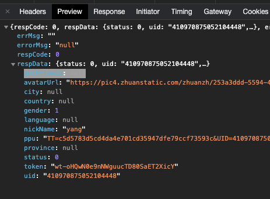

线上zzUid：410970875052104448 

线下uid：1446732087959750144

zzMobile：18582552002


zlj线上uid：92461341

zlj线下uid：210183005


权限系统外部用户 18582552002  uuR!nLgdpG6R

微信小程序AppId：wx9df7443125e6f01a

微信公众平台登录密码：zhuanzhuan20151112


node -v 12.22.10

### ERP

#### 主线流程系统功能


#### 1、采购管理：


#### 2、销售管理



#### 3、售后流程


#### 4、加保流程


#### 5、库存管理


### 小程序授权登录逻辑

1.展示登录界面，等待用户交互

```js
// adapter-mini/login/ZZLogin
function _authLogin(){
	let userAuthRes = await this._handleUserAuth(options);
}
```


```js
userAuthHandler() {
  // 该方法会调用AuthModal.vue实例展示上图中的弹窗
	let userInfoRes = await page.__asyncOpenAuthModal({})
}
```

userInfoRes打印信息如下图所示


2.设置头像和昵称


```js
userAuthHandler() {
  // 该方法会调用SetUserInfoModal.vue实例展示上图中的弹窗
	const setUserInfo = await page.__asyncOpenSetUserInfoModal()
}
```

其中点击头像区域或点击微信快捷设置会弹出微信内置的头像选择器

```vue
// open-type="chooseAvatar"时点击会自动弹出，用户选择后通过@chooseavatar监听回调
<button v-else  class="modal-set" open-type="chooseAvatar" @chooseavatar="onChooseAvatar">微信快捷设置</button>
```


头像、昵称任一项设置完成后，底部按钮会变为确认按钮，此时可以点击关闭弹窗，完成设置

合并后的授权信息如下（userInfo中的acatarUrl和nickName均为刚刚新设置的）：


3.拿到授权信息后，调用相应的鉴权器中的authLogin方法进行接口调用

mini_main中的authType为'wechat'，对应的鉴权器为new ZZWechatAuth()

```js
// adapter-mini/login/auth/ZZWechatAuth.js
async authLogin({loginOptions, configOptions, beforeRes, authData}){
  return this.loginByWxAuth({
    wxLoginRes: beforeRes.wxLoginRes,
    authData,
    loginOptions,
    configOptions,
  });
}
```

authLogin入参数对应的打印值如下所示：




先调用/zzopen/passport/miniwxsilencelogin获取authFlowId（这里只有从未与转转账号绑定过的用户才会返回authFlowId）




接着再调用miniwxauthlogin并传入authFlowId将当前用户与转转账号进行绑定


### 小程序新用户首次登录

假设现在有个新用户来访问我们的小程序，默认进入首页

1.如果小程序的启动逻辑（比如main.js、App.uniapp.vue） 和 首页（index.vue）中均没有使用$httpWithLogin({ mode: common }) 或者mode：silent，那么用户进来不会尝试进行静默登录也不会尝试授权登录

2.如果小程序的启动逻辑（比如main.js、App.uniapp.vue） 和 首页（index.vue）中存在$httpWithLogin({ mode: common })，那么首先会调用一次silentLogin尝试静默登录 => 静默登录失败 => 尝试授权登录 => 弹出授权弹窗 => 用户同意授权 =>silentLogin获取authFlowId => authLogin 注册并登录成功

3.如果小程序的启动逻辑（比如main.js、App.uniapp.vue） 和 首页（index.vue）中不存在$httpWithLogin({ mode: common })，但是存在$httpWithLogin({ mode: silent })，那么就会尝试静默登录，静默登录失败，对用户无影响无感知

注： authLogin和silentLogin并非指代授权登录和静默登录，只是指两个接口名，因为授权登录中，既会调用silentLogin也会调用authLogin


**流程详细说明**

1.复用失败

2.尝试静默登录

status不等于0，静默登录失败


3.尝试授权登录


### Magic魔方

线上打包机ip：10.9.31.39

```shell
ssh wanghongyan02@rig.zhuanos.com
  密码：wcc19941219.
  work@192.168.152.239
  /opt/web/node/ZZMagicBuildService_v3/magic-deploy/magic-admin-v3
nvm use 
nvm use v12.22.4
  git pull
  npm run build
npm owner add zhangyalong @zz-magic/magic-newzz-turntable
npm config set registry https://rcnpm.zhuanspirit.com/
npm get registry
```


#### 开发相关

##### 开发&测试流程

1. 开发：每个魔方组件对应一个项目

2. 本地测试：

   在`profile.json`文件中增加

   `devActivityId`或`activityId`属性，值为专题id，删除这个属性则只显示当前组件

   `componentIndex`属性，非必填，默认为0，调试第几个当前组件，例如：有些专题有可能出现5个图片组件，想调试第三个就输入3

   `isZzActivity`属性，非必填 默认都是'1'，@params: 2-找靓机专题， 其他：转转专题

   例如：

   ```json
   {
     "componentName": "magic-dep-base",
     "devActivityId": "10885", 
     "componentIndex": "1",
     "isZzActivity": "2",
     "data": {
       "text": "test"
     }
   }
   ```

   进入预览模式

   https://m.zhuanzhuan.com/preview.html?activityId=10885

3. 联调&测试环境

   首先到beetle上编译并部署

   whistle配置：

   ```
   # 测试环境
   192.168.153.10 magic.zhuanspirit.com
   192.168.152.239 s1.zhuanstatic.com/magic
   192.168.152.239 m.zhuanzhuan.com/Mzhuanzhuan
   # 接口测试环境
   10.135.2.132 app.zhuanzhuan.com reqHeaders://(Global-Route-Tag:yangsx)
   
   # 线上专题 - 需要配置 - 接口请求到线上
   #115.159.231.71 magic.zhuanspirit.com/newzz/
   # 测试环境专题 - 需要配置 - 接口请求到测试环境
   #192.168.153.10 magic.zhuanspirit.com/newzz/
   ```

   进入[魔方管理后台](https://magic.zhuanspirit.com/newzz/web/index.html#/activity/list?curPage=1)在专题中添加开发的组件，保存配置并发布，得到二维码，手机连接代理后扫码测试。


##### 本地测试打包机服务192.168.152.71

设置cicd.test.js 中的url为http://192.168.152.71:7003

启动71服务器上的node_service服务，`pm2 start pm2.config.js --env dev`

> pm2 服务常用命令
>
> 停止服务`pm2 stop <service_name>`
>
> 查看服务日志`pm2 log`
>
> 查看当前机器上已启动的服务`pm2 status`
>
> 查看某个服务的状态`pm2 show <service_name>`

启动71服务器上的打包机服务，`npm run dev`

##### 本地测试ZZMagicBuildService

1. 配置代理

   此代理会将所有接口指向本地，除了magic-seed&magic-admin-v3&后台组件代码。例如，预览区magic-seed使用的是线上环境的，选择左侧的组件实际加载的代码也是线上环境的。

   ```js
   127.0.0.1:7048 magic.zhuanspirit.com/newzz/ excludeFilter://*/newzz/web/ excludeFilter://*/newzz/tpl/ excludeFilter://magic.zhuanspirit.com/newzz/widgets/preview/*
   ```

2. 启动服务

   node_magic-admin_service：`npm run dev`

   ```js
   // 修改 config/config.local.js
   config.io = {
     // url: 'http://192.168.152.223:7003',
     // url: 'http://192.168.152.71:7003',
     url: 'http://127.0.0.1:7003', // 将websocket通信地址指向本地ZZMagicBuildService
     token: 'zzmagic-testing-io-token',
   };
   ```

   ZZMagicBuildServe：`npm run dev`

3. 本地增加组件

   虽然在魔方后台加载的代码是线上环境的，但当执行发布操作时，需要使用本地ZZMagicBuildService/magic-deploy/magic-components/下的组件代码。

   但此时本地magic-components下是没有任何文件的，因此需要在本地生成一些组件供测试：

   方式1(推荐): 进入到魔方后台 ➡️左侧菜单选择组件➡️找到需要的组件并点击更新。

   方式2: 参考第4点——更新基础依赖/组件 

   方式3: 进入到对应目录，手动执行命令`git clone` &&`cd dirname; cp -r src src_tmp; cd src_tmp; npx mc preview.vue`

4. 更新基础依赖/组件（可选）

   本地ZZMagicBuildService中的magic-dep-base&magic-seed 可能不是最新的，可以手动更新一下。

   ```js
   // ZZMbuildServce/test/app/controller/cicd.test.js
   
   // 更新dep-base
   socket.emit('build', {
   	type: 'component',
   	name: '@zz-magic/magic-dep-base',
   	branch: 'magic-dep-base-feature-3958-25', // 分支，要更新成哪条分支的代码
   	git: 'http://gitlab.zhuanspirit.com/zz-fe-magic/magic-dep-base.git',
   	reinstallModule: 'false',
   })
   // 更新组件
    socket.emit('build', {
      type: 'component',
      name: '@zz-magic/magic_newzz_demo4',
      branch: 'magic_newzz_demo4-feature-4050-3',
      git: 'git@gitlab.zhuanspirit.com:zz-fe-magic/magic_newzz_demo4.git',
    })
   ```

5. 注释离线包&CDN推送

   在服务器上，发布专题时会将专题的静态资源推送CDN&离线包，路径通常是从根目录`/`开始，但是在本地电脑上，一般没有权限在根目录写入进而导致报错，并且在本地的数据也并不会被推送至CDN，因此并没有实际作用。

   所以我们需要在本地开发时注释掉相关方法：

   ```js
   // ZZMagicBuildService/app/lib/templateLoader.js esbuild方法
   // // 拷贝至cdn
   // const bundlePath = path.join(esTplPath, 'bundle')
   // let templateLoaderConfig = this.config.templateLoader;
   // let ftpConfig = templateLoaderConfig.ftp;
   // let mountStaticDir = ftpConfig.mountStaticDir;
   // let cdnStaticDir = ftpConfig.cdnStaticDir;
   // fse.copySync(bundlePath, path.join(cdnStaticDir, `/${this._id}`))
   // fse.copySync(path.join(this.templateLoaderConfig.pluginProjectHome, 'common-chunk/bundle'), path.join(cdnStaticDir, `/common`), {overwrite: false})
   // fse.copySync(path.join(bundlePath, 'index.html'), path.join(mountStaticDir, `/${this._id}/index.html`))
   
   // // 离线包推送
   // ;(async() => {
   //   try {
   //     await this.offlinePush(bundlePath, this._id)
   //   } catch (err) {
   //     ctx.logger.info(`\n\n [Offline Publish Error] 专题Id: ${this.activityId}, error: ${err.message}`)
   //   }
   // })()
   return {}
   ```

6. 发布专题并查看

   此时我们已经可以在模仿后台进行专题发布的测试了，点击发布，会在本地`ZZMagicBuildService/magic-deploy/magic-seed/activity`生成专题的静态资源。文件名与发布的专题路径中的ID一致：

   例：`https://m.zhuanzhuan.com/Mzhuanzhuan/zhuanzhuan/zzactivity/magic/64898a6737ece6007affb236/index.html?magicplatform=zz&needNewWebview=1` 中的`64898a6737ece6007affb236`即对应本地的专题文件名。

   进入到专题文件的bundle目录下，编辑HTML文件，可以发现HTML中引入的资源都是从CDN上引入的，但由于我们的资源并没有被推送至CDN，因此我们还需要将资源路径手动改为本地：

   - 两个样式文件，直接替换成本地的
   - JS文件需要注意，第一个`script`标签的src需要从magic-seed/common-chunk引入，这里是`Vue、lego、native`等公共部分；第一个`script`标签的src引入当前目录下的index文件即可；

   ```html
   <head>
     <link href="./commonui-MG5N6BDU.css" rel="stylesheet">
     <link href="./index-IIEEHMVQ.css" rel="stylesheet">
   </head>
   <body>
   <div id="root"></div>
     <script src="../../../common-chunk/bundle/magic-common.0c0ac973d82fc83df683.js"></script>
     <script src="./index-BBO6GFBY.js"></script>
   </body>
   ```

   将HTML在浏览器运行就可以查看专题了。


#### 知识梳理

##### 1.配置区与预览区交互原理

1. adminV3有一个update.ts，在操作时调用update将数据更新到widgetHandler这个model中。这个数据是全局可以获取的。

2. 等到widgetHandler更新完毕后，update中会自动调用iframeUpload，并将所需参数传入

3. iframeUpload获取到iframe的window对象然后调用其update方法（这个update方法是在预览区mounted的时候挂载的），这样便将数据进行了传递。

   ```js
   const iframeUpload = (params: paramsType) => {
     document.getElementById("magic-set-iframe") &&
       document.getElementById("magic-set-iframe").contentWindow &&
       document.getElementById("magic-set-iframe").contentWindow.update &&
       document.getElementById("magic-set-iframe").contentWindow.update(params);
   };
   ```

4. 在预览区中，点击删除组件，也是同理，调用了adminV3的update方法——window.parent.update。

##### 2.预览区选中配置区加载对应配置

1. 预览区选中某一个组件后，会通过调用adminV3 window.update，更新widgetHandler
2. 配置区监听widgetHandler，找到normalList（存储了组件信息及其data）中选中的组件名componentName，然后根据name调接口拿到配置区代码，loadJS转成组件并渲染，同时传入初始值parseData、update、保存表单的save方法——组件调用save时传入一个回调函数，adminV3点保存的时候会调用该方法。

##### 3.预览区&配置区文件位置


##### 4.组件更新流程

1. `node_magic_admin_service`接收到`/component-config/update（/add）`的POST请求

2. `/controller/component_config` 调用了 `/lib/buildComponent`

3. ` /lib/buildComponent` 中 调用了`socket.buildComponent`

4. 与`ZZMagicBuildService`建立`socket`连接并将组件名发送过去

   ```js
   // socket.js
   const tunnelComponent = new Tunnel(socketComponent, {
     sendFlag: 'component-build',
     receiveFlag: 'component-built',
     key: 'componentName',
   })
   
   exports.buildComponent = componentName => {
     return tunnelComponent.send({ componentName })
   }
   ```

5. `ZZMagicBuildService`接收到`component-build`，在`/io/controller/component`中调用`/lib/buildComponent`中的`buildComponent`方法

6. `buildComponent`方法处理流程

   > 1.根据组件名获取并下载组件包
   > 2.拿到当前要编译组件的依赖 
   >
   > ```
   > /magic-deploy/magic-components/${componentName}/package.json
   > ```
   >
   > 3.拿到公共依赖（dep-base内的所有依赖）
   >
   > ```
   > /magic-deploy/node_modules/@zz-magic/magic-dep-base/package.json
   > ```
   >
   > 4.两份`package.json`做diff，删除组件依赖中与dep-base重复的依赖
   >
   > 5.假如包依赖的有魔方组件（例如红包基础组件）  扁平化处理（5 & 7配合）
   >
   > ​	更新对应的组件，并且删除依赖
   >
   > ```
   > if (/@zz-magic/.test(componentName)) {
   > 	linksArr.push(componentName);
   > 	await buildComponent(componentName, config, logger); // 更新对应的组件
   > 	delete restJson[componentName];
   > }
   > ```
   >
   > 6.进入到对应的组件文件下，执行`npm i`
   >
   > 7.兼容从`node_modules`引入基础包的方式（例如图片基础组件）（5&7配合）
   >
   > ​		在5中删除了`package.json`中的依赖会导致我们的组件在引用其他红包组件时找不到，所以需要在当前组件的`node_modules`中创建对应的文件，并软链到`/magic-deploy/magic-components`下对应的组件文件
   >
   > ```
   > mkdirsSync(`${targetPackagePath}/node_modules/@zz-magic`);
   > const { code, stderr } = await shelljs.shellExec(`
   > ln -s ${config.componentDir}/${convertName(componentName)} 	    	${targetPackagePath}/node_modules/@zz-magic/${convertName(componentName)}
   > `, { silent: true });
   > ```
   >
   > 8.添加环境变量
   >
   > 9.打包组件，执行`npm run build`
   >
   > 9.构建预编译版本，详见*构建预编译版本*
   >
   > ```
   > cd ${targetPackagePath}; cp -r src src_tmp; cd src_tmp; npx mc preview.vue
   > ```
   >
   > 10.读取打包后的`profile`，返回`profile`以及`buildMsg`

##### 5. 构建预编译版本

1. `npx mc preview.vue`

2. 使用`@vue/component-compiler-utils`中的`parse`解析`.vue`，得到`preview-render.js`、`preview.css`、`preview-options.js`,并生成入口文件`preview.js`

   

   

   

   

3. 当解析上一步的js部分时，会进行递归调用`compile`。如果文件类型是js，会调用`analysisImport`分析引入的文件并将本地的文件收集起来然后遍历调用`complie`，然后对当前js文件进行`babel`处理，结果如步骤2中图所示。

   总的来说，就是将`.vue`文件拆分成四个文件并将js进行`es6->es5`的处理，`.css`文件，在postprocess中也会对一些基础库做一下px转rem及vw转rem等操作，将非js类、css、vue类型的文件直接copy到对应的目录。（还有魔方组件互相依赖拍平、对一些业务组件引入的第三方库样式处理）

##### 6. 发布流程

1. 前置流程

   略

2. 通过socket接收信息

   ```
   io.of('/activity').route('activity-build', io.controller.activity.build);
   ```

3. 调用`TemplateLoader.generateTemplate`

   方法内会优先使用`esbuild`去打包，如果报错则转而使用`webpack`打包。(esbuild打包入口是magic-seed/src/index-fn.js，webpack打包入口文件是magic-seed/src/index.js)

4. `TemplateLoader.esbuild`方法流程

   > 1.将`esbuild`文件`copy`到对应专题目录下
   >
   > ```
   > /magic-deploy/magic-seed/esbuild => /magic-deploy/magic-seed/activity/${activity_id}
   > ```
   >
   > 2.将参数中传入的`windowActivityData`写入到`config-space`中
   >
   > // await this.writeJsonFile()
   >
   > // config-space中存储了专题的信息，以及normalList组件信息（含组件的详细配置）
   >
   > ```
   > /magic-deploy/magic-seed/config-space/${activity_id}.js
   > ```
   >
   > 3.根据`config-space/${activity_id}.js`的配置生成`importCode & jsCode`
   >
   > ​	importCode：根据`normalList`中的组件，生成对应的`require`语句(注意：这里require的，是预构建产物prebuild中的preview.js)
   >
   > ​	jsCode：根据`normalList`中的组件，生成一个`Map`——组件名与`require`进来的组件的映射关系
   >
   > 4.根据对应专题目录下`build-template.ejs`模板生成入口文件并写入`index.js`
   >
   > ```js
   > const buildTpl = fse.readFileSync(path.join(esTplPath, 'build-template.ejs'));
   > const entryCode = _.template(buildTpl)({
   > importCode,
   > jsCode,
   > 	configPath: this.getFilePath(),
   > });
   > fse.writeFileSync(path.join(esTplPath, 'index.js'), entryCode);
   > ```
   >
   > ```js
   > // build-template.ejs解析
   > // render是/magic-seed/prebuild/index-fn.js 用来根据传入的config（config.normalList中存放了所有组件的配置信息）
   > const render = require('../../prebuild/index-fn.js').default
   > // 所有的专题信息 __activityData__
   > const config = require('<%=configPath%>')
   > // 引入专题内组件的require命令
   > <%=importCode%>
   > // 第一个参数为组件名与组件的映射
   > render(<%=jsCode%>, config)
   > ```
   >
   > ```js
   > // 根据模板生成的入口文件
   > const render = require('../../prebuild/index-fn.js').default
   > const config = require('/opt/web/node/ZZMagicBuildService/magic-deploy/magic-seed/config-space/637722d0f7ff9a7f2a6c225f.js')
   > 
   > const magicNewzzRedEnvelopeRain = require('/opt/web/node/ZZMagicBuildService/magic-deploy/magic-components/magic-newzz-red-envelope-rain/prebuild/preview').default;const magicNewzzImage = require('/opt/web/node/ZZMagicBuildService/magic-deploy/magic-components/magic-newzz-image/prebuild/preview').default
   > 
   > render({'magic-newzz-red-envelope-rain': magicNewzzRedEnvelopeRain,'magic-newzz-image': magicNewzzImage}, config)
   > ```
   >
   > 5.编译index.js
   >
   > 调用专题目录下的build.js（esbuild配置也在该文件中，调用时传入）
   >
   > ```js
   > await shelljs.shellExec(`node ${path.join(esTplPath, 'build.js')} ${this._id}`);
   > ```
   >
   > ```js
   > // build.js
   > await esbuild.build() // onResolve：当解析到zz-ui/b2c-ui的样式文件时，将引入路径存储起来；onLoad：当加载到zz-ui/b2c-ui的样式文件时直接返回空函数，不进行打包处理，后边单独处理。
   > 
   > await zzCssBuild(zzUiCssPath) // 创建了一个uicss.js文件，然后将收集到的样式文件路径拼上requeire命令插入到uicss.js中。执行esbuild.build去编译打包uicss.js并将产物输出到/magic_deploy/magic_seed/activity/${activity_id}/bundle/commonui-[hash].js(以及.css)。然后对.css文件进行一些操作（pxtorem）,最后删除uicss.js
   > await b2cCssBuild(b2cUiCssPath)// 同zzCssBuild
   > await swcTransform() // 没看
   > ```
   >
   > 至此我们已经将所有的文件编译打包好了。
   >
   > // commonui-A54BB3E4.css  index-MCVGAEXK.css commonui-FHNOW74L.js   index-XUE5VKAD.js  b2ccommonui-HRKSQFA4.js
   >
   > 6.生成html
   >
   > 调用专题目录下的genHtml.js，将`./bundle/index-*.js`、`./bundle/*.css`以及`../../common-chunk/bundle/*.js`插入到模板中并生成index.html
   >
   > jsLink：`<script src="https://s1.zhuanstatic.com/magic/${activity_id}/${.js}"></script>`
   >
   > commonJsLink：`<script src="https://s1.zhuanstatic.com/magic/common/${commonJs}"></script>`
   >
   > cssLink：`<link href="https://s1.zhuanstatic.com/magic/${activity_id_id}/${.css}" rel="stylesheet">`
   >
   > 7.拷贝至cdn & 推送到离线包服务器
   >
   > 

##### 7.CICD

1. magic-seed

   任何情况下，不会更新依赖，只会更新magic-deploy/magic-seed，并且magic-deploy/magic-seed/no de_modules是软链到magic-deploy/node_modules的

2. magic-admin-v3

   根据是否勾选“重新构建依赖”，来进入到magic-admin-v3下执行npm i 

3. 魔方组件

   发包、然后构建

##### 8. 公共依赖抽离

**本地&魔方后台：**

1. 在webpack配置中使用externals选项告知webpack打包时不需要处理相关依赖。

2. 另外使用插件在html中注入公共依赖。

```json
externals: { ...externalsConfig.previewExternals, ...externalsConfig.configExternals },
    plugins: [
      new HtmlWebpackPlugin({
        filename: 'index.html',
        template: path.join(__dirname, '../public/index.html'),
        chunks: ['index']
      }),
      new HtmlWebpackPlugin({
        filename: 'preview.html',
        template: path.join(__dirname, '../public/preview.html'),
        chunks: ['preview']
      }),
      new AddAssetHtmlPlugin([
        {
          filepath: path.resolve(__dirname, '../dist/magic-config-externals.*.js'),
          files: 'index.html'
        },
        {
          filepath: path.resolve(__dirname, '../dist/magic-preview-externals.*.js'),
          files: 'preview.html'
        }
      ]),
      new VueLoaderPlugin()
    ]
```

```js
// externalsConfig
module.exports = {
  previewExternals: {
    vue: {
      root: 'Vue', // 将全局变量 Vue 作为外部依赖引入,这样当组件在import from 'vue'时，就会自动从window.Vue中获取
      commonjs: 'vue',
      commonjs2: 'vue',
      amd: 'vue'
    },
```


**发布专题：**

1. 在build magic-seed时，就已经将公共的模块打包生成好了(node ./common-chunk/build-chunk.js)

   ```json
   "build": "cross-env NODE_ENV=production webpack --display-modules --config webpack.preview.config.js",
   "prebuild": "mc ./src/index-fn.js && node ./common-chunk/build-chunk.js"
   ```

   执行build-chunk打包公共依赖并将其输出到bunlde目录下。

   

   其中commen-try如下，将所有的依赖挂载到了window对象上，如vue挂载到了window.vue

   

   在专题的最外层壳子html中会引入这个公共依赖文件。

   

   当组件import from 'vue'的时候，会自动从window.vue获取

   

**注意点：**

本地&开发将vue挂载到了window.Vue，而发布专题则挂载到了window.vue。这两者都可，因为只要你整体打包时挂载到的变量名 === 你在组件内部处理后引入的变量名 即可。


##### 9.magic-seed中三个入口文件的用处

index.js: 发布时，webpack打包入口

index-fn.js: 发布时，esbuild打包入口

preview.js: 本地启动&魔方后台预览区，启动服务的入口

#### 基础依赖合并

##### 魔方基础依赖介绍

- `dep-base`提供了本地运行组件的能力以及组件需要的所有第三方依赖
- `common-config`提供了配置区的一些常用表单项，如跳转配置、展示终端配置等
- `common-preview`提供了预览区的一些常用能力，如跳转、埋点上报等
- `dep-base`依赖`common-config`和`common-preview`，`common-config`和`common-preview`又依赖`dep-base`


一个魔方组件，通常只需要依赖`dep-base`即可，因为在安装`dep-base`的时候会自动将`common-config & common-preview`的内容打包生成到`dep-base`中。

```json
"dependencies": {
  "@zz-magic/magic-dep-base": "^7.0.0"
}
```

安装完的依赖目录是这样的


##### 魔方为什么要做环境隔离

之前，魔方在beetle编译某个基础依赖（e.g. @zz-magic/magic-common-config）时：

- 会发布一个正式包（e.g. @1.1.3）
- 并将测试服务器上专门存放公共依赖的文件下的`node_modules`删除，然后执行`npm install`重新安装依赖
- 在安装中会使用我们最新发布的`@zz-magic/magic-common-config@1.1.3`。（此处实际是在一个临时文件夹中操作，然后安装后再复制出来的，可以减少测试环境的不可用时间）

举一个常见的场景来说明下这种模式的问题——A在开发`common-preview`，B在开发`common-config`，两人都在测试环境进行了编译，导致发出去了两个正式包`@zz-magic/magic-common-config@1.1.3` & `@zz-magic/magic-common-preview@1.1.3` 。那么此时，如果A开发测试完了，想要上个线，那么在执行服务器上执行到`npm i`的 时候，就会把B还未测试完成的包给安装到线上环境去。（其实在测试服务器上两个人的代码也是混合在一起的，不过毕竟是测试环境，影响较小）

从这个场景分析，可以发现有两个主要的问题：

1. 测试环境发布正式包，导致线上无法区分

2. `npm install`正常情况下只会安装正式包，不会安装beta包

   ```
   "@zz-magic/magic-dep-base": "^7.0.0"
   "@zz-magic/magic-common-config": "^1.0.0",
   "@zz-magic/magic-common-preview": "^1.0.0",
   ```

   

   

##### 设计思路

针对上述的两个问题，对应的解决办法就是：

1. 测试环境发beta包，线上发正式包

2. 使用`npm install @package@version(-beta)` 替换`npm install`

   

第一点就不说了，大致就是先`npm view packageName versions`获取包的所有版本，然后根据环境去获取最新的正式包版本或者是最新的beta版本，然后修改版本号再发包。

第二点，在更新依赖的时候，通过指定版本号的形式去安装我们最新发布的包。只不过在线上环境中，安装的是正式包，测试环境中安装的beta包。

看起来一切是那么的美好，但现实并不总是一帆风顺......


##### 问题复现&解决


这个目录下只用于存放我们的node_moudles，一开始我们肯定是要先初始化执行一下`npm install`，之后才能去单独的更新对应的依赖。


为了跟之后的操作做对比，我将记录下`dep-base` & `common-config`的版本以及他们node_modules的情况。

> dep-base: "@zz-magic/magic-dep-base@7.4.45"  node_modules下无其他依赖 
>
> 
>
> common-config: "@zz-magic/magic-common-config@1.1.3"  node_modules下无其他依赖 
>
> 

接下来，我将执行` npm i @zz-magic/magic-common-config@1.1.3-beta.1`去单独更新`common-config`。

执行结果：

> dep-base: "@zz-magic/magic-dep-base@7.4.45"  
>
> ​					node_modules下存在：common-config@1.1.3
>
> 
>
> common-config: "@zz-magic/magic-common-config@1.1.3-beta.1"  node_modules下无其他依赖 

根据npm包安装的机制，默认情况下是不会使用beta包的，dep-base依赖的`"@zz-magic/magic-common-config": "^1.0.0"`需要使用稳定的版本，所以beta版本被放在最外层，而将之前的`common-config@1.1.3`放在了dep-base/node_modules下。

魔方的基础依赖在使用前会在dep-base下执行一个`externals`命令将`common-config`和`common-preview`的内容打成dist放在`dep-base`下。但是node_modules依赖的查找顺序是先从当前文件目录下查找的，所以生成dist文件时使用的将会是dep-base/node_modules/下的`common-confg@1.1.3`，而不是最外层的`common-confg@1.1.3-beta.1`

所以，我需要手动删除`dep-base/node_modules/@zz-magic/magic-common-config`，再去执行`externals`命令。（我们希望优先使用最外层的beta版本，但是如果当前目录下存在其他版本，则会优先使用当前目录下的文件，这是不符合要求的）


那接下来我们再试试在此基础上更新`dep-base`，`npm i @zz-magic/magic-dep-base@7.4.45-beta.1`。

结果就是出现了更多冗余的依赖。。。

> dep-base: "@zz-magic/magic-dep-base@7.4.45-beta.1"  
>
> 					node_modules下存在：common-config@1.1.3 & dep-base@7.4.45
>
> 
>
> common-config: "@zz-magic/magic-common-config@1.1.3-beta.1"  
>
> ​								node_modules下存在：common-config@1.1.3 & dep-base@7.4.45
>
> 

原因跟之前一样，我们安装的beta版本的`dep-base`不符合`common-config`所依赖的`"@zz-magic/magic-dep-base": "^7.0.0"`，就导致`common-config`下的node_modules中又多了一个`@zz-magic/magic-dep-base@7.4.45`，然后这个7.4.45的`dep-base`又依赖一个稳定版本的`common-config`，所以在同级目录下还会再多一个`@zz-magic/magic-common-config@1.1.3`

同样的，我们仍需要先手动的去删除这些冗余的、不符合我们要求的依赖。

综上，为了确保我们项目中使用的都是我们刚发布的beta包，我们需要在每一次更新依赖时都执行一下这三条命令去清除冗余的依赖，然后再去执行打包命令。

```shell
rm -rf ./node_modules/@zz-magic/magic-dep-base/node_modules/@zz-magic
rm -rf ./node_modules/@zz-magic/magic-common-config/node_modules/@zz-magic
rm -rf ./node_modules/@zz-magic/magic-common-preview/node_modules/@zz-magic

cd node_modules/@zz-magic/magic-dep-base
npm run externals 
```

然而，到这一步还没完事，我将代码部署到测试服务器上后，经常出现依赖没有安装完成或安装完没有生成dist文件的情况，总是执行到一半就“中断”了。但是我在本地测试的时候却不会出现这种问题。

经过一步一步的排查，最终将问题定位到了这一行代码

```js
await shelljs.shellExec(`${this.shellPath['magic-admin-v3-node-modules']}`)
```

查看`shelljs.shellExec`方法：

```js
exports.shellExec = function (command, options = {}) {
  return new Promise((resolve, reject) => {
    Object.assign(options, {timeout: 300000});
    shell.exec(command, options, (code, stdout, stderr) => {
      return resolve({
        code,
        stdout,
        stderr,
      });
    });
  });
};
```

经常中断，难道是过了超时时间？我试着将超时时间从5min改到10min，部署至测试服务器，再次更新依赖，一切正常了......（不得不吐槽这个测试服务器的性能甚至不如我的Mac）

再一看编译时间，耗时10min，!真棒。

`magic-dep-base`


编译`magic-common-config`


magic-common-preview：


##### 优化

如此低效率的更新显然不能让人满意，而且由于魔方自身的原因，当编译基础依赖时，其他人是不能再部署其他魔方服务的，这就会阻塞其他人的流程，对开发人员的体验是十分差的。

首先就是先分析问题找出原因：

第一点：很容易想到的，当安装beta版本的依赖时，总是会额外产生很多冗余的稳定版本的依赖。

第二点：安装依赖耗时么？耗时，但是至于这么耗时么？不至于。耗时中的大头另有其因，其实就是`dep-base`中的`externals`命令，打包，这个是比较耗费时间的通常需要1-2分钟。

所以在一定程度上是问题1导致了问题2——安装了冗余的依赖，其中冗余的`dep-base`会自动执行`externals `命令导致耗时过久。

**所以我们首先需要解决的就是避免安装冗余的依赖：**

`dep-base`需要依赖`common-config`，是因为需要将`preview`的内容打包生成到`dep-base`下供组件/专题/本地开发使用。

`common-config`需要依赖`dep-base`只是因为本地开发时需要。

如果去掉`common-config`的依赖项，那就可以在安装`common-config@beta`时避免额外安装`dep-base`。但是，本地开发`common-config`的场景还是很多的，因此需要想个办法尽可能的减少由此带来的对开发体验的影响。

于是我在脚本中加入了一个自动检查并安装依赖的命令`depcheck`。

```json
// dev之前先检查dep-base
"predev": "npm run depcheck && magic -c"
// list可以列出当前工程下的dep-base情况以及版本
// 如果没有会返回一个假值并走到npm i命令去安装dep-base
"depcheck": "npm list @zz-magic/magic-dep-base || npm i --no-save @zz-magic/magic-dep-base",

```

这样，在安装`common-config@beta`的时候就不会额外安装`dep-base`也不会额外执行`externals`命令了。

那么在安装`dep-base@beta`的时候呢？还是会额外安装冗余的`common-config`然后自动执行`externals`，然后删除冗余的`common-config`，再手动执行一次`externals`。

**接下来需要针对dep-base再次进行优化：**

由于`dep-base`是强依赖`common-config`的所以不能去掉依赖项，冗余的`common-config`肯定是避免不了的，不过这又有什么关系呢，安装再删除一共也影响不了几秒钟。

但重点是`A`中有这样一个脚本命令：`postinstall：npm run externals`——该命令是为了在开发时安装依赖等场景可以自动执行`externals`以减少操作次数&降低学习成本。

这就会导致第一次执行`externals`的时候实际使用的是冗余的稳定版本`common-config`，而非我们需要的最外层的`common-config@beta`，所以还需要删掉冗余依赖然后额外执行一次`externals`，这才是最耗时的部分。

“要是在`npm i`的时候可以不执行`postinstall：npm run externals`就好了”，带着这个期许，我找到了一个好用的脚本参数——`--ignore-scripts`（忽略依赖中的脚本命令，不去执行任何脚本）

这样一来，在安装`dep-base`的时候，也不会额外执行`externals`命令了！

magic-dep-base：


magic-common-config：


magic-common-preview：


##### 总结

以上，就是在对魔方基础依赖环境隔离改造的思路和问题的解决：

1. 通过发布beta版本的包来区分测试环境与线上环境
2. 但是带来了编译速度严重下降的问题
3. 通过去掉`common-config & common-prevew`中的依赖项来避免安装冗余的依赖

4. 针对`dep-base`，在`npm i`的使用加入`--ignore-scripts`命令来避免额外执行`externals`


#### 新增通用专题

##### 初步改动方案

1.新增business字段值`300`  (100 转转专题  200 找靓机专题 300 通用专题)

​	对于部分通用页面——指无业务逻辑、便展示/提示类的静态页面，可以让运营一次搭建，投放在双端，提高搭建效率。

2.保留isZzActivity，新增一个参数newActivityType（通用专题===”1“）

​	不使用布尔值为了更好的扩展性。在判断isZzActivity之前先判断newActivityType，这样可以不用处理非通用组件，只需关注通用组件（22个通用组件，排除业务组件后剩10个）。

3.config区的MagicLink

​	在通用专题中，提供2个跳转配置，分别是转转跳转配置和找靓机跳转配置，组件复用。在页面中根据实际投放的端情况，去选择读取转转/找靓机配置（除找靓机端内&找靓机小程序，都走转转配置）。

​	待办：

​	1）端外吊起逻辑

4.preview区的MagicLink，按照3中的规则新增通用专题中的对应逻辑。

5.配置区MagicTerminal

​	有些场景，比如微信小程序，微信侧是禁止分享和裂变这种行为的，如果有引流的行为小程序会被封。可能会使用该配置。

  因此在通用专题中，仍需提供该配置，可选值为 目前转转配置与目前找靓机配置的并集。

  其他待办：

  1）magic-seed中的getClient会有问题，改为[native.in](http://native.in/)

6.magic-seed中的上报zpm，非找靓机专题都打开

7.组件中涉及到的地方绝大多数都是MagicLink & MagicTerminal，个别的地方需要在开发时结合逻辑看看如何调整。


##### 基础项目改动点

###### 1）magic-seed

1. 专题上报zpm

   通用专题上报

2. 新增参数、传参

3. HideHead中的MagicLink

###### 2）magic-dep-base

1. 新增参数、传参
2. 文档修改

###### 3）magic-common-preview

1. MagicLink

   原逻辑

   ```
   MagicLink(isZzActivity, this.parseData.link)
   根据isZzActivity，判断使用zzLink还是zljLink
   ```

   通用逻辑

   如果传入了newActivityType（===“1”）,则isZzActivity无用，会按照端的情况动态选择使用哪个逻辑。
   目前判断逻辑是，只要不是找靓机app 和 找靓机小程序，都走zzlink

   ```jsx
   const mockCommonActivityData = {
     zz: {
       type: '1100',
       param: ''
     },
     zlj: {
       value: '12123123123123',
       type: 1
     }
   }
   MagicLink(isZzActivity, mockCommonActivityData, newActivityType)
   ```

2. MagicLogger

   通用专题逻辑与转转一致

   ```
   if ((common || debug_env === 'common') && actiontype_zz) {
   	zzLogger({ actiontype: actiontype_zz, backup })
   }
   if ((zz || debug_env === 'zz') && actiontype_zz) {
   	zzLogger({ actiontype: actiontype_zz, backup })
   }
   ```

   

###### 4）magic-common-config

1. MagicLink

   原逻辑

   ```jsx
   <Form.Item name="link">
   	<MagicLink isZzActivity={true/false} />
   </Form.Item>
   value:
   zlj—link: {value: 'zljgo://native_api?type=13', type: 39}  // 都是type+zljgo协议的跳转
   zz—link:{type: '1600', param: '123'[, channelId: '喔喔喔喔']} // 都是type+params 
   ```

   通用逻辑

   ```jsx
   <Form.Item name="link">
   	<MagicLink isZzActivity={isZzActivity} newActivityType='1' />
   </Form.Item>
   value:
   {
       "zz": {
           "type": "1100",
           "param": ""
       },
       "zlj": {
           "value": "12123123123123",
           "type": 1
       }
   }
   ```

   

2. 展示终端

   原逻辑

   根据勾选的配置，使用native.getClient方法去匹配

   ```
   const zzTerminal = [
     { label: 'm页', value: 'm' },
     { label: '转转', value: 'zz' },
     { label: '小程序', value: 'miniprogram' },
     { label: '微信', value: 'wechat' },
     { label: '采货侠', value: 'zzhunter' },
     { label: '转转专业卖家', value: 'zzseller' }
   ];
   
   const zljTerminal = [
     { label: 'm页', value: 'm' },
     { label: '微信', value: 'wechat' },
     { label: '找靓机', value: 'zlj' },
     { label: '找靓机小程序', value: 'miniprogramzlj' }
   ];
   ```

   通用逻辑

   ```
   const commonTerminal = [
     { label: 'm页', value: 'm' },
     { label: '转转', value: 'zz' },
     { label: '找靓机', value: 'zlj' },
     { label: '小程序（除找靓机小程序）', value: 'miniprogram' },
     { label: '找靓机小程序', value: 'miniprogramzlj' }, // 需要单独根据T值处理
     { label: '微信', value: 'wechat' },
     { label: '采货侠', value: 'zzhunter' },
     { label: '转转专业卖家', value: 'zzseller' }
   ];
   ```

   

###### 5）magic-admin-v3

1. 分享信息初始值

   通用专题默认使用转转的分享初始值。

   

2. 发布时通用专题注册区域id

   

3. 左侧组件列表

   

4. 增加通用专题配置


##### 组件项目改动点

###### 1）~~(x)magic_newzz_game_business_filterlist~~

​	业务组件，不支持通用

###### 2）~~(x)双卖场帮选magic-newzz-helpselect~~

​	业务组件，不支持通用

1. magicPlatform

   根据专题类型去走不同的业务逻辑，多处使用。

   ```
   export const magicPlatform = (isZzActivity = true, cb) => {
     if (!cb.zz || !cb.zlj) throw new Error('函数使用不合法，仅支持 zz | zlj 函数调用')
     isZzActivity ? cb['zz']() : cb['zlj']()
   }
   ```

   

2. getCardList

   ```
   this.isZzActivity ? this.getDataList() : this.getZLJDataList(requestParams)
   ```

3. baseRender

   内部单独写了一个baseRender

###### 3）倒计时magic-newzz-activity-countdown

1. MagicTerminal

###### 4）弹幕magic-newzz-barrage

1. MagicLink
2. MagicTerminal

###### 5）按钮magic-newzz-button

1. MagicLink
2. MagicTerminal

###### 6）弹窗magic-newzz-dialog

1. form['_newActivityType'] = newActivityType

2. MagicLink
3. MagicTerminal

###### 7）~~(x)嵌入页magic-newzz-iframe~~

​	iframe嵌入会导致lego的t值混乱，从而无法识别出端的情况，暂不支持

1. MagicTerminal

###### 8）图片magic-newzz-image

1. MagicLink

2. MagicTerminal

3. 开启预约提醒

   原逻辑：仅转转专题支持

   通用逻辑：支持，该方法需要找靓机版本（9.2.10）以上，找靓机专题暂时保持不支持

   ```jsx
   { (newActivityType === '1' || isZzActivity) &&
   	<>
       <MagicCard title="开启预约提醒" bold addon={
         <Form.Item name='remind' initialValue="0" >
         <Radio.Group>
         <Radio value={'1'}>是</Radio>
         <Radio value={'0'}>否</Radio>
       </Radio.Group>
     </Form.Item>
   }
   ```

   

###### 9）~~(x)新品发布会直播magic-newzz-live~~

​	业务组件，不支持通用

1. MagicTerminal

###### 10）~~(x)抽奖机magic-newzz-lottery-machine~~

​	业务组件且年使用量为0，不支持通用

1. saveDrawMachineModule

```js
/api/magic/drawMachine/saveDrawMachineModule
# 参数中的sourceType: isZzActivity ? 1 : 2,
```

2. 抽奖机自己写了一个magic-terminal

###### 11）~~(x)广播magic-newzz-notice-bar~~

​	年使用量为0，不支持通用

1. MagicLink
2. MagicTerminal

###### 12）导航magic-newzz-page-tab

1. MagicLink
2. MagicTerminal

###### 13）~~(x)气泡卡magic-newzz-pop~~

​	涉及商品，不支持通用

1. 修改infoId主动获取商品进行填充

   ```jsx
   if (newActivityType === '1') {
     formData[name[0]][name[1]].skip = {
       zz: {
         type: '1800',
         param: infoId
       },
       zlj: {
         type: 37,
         value: infoId
       }
     };
   } else if (isZzActivity) {
     formData[name[0]][name[1]].skip = {
       type: '1800',
       param: infoId
     };
   } else {
     formData[name[0]][name[1]].skip = {
       type: 37,
       value: infoId
     };
   }
   ```

2. MagicLink

3. MagicTerminal

###### 14）排行榜magic-newzz-ranklist

1. MagicLink
2. MagicTerminal

###### 15）~~(x)红包雨magic-newzz-red-envelope-rain~~

1. MagicTerminal

###### 16）~~(x)红包magic-newzz-red-packet~~

1. form['_newActivityType'] = newActivityType

2. 红包跳转配置（按红包配置跳转）

   原逻辑：adapter 无法区分转转小程序和找靓机小程序，通过 isZzActivity 判断是找靓机环境和转转环境

   ```jsx
   if (isZzActivity) {
     if (native.in('miniprogram')) {
       const weChatUrl = redPkg.weChatUrl;
       weChatUrl && native.enterUnifiedUrl({ unifiedUrl: weChatUrl });
     } else {
       const appUrl = redPkg.appUrl;
       if (!appUrl) return;
       if (/^(http|https)/i.test(appUrl)) {
         native.skipToUrl({ targetUrl: appUrl });
       } else {
         native.enterUnifiedUrl({ unifiedUrl: appUrl });
       }
     }
   } else {
     const url = redPkg?.url?.indexOf('zljgo') > -1 ? redPkg.url : `zljgo://native_api?type=1&content=${encodeURIComponent(redPkg.url)}`;
     url && MagicLink(false, { value: url });
   }
   ```

   通用逻辑：通过T值+native.in区分找靓机环境（找靓机app + 找靓机小程序）

   ```jsx
   if(isLikeZLJ()) {
       const url = redPkg?.url?.indexOf('zljgo') > -1 ? redPkg.url : `zljgo://native_api?type=1&content=${encodeURIComponent(redPkg.url)}`;
       url && MagicLink(false, { value: url });
   } else {
     if (native.in('miniprogram')) {
       const weChatUrl = redPkg.weChatUrl;
       weChatUrl && native.enterUnifiedUrl({ unifiedUrl: weChatUrl });
     } else {
       const appUrl = redPkg.appUrl;
       if (!appUrl) return;
       if (/^(http|https)/i.test(appUrl)) {
         native.skipToUrl({ targetUrl: appUrl });
       } else {
         native.enterUnifiedUrl({ unifiedUrl: appUrl });
       }
     }
   }
   ```

3. 找靓机端外领取红包时，吊起app

   原逻辑：端外找靓机专题直接吊起找靓机app

   ```jsx
   const { isZzActivity } = this.allData;
   if (!isZzActivity && !native.in(['zlj', 'miniprogram'])) {
     MagicLink(false, {
       value: `zljgo://native_api?type=1&content=${encodeURIComponent(
         window.location.href
       )}`
     });
     return;
   }
   ```

   通用逻辑：在端外，无法根据专题类型预判运营想要吊起的app，所以通用专题不自动吊起。可以让运营在页面设置中配置“端外APP调起逻辑设置”。

   ```jsx
   const { isZzActivity, newActivityType } = this.allData;
   if (!newActivityType && !isZzActivity && !native.in(['zlj', 'miniprogram'])) {
     MagicLink(false, {
       value: `zljgo://native_api?type=1&content=${encodeURIComponent(
         window.location.href
       )}`
     });
     return;
   }
   ```

4. 开启预约提醒

   原逻辑：仅转转专题支持

   通用逻辑：支持，该方法需要找靓机版本（9.2.10）以上，找靓机专题暂时保持不支持

   ```jsx
   theme === '5' &&
   	layout === 'column-1' &&
   		(form['_isZzActivity'] || form['_newActivityType'] === '1' ) && (
   			<MagicCard
   				title="开启预约提醒"
   				bold
   			</MagicCard>
          
   ```

5. MaigcLink

6. MagicTerminal

###### 17）富文本magic-newzz-rich-text

1. MagicTerminal

###### 18）~~(x)电子维修卡magic-newzz-trade-warranty-card~~

​	仅使用一次，之后不会使用，暂不支持

1. MagicTerminal

###### 19）~~(x)转盘magic-newzz-turntable~~

​	暂未处理

1. saveLotteryMachineConfig

   ```js
   businessSource: isZzActivity ? 1 : 2,
   /zzopen/zzyylogic/addOrUpdateLotteryMachineConfig
   ```

   参数作用是 找靓机只能用找靓机的红包 转转只能用转转的红包；对于通用专题，后端无法兜底。

2. MagicTerminal

###### 20）视频magic-newzz-video

1. MagicTerminal

###### 21）~~(x)找靓机落地页直播引导magic-newzz-zlj-live-guide~~

​	业务组件，不支持通用

1. renderData

   ```jsx
   renderData() {
     if (this.isZzActivity) {
       const obj = Object.assign({}, this.parseData, {
         image: this.dataInfo.imgUrl,
         guideTitle: this.dataInfo.mainText,
         guideContent: this.dataInfo.auxiliaryText,
         guideBtnText: "立即添加",
       });
       return obj;
     } else {
       return this.parseData;
     }
   },
   ```

2. getDataInfo()

   ```jsx
     created() {
       //转转专题
       if (this.isZzActivity) {
         this.getDataInfo();
       } else {
         this.visible = true;
       }
     },
     methods: {
       //转转秒杀小组件获取数据
       getDataInfo() {
         getSecKillDesktopModuleConfig().then((res) => {
           if (res && Object.keys(res).length > 0) {
             this.dataInfo = res;
             this.visible = true;
           } else {
             this.visible = false;
           }
         });
       },
   ```

3. zzAddDesktopComponent

   ```jsx
   jumpToUrl() {
     //转转专题
     let _value = "";
     if (this.isZzActivity) {
       //添加桌面小组件
       this.zzAddDesktopComponent();
     } else {
       const { value } = this.parseData.link || {};
       _value = value;
       enterPage(value);
     }
   ```

###### 22）~~(x)行间距magic-newzz-blank~~

 年使用量为0，不支持通用

1. MaigcTerminal

###### 23）~~(x)机型价格趋势组件magic-newzz-model-card~~

###### 24）~~(x)机型卡片组件magic-newzz-user-model-card~~

##### 自测方案

1. 先部署magic-common-config、magic-common-preview、magic-seed

2. 再部署magic-dep-base

3. 之后组件升级magic-dep-base，在profile或url上增加newActivityType: '1' ，进行本地测试

4. 组件本地测试完成后，部署至测试环境

5. 最后部署magic-admin-v3，进行整个流程的测试

​	待办：

​	现在在测试环境编译后，会发布一个包，此时如果有其他人上线基础项目，会自动更新其他基础项目将测试包带上。所以需要修改这一块的逻辑，测试环境编译时发包带上tag，上线时，只取不带tag的包。

##### 测试建议

1. 创建通用专题，使用通用专题组件搭建页面，是否可以正常保存/回显配置。
2. 生成的专题页面是否可以正常打开，会不会有报错/异常。
3. 通用专题在不同端（zzApp、zljApp、小程序、m页）的表现是否一致或兼容。
4. 回归测试，通用专题组件在转转/找靓机专题中是否正常。
5. 组件或组件中的配置是否合理，比如部分组件/配置是不是应该只对应转转/找靓机专题，不适合放在通用专题中。

##### 上线方案

先上线5个基础项目（seed、dep-base、common-preview、common-config、admin-v3），但是不开放通用专题的创建，先运行一周观察是否对现有逻辑造成影响。如果没有问题，上线通用专题组件，同时开放通用专题创建入口。

由于专题一旦创建，没有办法实现回滚或切换成其他专题的方法，所以只能尽量在测试环节多覆盖一些场景。


#### 魔方互动能力-发布订阅模式

如何可以，我觉得魔方来做更好：目前的魔方页面，交互方式只有组件的点击事件，且交互范围也仅限于当前组件；
未来可能会有更加丰富的活动页面需要用到类似的跨组件交互能力；

##### 实现思路

先给组件A定义一些需要监听的事件Event和事件处理函数EventHandler，再给组件B的某些操作中写入一些事件发布EventEmiter;

当组件B在执行到某个动作时，会触发用户定义的Event，A或其他组件中如果监听了该Event，则会触发相应的EventHandler

##### 配置层

**计数器组件**，计数器可以配置基础的样式，最大值、最小值、步长、单位等；

+交互设置：

触发事件：

1. 计数器改变时，触发【】事件

2. 计数器满时，触发【】事件（eg，countMax）

监听事件：

	1. 监听到【】事件，增加一单位计数（eg，countAdd）
	1. 监听到【】事件，减少一单位计数
	1. 监听到【】事件，设置计数


**图片组件**，基本复用现有能力

+交互设置：

触发事件：

1. 点击图品时，触发【】事件（eg，countAdd、showDialog1，10张图就是10次countAdd、showDialog{num} ）


**弹窗组件**，增加触发条件——监听触发


+交互设置：

监听事件：

1. 监听到【】事件，弹出（eg，showDialog1,10张图就是10次showDialog{num} ）

触发事件：

1. 弹窗展示时，触发【】事件
2. 弹窗关闭时，触发【】事件


**红包组件**，增加不可领取状态，但是该状态在后端是没有的，应该是个纯前端、用于前端交互的状态，所以感觉可以单独提出来作为一个设置项，而不是放到现有的红包状态中：

1.红包的状态相关的逻辑本身就比较复杂了，再引入一种会有较大的开发成本和测试成本
2.”不可领取“状态意义与现有的不同，现有状态都是可以通过接口去获取的，而”不可领取“仅用于前端活动玩法，相对独立

配置项：

1. 默认锁定红包，复选框
2. 上传不可领取状态图，勾选默认锁定红包后展示；


+交互设置：

触发事件：

1. 红包领取成功时，触发【】事件

监听事件：

 	1. 监听到【】事件，解锁红包（eg，countMax）


##### 展示层

在magic-common-preview中增加一个EventBus as MagicEventBus并导出，需要的组件直接从preview中引入即可；

MagicEventBus封装一层$on、$emit方法，以支持配置区的数据结构（比如同时监听、发布多个事件），方便使用。

~~发布后的魔方页：~~

~~在magic-seed/src/index.js、magic-seed/src/index-fn.js中将EventBus绑定到Vue实例上；再额外写两个公共方法，magicEventOn，magicEventEmit，用于解析并处理配置区的事件数据，方便开发人员使用。~~

~~开发组件中：~~

~~magic-dep-base/src/view.tsx 需要从magic-seed引入相应的方法并挂载到Vue实例上，方便本地开发组件时进行调试。~~

~~魔方后台：~~

~~魔方后台，由于组件基本都是不可交互的，所以理论上无需引入事件交互的能力；只需要在magicEventOn，magicEventEmit中判断好当前环境，如果是魔方后台，不执行事件相关的逻辑即可~~


##### 考虑到的问题

1. 后台配置如何校验避免出现死循环？

   组件A触发事件1，组件B监听到事件1执行动作并触发事件2，组件A监听到事件2后又触发事件1......

2. 未来支持

   有了这种交互能力，以后可以实现更多的玩法、特效；

   比如新增一个Lottie魔方组件，在弹窗弹出时触发一个事件，使Lottie展示并执行，可以将特效叠加在任意的现有组件上而无需定制化开发。


### 移动端开发

#### PC端模拟移动端设备


**zz-andr**: Mozilla/5.0 (Linux; Android 10; GM1900 Build/QKQ1.190716.003; wv) AppleWebKit/537.36 (KHTML, like Gecko) Version/4.0 Chrome/79.0.3945.116 Mobile Safari/537.36 zzVersion/9.2.5 zzT/15 zzDevice/1_80_2.625 zzApp/58ZhuanZhuan

**zlj-andr**:Mozilla/5.0 (Linux; Android 11; PCRM00 Build/RKQ1.200903.002; wv) AppleWebKit/537.36 (KHTML, like Gecko) Version/4.0 Chrome/83.0.4103.106 Mobile Safari/537.36 zlj{Android/11/zhaoliangji-v2/8.5.31}zlj


#### 不同方式页面跳转的区别

**1.skipToUrl**

native提供的能力，可以根据端的类型使用不同的方法去做掉跳转。

App：使用enterPage方法，根据targetUrl的类型做不同处理。对于H5链接，会新开一个webView去加载页面；对于统跳协议，会新打开一个webview，根据统跳协议去加载相关配置然后展示对应页面。

一个webview相当于打开一个浏览器。

**2.location.href**

直接在替换当前的webview的url。相当于一个浏览器，多开一个tab。


### 效率

### 工具箱/文档

#### 转转交易工具箱

线上：https://tradetool.zhuanspirit.com/

测试：http://192.168.170.39:6140/

#### C端登录

https://m.zhuanzhuan.com/common/loginsms/index.html?#/login

#### 处理日期

https://fe.zhuanspirit.com/common/@zz-common/zz-utils/

```
npm i @zz-common/zz-utils -S
import { day } from '@zz-common/zz-utils'
day('2019-03-12')                // 解析
  .startOf('month')              // 定位到月初
  .add(1, 'day')                 // 加一天
  .set('year', 2018)             // 修改年份
  .format('YYYY-MM-DD HH:mm:ss') // 格式化: 2018-03-02 00:00:00
```

#### Request/fetch

https://fe.zhuanspirit.com/common/@zz/fetch/

```jsx
// 修改请求头，exp：上传文件时
// request.js
const zfetch = (url, params, method,options) => {
  return new Promise((resolve, reject) => {
    fetch({
      url: baseURL + url,
      csrfToken: false,
      method,
      params,
      ...options
    })
      .then((res) => {})
      .catch((err) => {})
  })
}

export default {
  get: (url, params) => zfetch(url, params, 'get'),
  jsonp: (url, params) => zfetch(url, params, 'jsonp'),
  post: (url, params,options) => zfetch(url, params, 'post',options)
}

// services/a.jsx
const transUidMobile = (params) => request.post('/usermanageserver/transformUidAndMobile', params,{format: 'multipart/form-data'})

```

#### 加密

```
import { JSEncrypt } from 'jsencrypt'

const PUBLICK_KEY = `MIICIjANBgkqhkiG9w0BAQEFAAOCAg8AMIICCgKCAgEAtvPni2+tFOh7aov3Qo0n
m/lFXaHlnvspGnwBcS3tYyG9`

encrypt.setPublicKey(PUBLICK_KEY)
const password = encrypt.encrypt(originPassword)
```


#### 查接口日志

1.先进入到qa平台，点击ip进入到服务

```
tail -f /opt/scf/log/zztradebasic/zztradebasic_error.log -n 50
```

2.https://log.zhuanspirit.com/


### BUG

#### run build构建失败

```
ERROR in static/js/app-async.7655d122a0cfadbd7d5f.js from UglifyJs
Unexpected token: operator (>) [./node_modules/@zz-yy/utils/node_modules/query-string/index.js:7,0][static/js/app-async.7655d122a0cfadbd7d5f.js:7317,33]
```

原因：不识别操作符 > ,query-string/index.js 使用了es6的箭头函数。降级@zz-yy/utils到v1.4.3版本未使用箭头函数的版本。

#### 静态资源控制台报net::ERR_CERT_AUTHORITY_INVALID

证书失效，重装证书

https://dashen.zhuanspirit.com/pages/viewpage.action?pageId=55870577


#### vue+ts beetle编译失败

要用类组件+vue-property-decorator


#### zz-ui/z-image ios下宽度异常

flex布局下，z-image在ios下会占据比实际更宽的位置

```css

/deep/ .z-image .z-image__img {
  width: auto;
}
```


### 项目知识

##### group-goods-system

```shell
#启动
npm run fis3
# host:
127.0.0.1:8080 d.zhuanspirit.com
# 开发地址
https://d.zhuanspirit.com/add-edit-activity.html?create=true&apiHost=ptyy.zhuanspirit.com
# 不行就再npm i 一下，切到node12
```


##### dsyy-main合并路由

renderRoutes（请求获得）中会以sourceRoutes为基础，把localRoutes（本地路由routes.js）中有name且hideMenu属性为true的route补充添加到sourceRoutes中。递归中，如果sourceRoutes有children属性，就会以该item的的name去查找localRoutes中对应的子路由，并再次调用renderRoutes。

也就是说，localRoutes中的path属性没有任何作用，name必须与sourceRoutes中的name对应才能完成对sourceRoutes的component属性的添加以及之后的子路由递归。此外会将localRoutes中hideMenu为true的路由补充添加到sourceRoutes


##### 发布Zant-ui

https://zant.zhuanspirit.com/docs/react/use-cn

1.将Zant-ui克隆到本地并新建分支

```shell
// 分支名规则：名字缩写-日期-功能-版本
git checkout -b yxs-20210715-cascader-1.0.9 
// 安装依赖并运行
npm i
npm run start(测试查看效果)
```

2.对照bun来修改Zant-ui中对应的文件。

- package.json中的version需要带beta：`1.0.9-beta.1`

- 各个组件文件中的demo，要注意其中是否有引入bun组件库，如果有需要修改为`import { Cascader } from '@zz-common/zant-ui';`
- 如果组件文件中的index.tsx有static propType则需要删除（包裹其引入命令import）

- 注意各组件中的index.zh-CN.md是否需要修改

- 最终需要修改根目录下CHANGEDLOG.zh-CN.md添加版本说明

3.修改完成后发布测试，没问题进行提交

```shell
# 发布测试
npm run pub:dev

# 提交
git add .
git commit -a -m '异步级联组件增加自定义请求'  (-a 相当于add)
git push (如果当前分支是在本地新建的则无法提交成功，会返回一条命令，执行该命令即可)
```


### 业务知识

#### 代卖模式

代卖模式是指物权不属于平台，但平台通过价格能力和销售能力，能为供应商提供保价结算的供货销售模式。

将B1商家的货，放在平台上售卖，货物本身还属于商家，这样增值税就不属于转转（反之，如果由转转将获取回收到平台，再卖出去，税额是以转转主体来算的，就会很高）。

采货侠代卖，其实在代卖模式中的改动不多，只是将主体从转转中抽离，以降低税务。


### EditableProTable

##### 首先，找到渲染操作列的地方

```tsx
// packages/table/src/utils/columsRender.tsx

/** 如果是编辑模式，并且 renderFormItem 存在直接走 renderFormItem */
if (mode === 'edit') {
  if (columnProps.valueType === 'option') {
    // 这条打印每次都会执行，可见每次数据更新，都会重新利用editableUtils.actionRender渲染单元格
    console.log('if (columnProps.valueType === :>> ', editableUtils);
    return (
      <div
        style={{
          display: 'flex',
          alignItems: 'center',
          gap: marginSM,
          justifyContent:
            columnProps.align === 'center' ? 'center' : 'flex-start',
        }}
      >
        {editableUtils.actionRender({
          ...rowData,
          index: columnProps.index || index,
        })}
      </div>
    );
  }
  return dom;
}
```

##### 查看editableUtils时如何产生的

```tsx
// packages/table/src/Table.tsx

/** 可编辑行的相关配置 */
const editableUtils = useEditableArray<any>({
  ...props.editable,
  tableName: props.name,
  getRowKey,
  childrenColumnName: props.expandable?.childrenColumnName || 'children',
  dataSource: action.dataSource || [],
  setDataSource: (data) => {
    props.editable?.onValuesChange?.(undefined as any, data);
    action.setDataSource(data);
  },
});
```

##### 查看columsRender是从哪开始调用的

```tsx
// packages/table/src/Table.tsx

// ---------- 列计算相关 start  -----------------
const tableColumn = useMemo(() => {
  console.log('useMemo for tableColumn', editableUtils);
  return genProColumnToColumn<T>({ // genProColumnToColumn中调用了columsRender
    columns: propsColumns,
    counter,
    columnEmptyText,
    type,
    marginSM: token.marginSM,
    editableUtils, // 这里传入了editableUtils
    rowKey,
    childrenColumnName: props.expandable?.childrenColumnName,
  }).sort(columnSort(counter.columnsMap));
  // eslint-disable-next-line react-hooks/exhaustive-deps
}, [
  propsColumns,
  counter?.sortKeyColumns,
  counter?.columnsMap,
  columnEmptyText,
  type,
  // eslint-disable-next-line react-hooks/exhaustive-deps
  editableUtils.editableKeys && editableUtils.editableKeys.join(','),
]);
```

##### 执行测试，发现tableColumn在输入后只会更新一次

第一次渲染时：


首次输入时：


继续输入：


##### 初步结论

1. ❌问题就出在`useMemo`的使用上，由于`tableColumn`被缓存住了，导致其内部的引用一直是旧值（已验证）
2. ✅让`tableColumn`每次都重新进行计算：每次传入新的`columns`可以解决该问题（`columns`定义在组件内部或将其变成一个方法）
3. ✅脱围机制：使用`ref`保存`value`，在actionRender中使用`ref.current`
4. ✅脱围机制：使用`ref`保存`onClick`，在actionRender中传入`ref.current`
5. ❓疑问1——`counter?.sortKeyColumns`是什么？为什么只有第一次输入时会改变？
6. ❓疑问2——为什么使用`EditableProTable`提供的`defaultDOM`进行删除没有问题？


##### 疑问1

先看看`counter.sortKeyColums`的定义，先不管他是干嘛的，就看他是一个Ref，这里就有一个问题——ref不能作为依赖项（或者说ref作为依赖项也不起作用，ref的更新并不会导致effect重新执行）


再看哪里会更新这个`sortKeyColumns`


这样其实就能看出来问题在哪了：

1. 首次渲染时，`sortKeyColumns`已经更新了，只不过因为`ref`的缘故，没有马上触发`tableColumns`的更新。
2. 一旦我们进行输入动作，组件更新，再次走到`tableColumns`时，由于`sortKeyColumns`与首次渲染的值不同，所以`tableColumns`会更新一次。此时能在`actionRender`中拿到首次输入后的值。
3. 之后再次进行输入，`sortKeyColumns`没有发生变化，`tableColumns`便不会更新了，`actionRender`也无法再拿到更新后的`state`

##### 疑问2

先找到点击`defaultDOM.delete`时实际执行的函数定义


通过打印/debug调试，发现该方法内总是可以拿到最新的`dataSource`，这与我们自己写的`onClick`不一样（我们自己写的只能拿到旧值）；

猜测可能是`useRefFunction`导致的，于是查看其实现：


看到其内部是通过`ref`将处理函数进行了保存，给`actionRender`传入的是`ref.current`，然后在每次组件渲染时更新`ref.current`的指向，使得每次点击时都调用最新的`onClick`

验证：

将`onClick`存入到`ref.current`中，然后在`actionRender`中传入`ref.current`。测试结果符合预期

```jsx
const myRefFunc = useRef(() => {})
const onClick = () => {
  console.log('commonClick dataSource :>> ', dataSource);
}
myRefFunc.current = onClick

<button onClick={myRefFunc.current}>my ref button</button>
```
