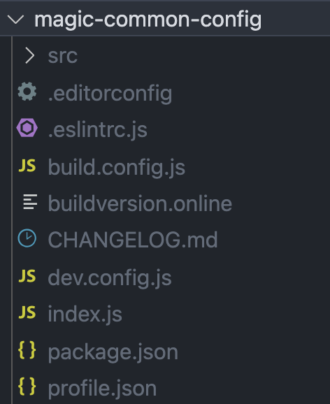
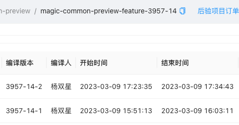
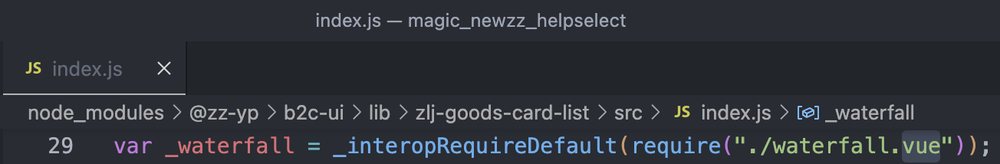

#### 魔方环境隔离

##### 魔方基础依赖介绍

- `dep-base`提供了本地运行组件的能力以及组件需要的所有第三方依赖
- `common-config`提供了配置区的一些常用表单项，如跳转配置、展示终端配置等
- `common-preview`提供了预览区的一些常用能力，如跳转、埋点上报等
- `dep-base`依赖`common-config`和`common-preview`，`common-config`和`common-preview`又依赖`dep-base`


一个魔方组件，通常只需要依赖`dep-base`即可，因为在安装`dep-base`的时候会自动将`common-config & common-preview`的内容打包生成到`dep-base`中。

```json
"dependencies": {
  "@zz-magic/magic-dep-base": "^7.0.0"
}
```

安装完的依赖目录是这样的


##### 魔方为什么要做环境隔离

之前，魔方在beetle编译某个基础依赖（e.g. @zz-magic/magic-common-config）时：

- 会发布一个正式包（e.g. @zz-magic/magic-common-config@1.1.3）
- 并将测试服务器上专门存放公共依赖的文件下的`node_modules`删除，然后执行`npm install`重新安装依赖
- 在安装中会使用我们最新发布的`@zz-magic/magic-common-config@1.1.3`。（此处实际是在一个临时文件夹中操作，然后安装后再复制出来的，可以减少测试环境的不可用时间）

举一个常见的场景来说明下这种模式的问题——A在开发`common-preview`，B在开发`common-config`，两人都在测试环境进行了编译，导致发出去了两个正式包`@zz-magic/magic-common-config@1.1.3` & `@zz-magic/magic-common-preview@1.1.3` 。那么此时，如果A开发测试完了，想要上个线，那么在执行服务器上执行到`npm i`的 时候，就会把B还未测试完成的包给安装到线上环境去。（其实在测试服务器上两个人的代码也是混合在一起的，不过毕竟是测试环境，影响较小）

从这个场景分析，可以发现有两个主要的问题：

1. 测试环境发布正式包，导致线上无法区分

2. `npm install`正常情况下只会安装正式包，不会安装beta包

   ```
   "@zz-magic/magic-dep-base": "^7.0.0"
   "@zz-magic/magic-common-config": "^1.0.0",
   "@zz-magic/magic-common-preview": "^1.0.0",
   ```

   

##### 设计思路

针对上述的两个问题，对应的解决办法就是：

1. 测试环境发beta包，线上发正式包

2. 使用`npm install @package@version(-beta)` 替换`npm install`

   

第一点就不说了，大致就是先`npm view packageName versions`获取包的所有版本，然后根据环境去获取最新的正式包版本或者是最新的beta版本，然后修改版本号再发包。

第二点，在更新依赖的时候，通过指定版本号的形式去安装我们最新发布的包。只不过在线上环境中，安装的是正式包，测试环境中安装的beta包。

看起来一切是那么的美好，但现实并不总是一帆风顺......


##### 问题复现&解决

在node_modules_temp文件中：


为了跟之后的操作做对比，我将记录下`dep-base` & `common-config`的版本以及他们node_modules的情况。

> dep-base: "@zz-magic/magic-dep-base@7.4.45"  node_modules下无其他依赖 
>
> 
>
> common-config: "@zz-magic/magic-common-config@1.1.3"  node_modules下无其他依赖 
>
> 

接下来，我将执行` npm i @zz-magic/magic-common-config@1.1.3-beta.1`去单独更新`common-config`。

执行结果：

> dep-base: "@zz-magic/magic-dep-base@7.4.45"  
>
> ​					node_modules下存在：common-config@1.1.3
>
> 
>
> common-config: "@zz-magic/magic-common-config@1.1.3-beta.1"  node_modules下无其他依赖 

为什么会这样呢？

dep-base依赖的`"@zz-magic/magic-common-config": "^1.0.0"`需要使用稳定的版本，所以beta版本被放在最外层，而将之前的`common-config@1.1.3`放在了dep-base/node_modules下。这样会有一个问题：

魔方的基础依赖在使用前会在dep-base下执行一个`externals`命令将`common-config`和`common-preview`的内容打成dist放在`dep-base`下。但是node_modules依赖的查找顺序是先从当前文件目录下查找的，所以生成dist文件时使用的将会是dep-base/node_modules/下的`common-confg@1.1.3`，而不是最外层的`common-confg@1.1.3-beta.1`

所以，我需要手动删除`dep-base/node_modules/@zz-magic/magic-common-config`，再去执行`externals`命令。（我们希望优先使用最外层的beta版本，但是如果当前目录下存在其他版本，则会优先使用当前目录下的文件，这是不符合要求的）


那接下来我们再试试在此基础上更新`dep-base`，`npm i @zz-magic/magic-dep-base@7.4.45-beta.1`。

结果就是出现了更多冗余的依赖。。。

> dep-base: "@zz-magic/magic-dep-base@7.4.45-beta.1"  
>
> 					node_modules下存在：common-config@1.1.3 & dep-base@7.4.45
>
> 
>
> common-config: "@zz-magic/magic-common-config@1.1.3-beta.1"  
>
> ​								node_modules下存在：common-config@1.1.3 & dep-base@7.4.45
>
> 

原因跟之前一样，我们安装的beta版本的`dep-base`不符合`common-config`所依赖的`"@zz-magic/magic-dep-base": "^7.0.0"`，就导致`common-config`下的node_modules中又多了一个`@zz-magic/magic-dep-base@7.4.45`，然后这个7.4.45的`dep-base`又依赖一个稳定版本的`common-config`，所以在同级目录下还会再多一个`@zz-magic/magic-common-config@1.1.3`

同样的，我们仍需要先手动的去删除这些冗余的、不符合我们要求的依赖。

综上，为了确保我们项目中使用的都是我们刚发布的beta包，我们需要在每一次更新依赖时都执行一下这三条命令去清除冗余的依赖，然后再去执行打包命令。

```shell
rm -rf ./node_modules/@zz-magic/magic-dep-base/node_modules/@zz-magic
rm -rf ./node_modules/@zz-magic/magic-common-config/node_modules/@zz-magic
rm -rf ./node_modules/@zz-magic/magic-common-preview/node_modules/@zz-magic

cd node_modules/@zz-magic/magic-dep-base
npm run externals 
```

然而，到这一步还没完事，我将代码部署到测试服务器上后，经常出现依赖没有安装完成或安装完没有生成dist文件的情况，总是执行到一半就“中断”了。但是我在本地测试的时候却不会出现这种问题。

经过一步一步的排查，最终将问题定位到了这一行代码

```js
await shelljs.shellExec(`${this.shellPath['magic-admin-v3-node-modules']}`)
```

查看`shelljs.shellExec`方法：

```js
exports.shellExec = function (command, options = {}) {
  return new Promise((resolve, reject) => {
    Object.assign(options, {timeout: 300000});
    shell.exec(command, options, (code, stdout, stderr) => {
      return resolve({
        code,
        stdout,
        stderr,
      });
    });
  });
};
```

经常中断，难道是过了超时时间？我试着将超时时间从5min改到10min，部署至测试服务器，再次更新依赖，一切正常了......（不得不吐槽这个测试服务器的性能甚至不如我的Mac）

再一看编译时间，耗时10min，!真棒。

`magic-dep-base`


编译`magic-common-config`


magic-common-preview：



##### 优化

如此低效率的更新显然不能让人满意，而且由于魔方自身的原因，当编译基础依赖时，其他人是不能再部署其他魔方服务的，这就会阻塞其他人的流程，对开发人员的体验是十分差的。

首先就是先分析问题找出原因：

第一点：很容易想到的，当安装beta版本的依赖时，总是会额外产生很多冗余的稳定版本的依赖。

第二点：安装依赖耗时么？耗时，但是至于这么耗时么？不至于。耗时中的大头另有其因，其实就是`dep-base`中的`externals`命令，打包，这个是比较耗费时间的通常需要1-2分钟。

所以在一定程度上是问题1导致了问题2——安装了冗余的依赖，其中冗余的`dep-base`会自动执行`externals `命令导致耗时过久。

**所以我们首先需要解决的就是避免安装冗余的依赖：**

`dep-base`需要依赖`common-config`，是因为需要将`preview`的内容打包生成到`dep-base`下供组件/专题/本地开发使用。

`common-config`需要依赖`dep-base`只是因为本地开发时需要。

如果去掉`common-config`的依赖项，那就可以在安装`common-config@beta`时避免额外安装`dep-base`。但是，本地开发`common-config`的场景还是很多的，因此需要想个办法尽可能的减少由此带来的对开发体验的影响。

于是我在脚本中加入了一个自动检查并安装依赖的命令`depcheck`。

```json
// dev之前先检查dep-base
"predev": "npm run depcheck && magic -c"
// list可以列出当前工程下的dep-base情况以及版本
// 如果没有会返回一个假值并走到npm i命令去安装dep-base
"depcheck": "npm list @zz-magic/magic-dep-base || npm i --no-save @zz-magic/magic-dep-base",

```

这样，在安装`common-config@beta`的时候就不会额外安装`dep-base`也不会额外执行`externals`命令了。

那么在安装`dep-base@beta`的时候呢？还是会额外安装冗余的`common-config`然后自动执行`externals`，然后删除冗余的`common-config`，再手动执行一次`externals`。

**接下来需要针对dep-base再次进行优化：**

由于`dep-base`是强依赖`common-config`的所以不能去掉依赖项，冗余的`common-config`肯定是避免不了的，不过这又有什么关系呢，安装再删除一共也影响不了几秒钟。

但重点是`magic-dep-base`中有这样一个脚本命令：`postinstall：npm run externals`——该命令是为了在开发时安装依赖等场景可以自动执行`externals`以减少操作次数&降低学习成本。

这就会导致第一次执行`externals`的时候实际使用的是冗余的稳定版本`common-config`，而非我们需要的最外层的`common-config@beta`，所以还需要删掉冗余依赖然后额外执行一次`externals`，这才是最耗时的部分。

“要是在`npm i`的时候可以不执行`postinstall：npm run externals`就好了”，带着这个期许，我找到了一个好用的脚本参数——`--ignore-scripts`（忽略依赖中的脚本命令，不去执行任何脚本）

这样一来，在安装`dep-base`的时候，也不会额外执行`externals`命令了！

magic-dep-base：


magic-common-config：


magic-common-preview：


##### 总结

以上，就是在对魔方基础依赖环境隔离改造的思路和问题的解决：

1. 通过发布beta版本的包来区分测试环境与线上环境
2. 但是带来了编译速度严重下降的问题
3. 通过去掉`common-config & common-prevew`中的依赖项来避免安装冗余的依赖

4. 针对`dep-base`，在`npm i`的使用加入`--ignore-scripts`命令来避免额外执行`externals`


#### 兼容B2C-UI引入方式

目前b2c侧开发魔方组件的时候，处于种种原因，导致引入组件的方式与正常组件库不同，通时魔方兼容欠缺导致经常会有

表面原因：

1. 在魔方使用b2c-ui时，如果使用常规的引入方式，`import { Button } from '@zz-yp/b2c-ui'`会导致报错


2. 由于1的存在，开发人员通常会直接从lib/src文件下单独引入组件

   ```js
   // 方式1
   import SelectPanel from '@zz-yp/b2c-ui/lib/select-panel';
   import '@zz-yp/b2c-ui/lib/select-panel/style.css';
   // 或
   // 方式2
   import RankDescription from '@zz-yp/b2c-ui/src/rank-description/index'
   import RankDescription from '@zz-yp/b2c-ui/src/rank-description'
   ```

   > 使用方式2，本地开发&魔方后台不会报错（webpack处理），只有发布专题时会报错（esbuild处理）
   >
   > 使用webpack处理时，编译&打包是一起进行的，所以解析到node_modules中的vue文件会将其编译成js文件然后进行打包处理。而发布专题的流程中，是先调用babel的api手动处理的组件依赖，只处理了本地文件，最终打包时是只利用了esbuild的打包能力，那么遇到vue文件就会报错。

 		

根本原因：

1. b2c-ui本身有bug，lib文件下引入了一个.vue文件

   

2. 魔方没有对b2c-ui做按需加载


解决办法：

使用babel插件，在编译时对b2c-ui的引入路径做处理

1. 首选支持b2c-ui按需加载

   ```json
   [
     'import',
     {
       libraryName: '@zz-yp/b2c-ui',
       camel2DashComponentName: true,
       customName: name => {
         return `@zz-yp/b2c-ui/lib/${name}`
       },
       customStyleName: name => {
         return `@zz-yp/b2c-ui/lib/${name}/style.css`
       }
     },
     '@zz-yp/b2c-ui'
   ]
   ```

2. 对于src下引入的文件，额外开发一个插件进行处理，将其转为从lib引入并额外引入样式文件

   ```js
   if (
     source &&
     types.isStringLiteral(source) &&
     /@zz-yp\/b2c-ui\/src\//.test(source.value)
   ) {
     const sourceValue = source.value
     const filePathArr = sourceValue.split('/')
     if (filePathArr[filePathArr.length - 1] === 'index') filePathArr.pop()
   
     // 替换src为lib，并拼接新的路径
     const transformedPath = filePathArr
       .join('/')
       .replace('/src/', '/lib/')
   
     // 生成新的导入语句
     const newImportDeclaration = types.importDeclaration(
       specifiers,
       types.stringLiteral(transformedPath)
     )
   
     // 生成样式文件的路径
     const stylePath = transformedPath.concat('/style.css')
   
     // 生成导入样式文件的语句
     const styleImportDeclaration = types.importDeclaration(
       [],
       types.stringLiteral(stylePath)
     )
   
     // 插入导入样式文件的语句
     path.insertAfter(styleImportDeclaration)
   
     // 替换原始导入语句
     path.replaceWith(newImportDeclaration)
   }
   ```

   

#### compositon-api编译问题排查

##### 1. 现象

本地开发&魔方后台对于使用composition-api的组件编译后展示正常。但是在发布后相关组件展示异常。


##### 2. 猜测

了解到：compositon-api官方文档要求，除非CDN引入，否则必须全局注册插件`Vue.use(VueCompositionAPI)`。

本地&魔方后台编译打包时使用的是webpack，而发布时使用的是esbuild，会不会是webpack自动在全局注册了compositon-api而esbuild没有注册？


##### 3. 排查过程

1. google “webpack自动注册composition-api” 相关问题，无果。

   

2. 查阅官方文档以及google “composition-api为什么需要全局注册”，了解到`Vue.use()`的注册原理是调用插件的`install`方法，于是去查看composition-api的源码。

   

3. 浏览源码的过程中，发现了composition-api会自动全局注册。

   ```js
   // auto install when using CDN
   if (typeof window !== 'undefined' && window.Vue) {
       window.Vue.use(Plugin);
   }
   ```

   

4. 直觉告诉我问题一定是出现在了这里，于是我在本地，将node_modules中的这行代码注释掉，使用webpack启动后，也复现了esbuild的问题，组件显示异常！

   

5. 报错信息：`Error: [vue-composition-api] No vue dependency found.`

   在源码中查找该错误提示：

   ```js
   // Error
   var constructor = vueConstructor || vueDependency;
   assert(constructor, 'No vue dependency found.');
   ```

   ```js
   // assert
   function assert(condition, msg) {
     if (!condition) {
       throw new Error('[vue-composition-api] '.concat(msg));
     }
   }
   ```

   可见，是由于没有`vueConstructor`导致的报错。


6. 接下来看看`vueConstructor`是如何产生的。

   ```js
   var vueConstructor = null;
   
   function setVueConstructor(Vue) {
     vueConstructor = Vue;
   }
   
   function install(Vue) {
     // ...
     setVueConstructor(Vue);
     // ...
   }
   ```

   又回到了我看源码最初的目的——`install`方法。也就是说，`@vue/composition-api`的`install`方法没有执行，即没有调用`Vue.use(VueCompositionAPI)`。也证明了我上边的推断——问题出在自动注册插件方法上。

   ```js
   // auto install when using CDN
   if (typeof window !== 'undefined' && window.Vue) {
       window.Vue.use(Plugin);
   }
   ```

   

7. 第一个判断条件肯定是没问题的，主要是第二个`window.Vue`

   什么情况下在会全局挂载Vue呢？1.通过CDN的形式使用Vue会自动全局挂载Vue   2.自定义暴露变量

   首先排除CDN，接下来查看魔方的代码，看看在哪里将`Vue`暴露到了`window`对象下。

   

   **1⃣️本地&魔方后台：**

   将公共依赖单独生成一份文件，供其他组件使用，此处将`vue`引入后命名为**大写`Vue`**并将其挂载到`window`。

   

   

   **2⃣️发布专题：**

   同样会抽离公共依赖，但是此处将`vue`挂载到`window`时命名为**小写`vue`**。

   

   

   

   **3⃣️对比：**

   可以看到，在本地&魔方后台，是将vue挂载到了`window.Vue`。

   而在发布专题时，将vue挂载到了`window.vue`。

   因此，在本地&魔方后台时，`!!window.Vue === true`，`@vue/composition-api`会自动全局挂载，而在发布专题时不会自动挂载。


##### 4. 结论

- `@vue/composition-api`会在`!!window.Vue === true`时自动注册插件。
- 本地开发魔方组件&魔方后台，会将vue挂载到`window.Vue`（大写）。
- 发布专题时，会将vue挂载到`window.vue`（小写）。
- 所以在本地&魔方后台时，在组件中无需手动注册插件`Vue.use(VueCompositionAPI)`。
- 而到了发布专题后，由于没有全局注册插件，导致`setup`语法无法识别，进而导致显示异常。


##### 5. 后续

需要将发布专题时挂载的vue，同样改为`window.Vue`，以支持组件无需显示注册`@vue/composition-api`。


