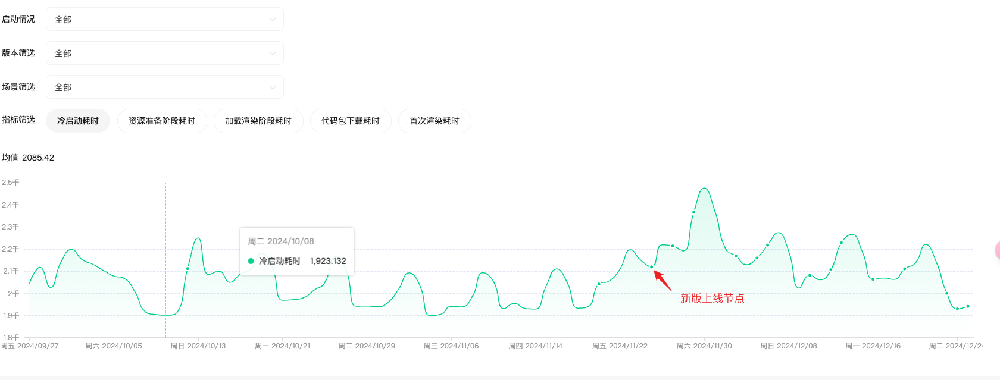
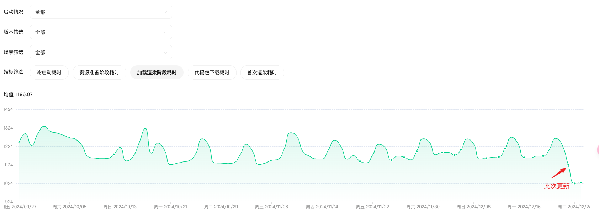
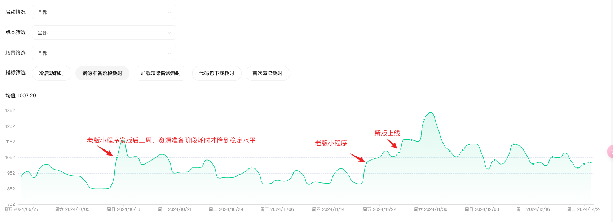
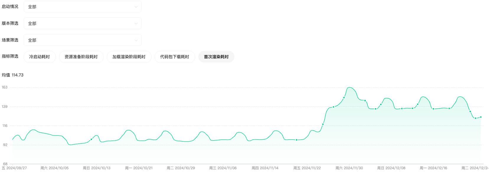

#### 目前的首页性能优化进度：

上次性能优化的发版后效果（主要是将主包体积继续压缩，将首页商列区域移到分包并异步加载）

1. 冷启动耗时与老版小程序接近了

   

2. 此次更新主要降低的是加载渲染阶段（资源准备完成后，代码注入+渲染）

   

3. 资源准备阶段耗时

   此处能优化的点只有一个，就是代码包体积；

   其他的优化手段如小程序信息缓存、环境预加载都只能通过微信侧介入，开发者无法优化；且每次发版，都会导致微信侧的缓存失效，无法有效利用微信侧的优化手段；可以看到老版小程序发版后，该指标至少需要3周才能恢复到稳定水平；

   

#### 接下来要做的事

1. 何时要拿到最终结果？
      由于上边提到的——发版必然会导致启动耗时增加，所以想要拿到稳定、最终的优化结果，必须要等小程序更新迭代不频繁的时候，那是不是得与平台侧产品提前沟通确定这个时间段？

2. 研究下首次渲染耗的影响因素以及如何降低

   该指标在此次更新后，确实有一个较明显的下降，但是相比于新版小程序发版后带来的增长，还是有很大的优化空间；

   

3. 可以再尝试下其他优化手段

   指可能效果不明显或成本较大，但理论上有用的优化手段

   如①优化封装setStorage等api到页面加载完成后再统一真正的存储到storage中（先放到缓存中）②缓存首页不常变动的数据......

