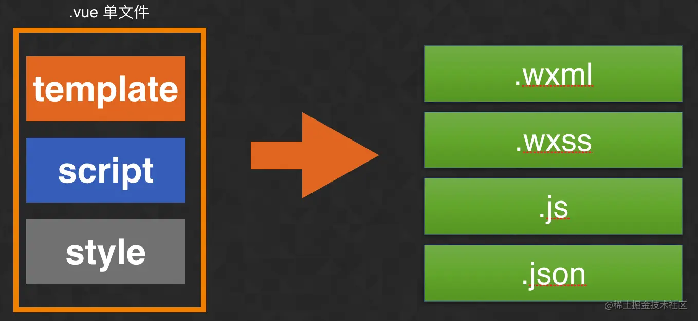
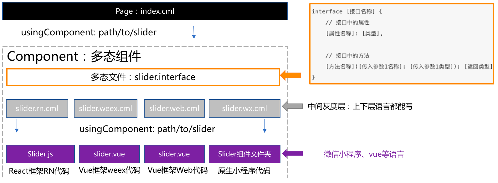

#  Taro vs CML vs Uni-App

**Uni-App、Taro、Chameleon** 这三个框架都是通过特定的编译和转换技术，以及封装统一的API和组件集，来实现一套代码跨多个小程序平台开发的。




## 无法抹平的差异处理

### Taro

#### 内置环境变量

Taro 在编译时提供了一些内置的环境变量来帮助用户做一些特殊处理。

##### process.env.TARO_ENV

用于判断当前的编译平台类型。

取值：`weapp` / `swan` / `alipay` / `tt` / `qq` / `jd` / `h5` / `rn`

可以通过这个变量来区分不同环境，从而使用不同的逻辑。在编译阶段，**会移除不属于当前编译类型的代码，只保留当前编译类型下的代码**，例如：

1. 在微信小程序和 H5 端分别引用不同资源：

```jsx
/** 源码 */
if (process.env.TARO_ENV === 'weapp') {
  require('path/to/weapp/name')
} else if (process.env.TARO_ENV === 'h5') {
  require('path/to/h5/name')
}

/** 编译后（微信小程序）*/
if (true) {
  require('path/to/weapp/name')
}
/** 编译后（H5）*/
if (true) {
  require('path/to/h5/name')
}
```

2. 决定不同端要加载的组件

```jsx
/** 源码（React JSX） */
<View>
  {process.env.TARO_ENV === 'weapp' && <ScrollViewWeapp />}
  {process.env.TARO_ENV === 'h5' && <ScrollViewH5 />}
</View>

/** 编译后（微信小程序）*/
<View>
  {true && <ScrollViewWeapp />}
</View>
/** 编译后（H5）*/
<View>
  {true && <ScrollViewH5 />}
</View>
```


##### Vue支持

目前在.vue文件template模板内容中支持条件编译的特性。

指定平台保留样式：

```vue
/*  #ifdef  %PLATFORM%  */
模板代码
/*  #endif  */
```

指定平台剔除样式：

```vue
/*  #ifndef  %PLATFORM%  */
模板代码
/*  #endif  */
```


其中 `PLATFORM` 的取值与 `process.env.TARO_ENV` 保持一致

例如，希望某段模板内容只在 **微信小程序中** 生效，可以如下写法

```vue
/*  #ifdef weapp  */
模板代码
/*  #endif  */
```

如果是多个平台，之间可以使用空格隔开。


#### 统一接口的多端文件

内置环境变量虽然可以解决大部分跨端的问题，但是会让代码中充斥着逻辑判断的代码，影响代码的可维护性，而且也让代码变得愈发丑陋。为了解决这种问题，Taro 提供了另外一种跨端开发的方式作为补充。

开发者可以通过使用**统一接口的多端文件**，来解决跨端差异的功能。针对一项功能，如果多个端之间都有差异，那么开发者可以通过将文件修改成 `原文件名 + 端类型` 的命名形式（端类型对应着 `process.env.TARO_ENV` 的取值），不同端的文件代码对外保持统一接口，而引用的时候仍然是 `import` 原文件名的文件。Taro 在编译时，会跟根据当前的编译平台类型，将加载的文件变更为带有对应端类型文件名的文件，从而达到不同的端加载对应文件的目的。

##### 使用要点

统一接口的多端文件这一跨平台兼容写法有如下三个使用要点：

- 不同端的对应文件一定要**统一接口和调用方式**。
- 引用文件的时候，**只需要写默认文件名，不用带文件后缀**。
- 最好有一个平台无关的默认文件，这样在使用 TS 的时候也不会出现报错。

通常有以下三种使用场景：

##### 多端组件

假如有一个 `Test` 组件存在微信小程序、百度小程序和 H5 三个不同版本，那么就可以像如下组织代码：

```text
├── test.js                Test 组件默认的形式，编译到微信小程序、百度小程序和 H5 之外的端使用的版本
├── test.weapp.js          Test 组件的微信小程序版本
├── test.swan.js           Test 组件的百度小程序版本
└── test.h5.js             Test 组件的 H5 版本
```

四个文件，对外暴露的是统一的接口，它们接受一致的参数，只是内部有针对各自平台的代码实现。

而使用 `Test` 组件的时候，引用的方式依然和之前保持一致。`import` 的是**不带端类型的文件名**，在编译的时候会自动识别并添加端类型后缀：

```jsx
import Test from '../../components/test'
;<Test argA={1} argA={2} />
```


##### 多端脚本逻辑

与多端组件类似，假如有需要针对不同的端写不同的脚本逻辑代码，我们也可以类似的进行处理，遵守的唯一原则就是**多端文件对外的接口保持一致**。

例如微信小程序上使用 `Taro.setNavigationBarTitle` 来设置页面标题，H5 则是使用 `document.title`。那么我们可以封装一个 `setTitle` 方法来抹平两个平台的差异。

1. 编写 `set_title.weapp.js`：

```js
// set_title.weapp.js
import Taro from '@tarojs/taro'
export default function setTitle(title) {
  Taro.setNavigationBarTitle({
    title,
  })
}
```

2. 编写 `set_title.h5.js`：

```js
// set_title.h5.js
export default function setTitle(title) {
  document.title = title
}
```

3. 调用：

```js
import setTitle from '../utils/set_title'

setTitle('页面标题')
```


### Uni-App

#### 环境变量（略）

#### 条件编译处理多端差异

以 `#ifdef` 或 `#ifndef` 加 `%PLATFORM%` 开头，以 `#endif` 结尾。

- `#ifdef`：if defined 仅在某平台存在
- `#ifndef`：if not defined 除了某平台均存在
- `%PLATFORM%`：平台名称

| 条件编译写法                                             | 说明                                                         |
| -------------------------------------------------------- | ------------------------------------------------------------ |
| #ifdef **APP-PLUS** 需条件编译的代码 #endif              | 仅出现在 App 平台下的代码                                    |
| #ifndef **H5** 需条件编译的代码 #endif                   | 除了 H5 平台，其它平台均存在的代码（注意if后面有个n）        |
| #ifdef **H5** \|\| **MP-WEIXIN** 需条件编译的代码 #endif | 在 H5 平台或微信小程序平台存在的代码（这里只有\|\|，不可能出现&&，因为没有交集） |

**`%PLATFORM%`** 可取值：

| 值          | 生效条件     | 版本支持 |
| :---------- | :----------- | :------- |
| MP-WEIXIN   | 微信小程序   |          |
| MP-ALIPAY   | 支付宝小程序 |          |
| MP-BAIDU    | 百度小程序   |          |
| MP-TOUTIAO  | 抖音小程序   |          |
| MP-LARK     | 飞书小程序   |          |
| MP-QQ       | QQ小程序     |          |
| MP-KUAISHOU | 快手小程序   |          |

支持的文件：

- .vue/.nvue/.uvue
- .js/.uts
- .css
- pages.json
- 各预编译语言文件，如：.scss、.less、.stylus、.ts、.pug


##### 条件编译使用

API、组件、样式、package.json的条件编译使用方式一样，下面是一个组件条件编译的例子

如下公众号关注组件仅会在微信小程序中出现：

```html
<view>
    <view>微信公众号关注组件</view>
    <view>
        <!-- uni-app未封装，但可直接使用微信原生的official-account组件-->
        <!-- #ifdef MP-WEIXIN -->
		        <official-account></official-account>
		    <!-- #endif -->
    </view>
</view>
```

此外，还有一些针对文件的条件编译，通过一些约定的目录规则来决定哪些平台需要编译哪些文件。与Taro类似。


### CML(可咪林)

**多态协议：**定义标准接口(interface)，各端模块各自独立实现，编译时和运行时对实现的接口输入输出做检查。

主要 2 个目标：

- 保障多端可维护性
- 编译时拆分多端代码

CML 会严格“管制”输入输出值的类型和结构，同时会严格检查业务层 JS 代码，避免直接使用某端特有的接口，不允许在公共代码处使用某个端特定的方法，即使这段代码不会执行，例如禁止使用`window`、`wx`、`my`、`swan`、 `weex` 等方法。


#### 环境变量（略）

#### 多态接口

#####  初始化多态接口

项目根目录下执行`cml init component`，选择`Polymorphic function`，输入文件名称，例如`utils`，生成如下文件结构

```bash
├── components
    └──utils
      └── utils.interface
```

初始化文件内容如下：

```vue
<script cml-type="interface">
interface UtilsInterface {
  getMsg(msg: string): void;
}
</script>
<script cml-type="web">
class Method implements UtilsInterface {
  getMsg(msg) {
    return 'web:' + msg;
  }
}
export default new Method();
</script>
<script cml-type="weex">
class Method implements UtilsInterface {
  getMsg(msg) {
    return 'weex:' + msg;
  }
}
export default new Method();
</script>
<script cml-type="wx">
class Method implements UtilsInterface {
  getMsg(msg) {
    return 'wx:' + msg;
  }
}
export default new Method();
</script>
<script cml-type="alipay">
class Method implements UtilsInterface {
  getMsg(msg) {
    return 'alipay:' + msg;
  }
}
export default new Method();
</script>
<script cml-type="baidu">
class Method implements UtilsInterface {
  getMsg(msg) {
    return 'baidu:' + msg;
  }
}
export default new Method();
</script>
```

文件中利用标签将各端代码进行物理隔离，利用 cml-type 属性指定平台。 `cml-type="interface"`为接口定义部分，利用接口校验语法定义这个接口的方法及方法的参数与返回值。

`cml-type="web|wx|weex|alipay|baidu"`为各端实现部分，按照 interface 接口的定义进行方法的实现输入输出。**注意要以`export default`的形式导出对象**。

##### 调用多态接口

在需要使用多态接口的组件中引入，例如`src/pages/index/index.cml`中引用，代码如下：

```js
import utils from '../../components/utils/utils.interface';
let message = utils.getMsg();
```


#### 多态组件



项目根目录下执行`cml init component`，选择`Polymorphic component`，输入组件名称，例如`c-list`，生成如下文件结构

```text
├── components
│   ├── c-list
│   │   ├── c-list.interface
│   │   ├── c-list.web.cml
│   │   ├── c-list.weex.cml
│   │   ├── c-list.wx.cml
│   │   ├── c-list.alipay.cml
│   │   ├── c-list.baidu.cml
│   │   └── ...
```

##### interface 文件

```
.interface`文件利用接口校验语法对组件的属性和事件进行类型定义， 保证各端的组件和事件一致，框架在开发环境的运行时做校验。例如`c-list.interface
type eventType = 'change';
type eventDetail = {
  value: string
}
type changeEvent = (a: eventType, detail: eventDetail) => void;

export default Interface Clist {
  name: string,
  age: number,
  changeEvent: changeEvent
}
```

##### *.[web|weex|wx|alipay|baidu].cml

`c-list.web.cml`、`c-list.weex.cml`、`c-list.wx.cml`、`c-list.alipay.cml`、`c-list.baidu.cml`、`...` 文件是灰度区，它是唯一可以调用下层端组件的 CML 文件，分别是 web、weex、wx、alipay、baidu 五个端的调用入口。建议这一块代码尽量薄，只是用来调用下层端代码，不要编写过于重的代码。

##### 使用方式

```vue
<c-list {...props}></c-list>
```


#### 多态模板

```vue
<template class="demo-com">
  <cml type="alipay,baidu">
    <view>alipay和baidu端以这段代码进行渲染</view>
    <demo-com title="我是标题2"></demo-com>
  </cml>
  <cml type="wx">
    <view>wx端以这段代码进行渲染</view>
    <demo-com title="我是标题wx"></demo-com>
  </cml>
  <cml type="base">
    <view
      >如果找不到对应端的代码，则以type='base'这段代码进行渲染，比如这段代码会在web端进行渲染</view
    >
    <demo-com title="我是标题base"></demo-com>
  </cml>
</template>
```