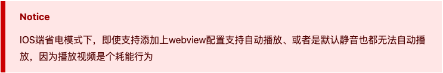
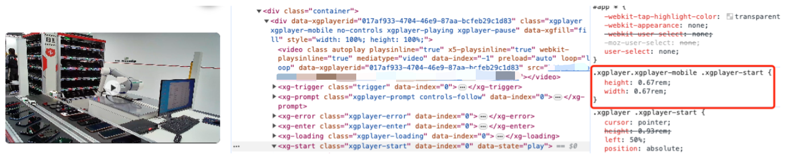
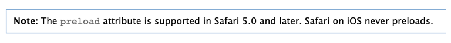
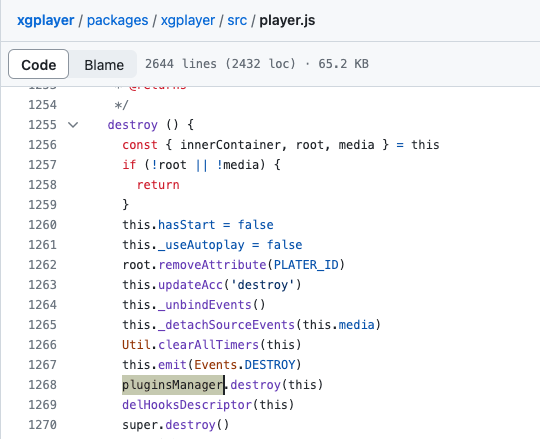
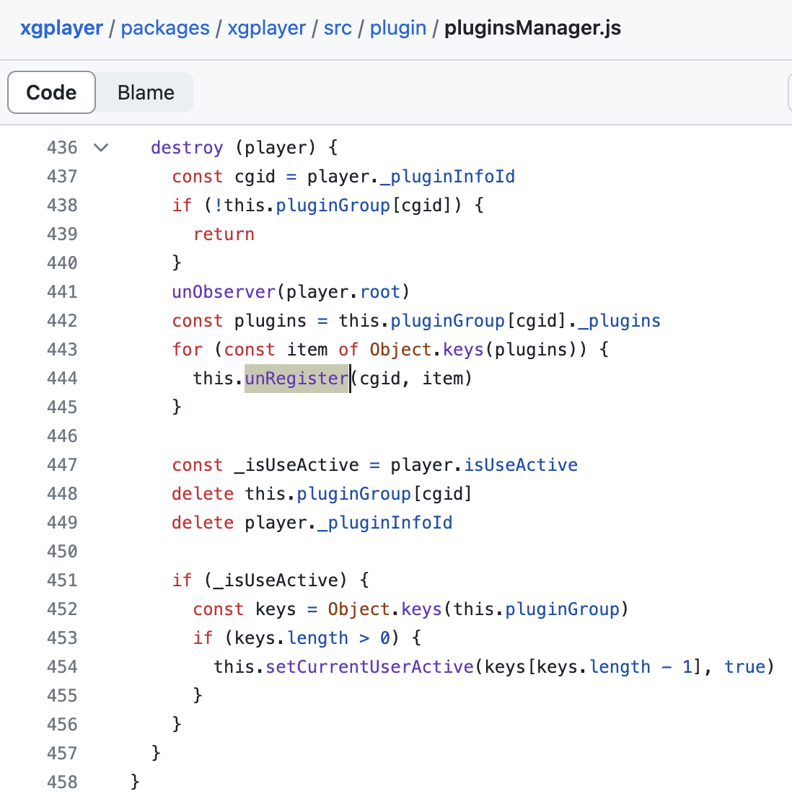
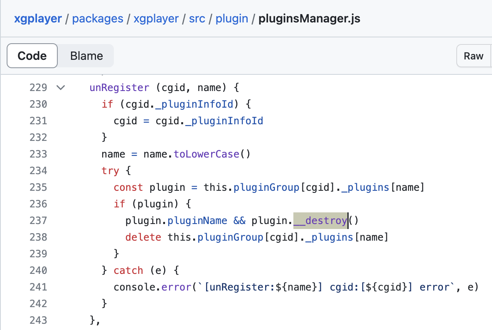

#### 一、背景介绍

为了强化官方验的心智，平台要做一版新的质检直播间，将我们的质检车间全方位透明的展现给用户。按照产品的设计来实现的话，其实就是将各个镜头的内容同时在一个页面内进行播放，除了工作时间的直播，还有休息时间的录播播放。不过直播和录播的生成都是在后端实现，前端只负责视频资源的播放。

#### 二、前期调研

对于简单的直播场景，我们需要关注的主要是**编解码格式**和**直播协议**，因为这两点直接决定直播能否播放。

**编解码格式：**视频的编码方式决定了视频的压缩方式，同样的需要对应的解码格式才能正常播放视频。但视频编码这个过程是在推流端做的，通常会采用H.264，目前基本上所有的播放器和浏览器都支持该解码方式，其兼容性基本不用考虑；所以虽然视频的编解码格式很重要，但只要没有特殊的场景如4k，一般无需过多考虑。

**拉流端直播协议：**不同的直播协议，其兼容性和直播效果有一些差异，而前端对兼容性的差异是敏感的，所以对于Web端，尽量选择兼容性最佳的HLS。

以下是我了解到的不同直播协议的特点及他们的优劣势：

**1）RTMP**

特点/优点：

1.基于TCP长连接，不需要多次建连，延时低，通常只有1~3s；
2.技术成熟，配套完善。

缺点：

1.兼容性差，需要依赖flash，因此无法在移动端使用。
2.容易被防火墙拦截。

**2）HLS**

特点/优点：

1.其工作原理是切片式传输，把直播流切成无数片，用户在观看视频时，每次客户端可以只下载一部分；
2.基于 HTTP协议，所以接入CDN较为容易，很少被防火墙拦下；
3.自带多码率自适应；
4.几乎支持所有设备；

缺点：

1.延时较大，通常不低于10s；
2.大量的TS片文件，会造成服务器存储和请求的压力；

**3）HTTP-FLV**

特点/优点：

1.把音视频数据封装成FLV，然后通过HTTP连接传输，与RTMP相比只是传输协议变了，能有效避免防火墙和代理的影响；
2.低延时，整体效果与RTMP非常接近；

缺点：

1.它的传输特性会让流媒体资源缓存在本地客户端，保密性较差；
2.不支持IOS；


#### 三、为什么使用xgPlayer

在确定了我所需要使用的直播协议后，我调研了一些社区推荐的播放器：tcplayer.js、xgplayer、DPlayer、plyr、ArtPlayer.js、Video.js。

其实以上的播放器在功能上都可以满足我的需求，并且也都支持H.264编码格式；
在直播能力的支持上也都会在底层依赖hls.js，flv.js，不过像tcplayer和xgplayer还单独包了一层，使得直播的实现更加的符合播放器的体系；

在我所调研的播放器里xgPlayer的文档是最清晰和完善的，并且xgPlayer使用插件机制，所有功能均可插拔，而且支持自定义扩展能力，十分方便，所以在开发体验上我认为更胜一筹。


#### 四、基本使用

##### 1.初始化

```js
import Player from 'xgplayer'
import FlvPlugin from 'xgplayer-flv'
import "xgplayer/dist/index.min.css"

new Player({
    id:'dom-id', // 播放器实例化所需的dom
  	url: 'test.flv', // 视频源
    width: '100%',
  	height: '100%'
})
```

##### 2.多实例

初始化时可以使用选择器id或容器el。但对于同时实例化多个播放器的场景，使用Id很容易导致最终只实例化成功一个，虽然你可以通过ID+索引的方式避免，但使用容器el还是更为简洁的。

```vue
<div ref="playerRef"></div>

const playerRef = ref()

new Player({
    el: playerRef.value,
		...
})
```

##### 3.常用属性

```js
new Player({
  	poster // 封面
		autoplay // 自动播放，基本上不支持有声自动播放；
		autoplayMuted // 自动静音播放，需要自动播放可使用改属性
		playsinline // 对于移动 Safari 浏览器来说是必需的，它允许视频播放时不强制全屏模式
		loop // 循环播放
		fitVideoSize // 根据视频内容调整容器宽高
		videoFillMode // 视频画面填充模式
		controls // 是否展示进度条
		videoAttributes // 透传给video标签的属性 
})
```

关于自动播放的限制还是很多的，所以把预期降低到大部分设备可以静音播放即可...


[关于自动播放](https://h5player.bytedance.com/guide/extends/aautoplay.html#%E7%A7%BB%E5%8A%A8%E7%AB%AF%E8%87%AA%E5%8A%A8%E6%92%AD%E6%94%BE)

##### 4.直播能力

**FLV协议：**使用xgplayer-flv，可用于PC、安卓

```js
import FlvPlugin from 'xgplayer-flv'
if (FlvPlugin.isSupported()) { // 第一步，检测当前环境是否支持
    const player = new Player({
        id: 'dom-id',
        url: 'test.flv', // flv 流地址
        isLive: true,
        plugins: [FlvPlugin] // 第二步
    })
}
```

**HLS协议：**使用xgplayer-hls，可用于PC、安卓、IOS（ios&部分andr不需要插件，原生支持）

在原生支持hls的情况下尽可能不使用xgplayer-hls，IOS浏览器原生即支持hls格式播放，但是缺少xgplayer-hls运行所需的[Media Source Extensions](https://w3c.github.io/media-source/)。

```js
import Player from 'xgplayer'
import HlsPlugin from 'xgplayer-hls'

let player
if (document.createElement('video').canPlayType('application/vnd.apple.mpegurl')) {
    // 原生支持 hls 播放
    player = new Player({
        el: document.querySelector('.player'),
        url: 'test.m3u8'
    })
} else if (HlsPlugin.isSupported()) { // 第一步，检测当前环境是否支持
    player = new Player({
        el: document.querySelector('.player'),
        isLive: true,
        url: 'test.m3u8', // hls 流地址
        plugins: [HlsPlugin] // 第二步
    })
}
```


##### 5.样式自定义

xgplayer提供了十分便捷的方式去配置icon。

```js
const playerConfig = {
  icons: {
    // 1.通过function方式 返回一个dom
    play: () => {
      const dom = Util.createDom('div', '', {}, 'customclass')
      return dom
    },
    // 2.直接html代码
    pause: `<div class='customclass'></div>`,
    // 3.直接一张图片链接
    startPlay: 'https://xxx.zhuanzhuan.com/xxx.png'
  }
}
```

但是很多地方的icon大小尺寸是固定死的，如果想要修改还是要去覆盖xgplayer默认的样式



##### 6.自定义插件

xgplayer支持插件的扩展机制，无论是简单的功能按钮还是复杂的播放逻辑都可以通过插件的形式来实现。

这里实现一个简单的插件，结合我们的通用组件库，用于在视频暂停时，展示一些提示。

```js
// demoPlugin.js
import Vue from 'vue'
import { Events, Plugin } from 'xgplayer'
import Demo from './demoPlugin.vue'
const { POSITIONS } = Plugin

export default class DemoPlugin extends Plugin {
  // 插件的名称，将作为插件实例的唯一key值
  static get pluginName() {
    return 'demoPlugin'
  }
  static get defaultConfig() {
    return {
      // 挂载在播放器最上方
      position: POSITIONS.ROOT_TOP
    }
  }
  constructor(args) {
    super(args)
    this.vm = null
  }
  // 插件实例化之后
  afterCreate() {
  	// 使用vue组件
    const Component = Vue.extend(Demo)
    this.vm = new Component().$mount('.demo-plugin')
		// 视频播放时
    this.on(Events.PLAY, () => {
      this.vm.hide()
    })
		// 视频暂停时
    this.on([Events.PAUSE], () => {
      this.vm.show()
    })
  }
  destroy() {
    // 播放器销毁的时候一些逻辑
  }
  render() {
    return '<div class="demo-plugin"></div>'
  }
}
```

```vue
// demoPlugin.vue
<template>
  <NoticeBar v-show="visible" swipe>
    <span style="padding-right: 50px;">我一定会回来的～我一定会回来的～我一定会回来的～</span>
  </NoticeBar>
</template>
<script setup lang="ts">
import { ref, defineExpose } from 'vue'
import { NoticeBar } from '@zz-common/zz-ui';

const visible = ref(true)

const show = () => {
  visible.value = true
}
const hide = () => {
  visible.value = false
}
defineExpose({
  show,
  hide
})
</script>
```

```js
// 使用
import DemoPlugin from './demoPlugin.js'
...
new Player({
  ...,
  plugins: [DemoPlugin]
})
```


#### 五、遇到的问题

##### 1.事件监听相关

在播放器的事件中有两个与播放操作相关的事件——play、canplay

**play**表示播放已开始。

**canplay**表示浏览器可以播放媒体文件了，但估计没有足够的数据来支撑播放到结束，不必停下来进一步缓冲内容。

简单区分下这两个事件：play可以具象的理解为点击播放按钮或者自动播放成功，canplay则表示视频资源已经开始加载并缓冲了一部分数据达到了启播的条件。

这两个事件的先后顺序不固定——如果没有设置自动播放、也没有设置预加载，那应该是play、canplay。如果设置了预加载，但没有设置自动播放，则应该是canplay、play，到目前按照事件的定义来看，还是能抓住一些规律的。
但是呢经过我测试发现，同样的设置，在原生video标签和xgplayer上执行顺序不同。另外在不同的操作系统上也会导致执行顺序不同，比如 ios Safari 从不预加载导致无法在未播放时触发canplay事件。所以十分不建议根据这两个事件的执行时机来做一些事（不过目前也想不到这种场景，只是无意中发现的）




##### 2.跨域问题

问题的起因是当时的直播流内容总是会间隔性的黑屏，而且后端无法监控到并调整视频源。
于是需要前端通过截取画面并分析截图的像素点来判断是否黑屏，以实现黑屏自动切换视频源的能力。

但是当通过canvas获取图片数据时`getImageData`报了一个`SecurityError`异常。

经查阅发现这是浏览器的安全策略，不通过CORS使用其他来源的资源，会污染画布。

在"被污染"的 canvas 中调用以下方法将会抛出安全错误：

- 在 `canvas` 的上下文上调用`getImageData()`
- 在`canvas`元素本身调用`toBlob()`、`toDataURL()`、`captureStream()`

所以如果要对视频内容进行截图或者对视频画面做一些操作处理，需要给video标签设置crossOrigin属性，在xgplayer中可以通过`videoAttributes`属性传入。

```js
const player = new Player({
  ...,
  videoAttributes: {
    crossOrigin: 'anonymous'
  }
})
```


##### 3.内存溢出

当不需要播放器时，记得及时销毁，否则可能会导致内存溢出。（尤其是多实例、切换播放的场景）

```js
player.destroy() // 销毁播放器
player = null // 将实例引用置空
```

**无需单独销毁插件实例，xgplayer自动会帮我们执行该操作。**—— xgplayer将所有注册的插件维护在`pluginGroup`对象中，当我们调用播放器的`destroy`方法时，遍历所有插件并依次执行插件的销毁方法。







##### 4.兼容性问题？？？

在测试的时候发现，iPhone 14Pro机型，直播播放的时候，如果跳转到其他页面，再返回到直播页，会导致视频播放错误；该问题暂时没有思路，不清楚原因...

目前的解决办法是，在页面不可见时，记录并销毁该播放器，在页面展现时再重新实例化之前的播放器。

#### 六、最终效果

目前线上正常运行，暂时没有发现其他问题。


#### 七、参考资料

[允许图片和 canvas 跨源使用](https://developer.mozilla.org/zh-CN/docs/Web/HTML/CORS_enabled_image)

[西瓜播放器](https://h5player.bytedance.com/guide/)

[Safari HTML5 Audio and Video Guide](https://developer.apple.com/library/archive/documentation/AudioVideo/Conceptual/Using_HTML5_Audio_Video/AudioandVideoTagBasics/AudioandVideoTagBasics.html)
